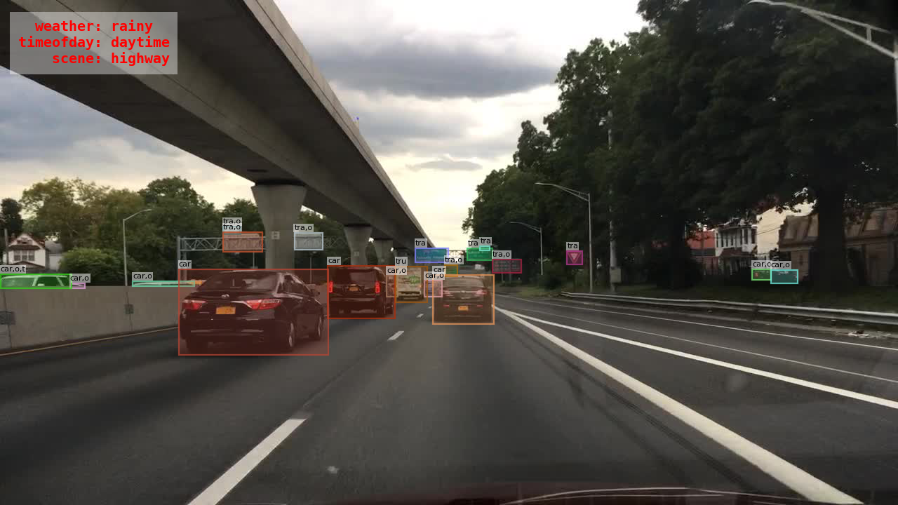

# Detection Models of BDD100K

The object detection task involves localization (predicting a bounding box for each object) and classification (predicting the object category).



The BDD100K dataset contains bounding box annotations for 100K images (70K/10K/20K for train/val/test). Each annotation contains bounding box labels for 10 object classes. For details about downloading the data and the annotation format for this task, see the [official documentation](https://doc.bdd100k.com/download.html).

## Model Zoo

For training the models listed below, we follow the common settings used by MMDetection (details [here](https://github.com/open-mmlab/mmdetection/blob/master/docs/model_zoo.md#common-settings)), unless otherwise stated.
All models are trained on either 8 GeForce RTX 2080 Ti GPUs or 8 TITAN RTX GPUs with a batch size of 4x8=32.
See the config files for the detailed setting for each model.

## Table of Contents

   * [Models](#model-zoo)
      * [Faster R-CNN](#faster-r-cnn)
      * [RetinaNet](#retinanet)
      * [Cascade R-CNN](#cascade-r-cnn)
      * [FCOS](#fcos)
      * [Deformable ConvNets v2](#deformable-convnets-v2)
      * [Libra R-CNN](#libra-r-cnn)
      * [HRNet](#hrnet)
      * [ATSS](#atss)
      * [Sparse R-CNN](#sparse-r-cnn)
      * [DyHead](#dyhead)
      * [Swin Transformer](#swin-transformer)
      * [Pyramid Vision Transformer](#pyramid-vision-transformer)
      * [Pyramid Vision Transformer v2](#pyramid-vision-transformer-v2)
      * [ResNet Strikes Back](#resnet-strikes-back)
      * [ConvNeXt](#convnext)
   * [Usage](#usage)
   * [Contribution](#contribution)

---

### Faster R-CNN

[Faster R-CNN: Towards Real-Time Object Detection with Region Proposal Networks](https://arxiv.org/abs/1506.01497) [NeurIPS 2015]

Authors: [Shaoqing Ren](https://www.shaoqingren.com/), [Kaiming He](http://kaiminghe.com/), [Ross Girshick](https://www.rossgirshick.info/), [Jian Sun](http://www.jiansun.org/)

<details>
<summary>Abstract</summary>
State-of-the-art object detection networks depend on region proposal algorithms to hypothesize object locations. Advances like SPPnet and Fast R-CNN have reduced the running time of these detection networks, exposing region proposal computation as a bottleneck. In this work, we introduce a Region Proposal Network (RPN) that shares full-image convolutional features with the detection network, thus enabling nearly cost-free region proposals. An RPN is a fully convolutional network that simultaneously predicts object bounds and objectness scores at each position. The RPN is trained end-to-end to generate high-quality region proposals, which are used by Fast R-CNN for detection. We further merge RPN and Fast R-CNN into a single network by sharing their convolutional features---using the recently popular terminology of neural networks with 'attention' mechanisms, the RPN component tells the unified network where to look. For the very deep VGG-16 model, our detection system has a frame rate of 5fps (including all steps) on a GPU, while achieving state-of-the-art object detection accuracy on PASCAL VOC 2007, 2012, and MS COCO datasets with only 300 proposals per image. In ILSVRC and COCO 2015 competitions, Faster R-CNN and RPN are the foundations of the 1st-place winning entries in several tracks. Code has been made publicly available.
</details>

#### Results

| Backbone | Lr schd | MS-train | Box AP-val | Scores-val | Box AP-test | Scores-test | Config | Weights | Preds | Visuals |
| :-: | :-: | :-: | :-: | :-: | :-: | :-: | :-: | :-: | :-: | :-: |
| R-50-FPN | 1x |  | 31.04 | [scores](https://dl.cv.ethz.ch/bdd100k/det/scores-val/faster_rcnn_r50_fpn_1x_det_bdd100k.json) | 29.78 | [scores](https://dl.cv.ethz.ch/bdd100k/det/scores-test/faster_rcnn_r50_fpn_1x_det_bdd100k.json) | [config](./configs/det/faster_rcnn_r50_fpn_1x_det_bdd100k.py) | [model](https://dl.cv.ethz.ch/bdd100k/det/models/faster_rcnn_r50_fpn_1x_det_bdd100k.pth) \| [MD5](https://dl.cv.ethz.ch/bdd100k/det/models/faster_rcnn_r50_fpn_1x_det_bdd100k.md5) | [preds](https://dl.cv.ethz.ch/bdd100k/det/preds/faster_rcnn_r50_fpn_1x_det_bdd100k.json) | [visuals](https://dl.cv.ethz.ch/bdd100k/det/visuals/faster_rcnn_r50_fpn_1x_det_bdd100k.zip) |
| R-50-FPN | 3x | ✓ | 32.30 | [scores](https://dl.cv.ethz.ch/bdd100k/det/scores-val/faster_rcnn_r50_fpn_3x_det_bdd100k.json) | 31.45 | [scores](https://dl.cv.ethz.ch/bdd100k/det/scores-test/faster_rcnn_r50_fpn_3x_det_bdd100k.json) | [config](./configs/det/faster_rcnn_r50_fpn_3x_det_bdd100k.py) | [model](https://dl.cv.ethz.ch/bdd100k/det/models/faster_rcnn_r50_fpn_3x_det_bdd100k.pth) \| [MD5](https://dl.cv.ethz.ch/bdd100k/det/models/faster_rcnn_r50_fpn_3x_det_bdd100k.md5) | [preds](https://dl.cv.ethz.ch/bdd100k/det/preds/faster_rcnn_r50_fpn_3x_det_bdd100k.json) | [visuals](https://dl.cv.ethz.ch/bdd100k/det/visuals/faster_rcnn_r50_fpn_3x_det_bdd100k.zip) |
| R-50-FPN | 5x | ✓ | 32.49 | [scores](https://dl.cv.ethz.ch/bdd100k/det/scores-val/faster_rcnn_r50_fpn_5x_det_bdd100k.json) | 31.86 | [scores](https://dl.cv.ethz.ch/bdd100k/det/scores-test/faster_rcnn_r50_fpn_5x_det_bdd100k.json) | [config](./configs/det/faster_rcnn_r50_fpn_5x_det_bdd100k.py) | [model](https://dl.cv.ethz.ch/bdd100k/det/models/faster_rcnn_r50_fpn_5x_det_bdd100k.pth) \| [MD5](https://dl.cv.ethz.ch/bdd100k/det/models/faster_rcnn_r50_fpn_5x_det_bdd100k.md5) | [preds](https://dl.cv.ethz.ch/bdd100k/det/preds/faster_rcnn_r50_fpn_5x_det_bdd100k.json) | [visuals](https://dl.cv.ethz.ch/bdd100k/det/visuals/faster_rcnn_r50_fpn_5x_det_bdd100k.zip) |
| R-101-FPN | 3x | ✓ | 32.71 | [scores](https://dl.cv.ethz.ch/bdd100k/det/scores-val/faster_rcnn_r101_fpn_3x_det_bdd100k.json) | 31.96 | [scores](https://dl.cv.ethz.ch/bdd100k/det/scores-test/faster_rcnn_r101_fpn_3x_det_bdd100k.json) | [config](./configs/det/faster_rcnn_r101_fpn_3x_det_bdd100k.py) | [model](https://dl.cv.ethz.ch/bdd100k/det/models/faster_rcnn_r101_fpn_3x_det_bdd100k.pth) \| [MD5](https://dl.cv.ethz.ch/bdd100k/det/models/faster_rcnn_r101_fpn_3x_det_bdd100k.md5) | [preds](https://dl.cv.ethz.ch/bdd100k/det/preds/faster_rcnn_r101_fpn_3x_det_bdd100k.json) | [visuals](https://dl.cv.ethz.ch/bdd100k/det/visuals/faster_rcnn_r101_fpn_3x_det_bdd100k.zip) |
| R-101-FPN | 5x | ✓ | 32.61 | [scores](https://dl.cv.ethz.ch/bdd100k/det/scores-val/faster_rcnn_r101_fpn_5x_det_bdd100k.json) | 31.94 | [scores](https://dl.cv.ethz.ch/bdd100k/det/scores-test/faster_rcnn_r101_fpn_5x_det_bdd100k.json) | [config](./configs/det/faster_rcnn_r101_fpn_5x_det_bdd100k.py) | [model](https://dl.cv.ethz.ch/bdd100k/det/models/faster_rcnn_r101_fpn_5x_det_bdd100k.pth) \| [MD5](https://dl.cv.ethz.ch/bdd100k/det/models/faster_rcnn_r101_fpn_5x_det_bdd100k.md5) | [preds](https://dl.cv.ethz.ch/bdd100k/det/preds/faster_rcnn_r101_fpn_5x_det_bdd100k.json) | [visuals](https://dl.cv.ethz.ch/bdd100k/det/visuals/faster_rcnn_r101_fpn_5x_det_bdd100k.zip) |

[[Code](https://github.com/facebookresearch/detectron2)] [[Usage Instructions](#usage)]

---

### RetinaNet

[Focal Loss for Dense Object Detection](https://arxiv.org/abs/1708.02002) [ICCV 2017]

Authors: [Tsung-Yi Lin](https://scholar.google.com/citations?user=_BPdgV0AAAAJ), [Priya Goyal](https://research.fb.com/people/goyal-priya/), [Ross Girshick](https://www.rossgirshick.info/), [Kaiming He](http://kaiminghe.com/), [Piotr Dollár](https://pdollar.github.io/)

<details>
<summary>Abstract</summary>
The highest accuracy object detectors to date are based on a two-stage approach popularized by R-CNN, where a classifier is applied to a sparse set of candidate object locations. In contrast, one-stage detectors that are applied over a regular, dense sampling of possible object locations have the potential to be faster and simpler, but have trailed the accuracy of two-stage detectors thus far. In this paper, we investigate why this is the case. We discover that the extreme foreground-background class imbalance encountered during training of dense detectors is the central cause. We propose to address this class imbalance by reshaping the standard cross entropy loss such that it down-weights the loss assigned to well-classified examples. Our novel Focal Loss focuses training on a sparse set of hard examples and prevents the vast number of easy negatives from overwhelming the detector during training. To evaluate the effectiveness of our loss, we design and train a simple dense detector we call RetinaNet. Our results show that when trained with the focal loss, RetinaNet is able to match the speed of previous one-stage detectors while surpassing the accuracy of all existing state-of-the-art two-stage detectors. Code is at: [this https URL](https://github.com/facebookresearch/detectron2).
</details>

#### Results

| Backbone | Lr schd | MS-train | Box AP-val | Scores-val | Box AP-test | Scores-test | Config | Weights | Preds | Visuals |
| :-: | :-: | :-: | :-: | :-: | :-: | :-: | :-: | :-: | :-: | :-: |
| R-50-FPN | 1x |  | 28.58 | [scores](https://dl.cv.ethz.ch/bdd100k/det/scores-val/retinanet_r50_fpn_1x_det_bdd100k.json) | 27.14 | [scores](https://dl.cv.ethz.ch/bdd100k/det/scores-test/retinanet_r50_fpn_1x_det_bdd100k.json) | [config](./configs/det/retinanet_r50_fpn_1x_det_bdd100k.py) | [model](https://dl.cv.ethz.ch/bdd100k/det/models/retinanet_r50_fpn_1x_det_bdd100k.pth) \| [MD5](https://dl.cv.ethz.ch/bdd100k/det/models/retinanet_r50_fpn_1x_det_bdd100k.md5) | [preds](https://dl.cv.ethz.ch/bdd100k/det/preds/retinanet_r50_fpn_1x_det_bdd100k.json) | [visuals](https://dl.cv.ethz.ch/bdd100k/det/visuals/retinanet_r50_fpn_1x_det_bdd100k.zip) |
| R-50-FPN | 3x | ✓ | 30.91 | [scores](https://dl.cv.ethz.ch/bdd100k/det/scores-val/retinanet_r50_fpn_3x_det_bdd100k.json) | 30.21 | [scores](https://dl.cv.ethz.ch/bdd100k/det/scores-test/retinanet_r50_fpn_3x_det_bdd100k.json) | [config](./configs/det/retinanet_r50_fpn_3x_det_bdd100k.py) | [model](https://dl.cv.ethz.ch/bdd100k/det/models/retinanet_r50_fpn_3x_det_bdd100k.pth) \| [MD5](https://dl.cv.ethz.ch/bdd100k/det/models/retinanet_r50_fpn_3x_det_bdd100k.md5) | [preds](https://dl.cv.ethz.ch/bdd100k/det/preds/retinanet_r50_fpn_3x_det_bdd100k.json) | [visuals](https://dl.cv.ethz.ch/bdd100k/det/visuals/retinanet_r50_fpn_3x_det_bdd100k.zip) |
| R-101-FPN | 3x | ✓ | 31.29 | [scores](https://dl.cv.ethz.ch/bdd100k/det/scores-val/retinanet_r101_fpn_3x_det_bdd100k.json) | 30.62 | [scores](https://dl.cv.ethz.ch/bdd100k/det/scores-test/retinanet_r101_fpn_3x_det_bdd100k.json) | [config](./configs/det/retinanet_r101_fpn_3x_det_bdd100k.py) | [model](https://dl.cv.ethz.ch/bdd100k/det/models/retinanet_r101_fpn_3x_det_bdd100k.pth) \| [MD5](https://dl.cv.ethz.ch/bdd100k/det/models/retinanet_r101_fpn_3x_det_bdd100k.md5) | [preds](https://dl.cv.ethz.ch/bdd100k/det/preds/retinanet_r101_fpn_3x_det_bdd100k.json) | [visuals](https://dl.cv.ethz.ch/bdd100k/det/visuals/retinanet_r101_fpn_3x_det_bdd100k.zip) |

[[Code](https://github.com/facebookresearch/detectron2)] [[Usage Instructions](#usage)]

---

### Cascade R-CNN

[Cascade R-CNN: Delving into High Quality Object Detection](https://arxiv.org/abs/1712.00726) [CVPR 2018]

Authors: [Zhaowei Cai](https://zhaoweicai.github.io/), [Nuno Vasconcelos](http://www.svcl.ucsd.edu/~nuno/)

<details>
<summary>Abstract</summary>
In object detection, an intersection over union (IoU) threshold is required to define positives and negatives. An object detector, trained with low IoU threshold, e.g. 0.5, usually produces noisy detections. However, detection performance tends to degrade with increasing the IoU thresholds. Two main factors are responsible for this: 1) overfitting during training, due to exponentially vanishing positive samples, and 2) inference-time mismatch between the IoUs for which the detector is optimal and those of the input hypotheses. A multi-stage object detection architecture, the Cascade R-CNN, is proposed to address these problems. It consists of a sequence of detectors trained with increasing IoU thresholds, to be sequentially more selective against close false positives. The detectors are trained stage by stage, leveraging the observation that the output of a detector is a good distribution for training the next higher quality detector. The resampling of progressively improved hypotheses guarantees that all detectors have a positive set of examples of equivalent size, reducing the overfitting problem. The same cascade procedure is applied at inference, enabling a closer match between the hypotheses and the detector quality of each stage. A simple implementation of the Cascade R-CNN is shown to surpass all single-model object detectors on the challenging COCO dataset. Experiments also show that the Cascade R-CNN is widely applicable across detector architectures, achieving consistent gains independently of the baseline detector strength. The code will be made available at this [https URL](https://github.com/zhaoweicai/cascade-rcnn).
</details>

#### Results

| Backbone | Lr schd | MS-train | Box AP-val | Scores-val | Box AP-test | Scores-test | Config | Weights | Preds | Visuals |
| :-: | :-: | :-: | :-: | :-: | :-: | :-: | :-: | :-: | :-: | :-: |
| R-50-FPN | 1x |  | 32.40 | [scores](https://dl.cv.ethz.ch/bdd100k/det/scores-val/cascade_rcnn_r50_fpn_1x_det_bdd100k.json) | 31.23 | [scores](https://dl.cv.ethz.ch/bdd100k/det/scores-test/cascade_rcnn_r50_fpn_1x_det_bdd100k.json) | [config](./configs/det/cascade_rcnn_r50_fpn_1x_det_bdd100k.py) | [model](https://dl.cv.ethz.ch/bdd100k/det/models/cascade_rcnn_r50_fpn_1x_det_bdd100k.pth) \| [MD5](https://dl.cv.ethz.ch/bdd100k/det/models/cascade_rcnn_r50_fpn_1x_det_bdd100k.md5) | [preds](https://dl.cv.ethz.ch/bdd100k/det/preds/cascade_rcnn_r50_fpn_1x_det_bdd100k.json) | [visuals](https://dl.cv.ethz.ch/bdd100k/det/visuals/cascade_rcnn_r50_fpn_1x_det_bdd100k.zip) |
| R-50-FPN | 3x | ✓ | 33.72 | [scores](https://dl.cv.ethz.ch/bdd100k/det/scores-val/cascade_rcnn_r50_fpn_3x_det_bdd100k.json) | 33.07 | [scores](https://dl.cv.ethz.ch/bdd100k/det/scores-test/cascade_rcnn_r50_fpn_3x_det_bdd100k.json) | [config](./configs/det/cascade_rcnn_r50_fpn_3x_det_bdd100k.py) | [model](https://dl.cv.ethz.ch/bdd100k/det/models/cascade_rcnn_r50_fpn_3x_det_bdd100k.pth) \| [MD5](https://dl.cv.ethz.ch/bdd100k/det/models/cascade_rcnn_r50_fpn_3x_det_bdd100k.md5) | [preds](https://dl.cv.ethz.ch/bdd100k/det/preds/cascade_rcnn_r50_fpn_3x_det_bdd100k.json) | [visuals](https://dl.cv.ethz.ch/bdd100k/det/visuals/cascade_rcnn_r50_fpn_3x_det_bdd100k.zip) |
| R-101-FPN | 3x | ✓ | 33.57 | [scores](https://dl.cv.ethz.ch/bdd100k/det/scores-val/cascade_rcnn_r101_fpn_3x_det_bdd100k.json) | 32.90 | [scores](https://dl.cv.ethz.ch/bdd100k/det/scores-test/cascade_rcnn_r101_fpn_3x_det_bdd100k.json) | [config](./configs/det/cascade_rcnn_r101_fpn_3x_det_bdd100k.py) | [model](https://dl.cv.ethz.ch/bdd100k/det/models/cascade_rcnn_r101_fpn_3x_det_bdd100k.pth) \| [MD5](https://dl.cv.ethz.ch/bdd100k/det/models/cascade_rcnn_r101_fpn_3x_det_bdd100k.md5) | [preds](https://dl.cv.ethz.ch/bdd100k/det/preds/cascade_rcnn_r101_fpn_3x_det_bdd100k.json) | [visuals](https://dl.cv.ethz.ch/bdd100k/det/visuals/cascade_rcnn_r101_fpn_3x_det_bdd100k.zip) |

[[Code](https://github.com/zhaoweicai/cascade-rcnn)] [[Usage Instructions](#usage)]

---

### FCOS

[FCOS: Fully Convolutional One-Stage Object Detection](https://arxiv.org/abs/1904.01355) [ICCV 2019]

Authors: [Zhi Tian](https://zhitian.xyz/), [Chunhua Shen](https://cshen.github.io/), [Hao Chen](https://stan-haochen.github.io/), [Tong He](https://tonghehehe.com/)

<details>
<summary>Abstract</summary>
We propose a fully convolutional one-stage object detector (FCOS) to solve object detection in a per-pixel prediction fashion, analogue to semantic segmentation. Almost all state-of-the-art object detectors such as RetinaNet, SSD, YOLOv3, and Faster R-CNN rely on pre-defined anchor boxes. In contrast, our proposed detector FCOS is anchor box free, as well as proposal free. By eliminating the predefined set of anchor boxes, FCOS completely avoids the complicated computation related to anchor boxes such as calculating overlapping during training. More importantly, we also avoid all hyper-parameters related to anchor boxes, which are often very sensitive to the final detection performance. With the only post-processing non-maximum suppression (NMS), FCOS with ResNeXt-64x4d-101 achieves 44.7% in AP with single-model and single-scale testing, surpassing previous one-stage detectors with the advantage of being much simpler. For the first time, we demonstrate a much simpler and flexible detection framework achieving improved detection accuracy. We hope that the proposed FCOS framework can serve as a simple and strong alternative for many other instance-level tasks. Code is available at:Code is available at: [this https URL](https://github.com/tianzhi0549/FCOS/).
</details>

#### Results

| Backbone | Tricks | Lr schd | MS-train | Box AP-val | Scores-val | Box AP-test | Scores-test | Config | Weights | Preds | Visuals |
| :-: | :-: | :-: | :-: | :-: | :-: | :-: | :-: | :-: | :-: | :-: | :-: |
| R-50-FPN |  | 1x |  | 27.69 | [scores](https://dl.cv.ethz.ch/bdd100k/det/scores-val/fcos_r50_fpn_1x_det_bdd100k.json) | 26.16 | [scores](https://dl.cv.ethz.ch/bdd100k/det/scores-test/fcos_r50_fpn_1x_det_bdd100k.json) | [config](./configs/det/fcos_r50_fpn_1x_det_bdd100k.py) | [model](https://dl.cv.ethz.ch/bdd100k/det/models/fcos_r50_fpn_1x_det_bdd100k.pth) \| [MD5](https://dl.cv.ethz.ch/bdd100k/det/models/fcos_r50_fpn_1x_det_bdd100k.md5) | [preds](https://dl.cv.ethz.ch/bdd100k/det/preds/fcos_r50_fpn_1x_det_bdd100k.json) | [visuals](https://dl.cv.ethz.ch/bdd100k/det/visuals/fcos_r50_fpn_1x_det_bdd100k.zip) |
| R-50-FPN |  | 3x | ✓ | 30.60 | [scores](https://dl.cv.ethz.ch/bdd100k/det/scores-val/fcos_r50_fpn_3x_det_bdd100k.json) | 28.96 | [scores](https://dl.cv.ethz.ch/bdd100k/det/scores-test/fcos_r50_fpn_3x_det_bdd100k.json) | [config](./configs/det/fcos_r50_fpn_3x_det_bdd100k.py) | [model](https://dl.cv.ethz.ch/bdd100k/det/models/fcos_r50_fpn_3x_det_bdd100k.pth) \| [MD5](https://dl.cv.ethz.ch/bdd100k/det/models/fcos_r50_fpn_3x_det_bdd100k.md5) | [preds](https://dl.cv.ethz.ch/bdd100k/det/preds/fcos_r50_fpn_3x_det_bdd100k.json) | [visuals](https://dl.cv.ethz.ch/bdd100k/det/visuals/fcos_r50_fpn_3x_det_bdd100k.zip) |
| R-101-FPN |  | 3x | ✓ | 31.13 | [scores](https://dl.cv.ethz.ch/bdd100k/det/scores-val/fcos_r101_fpn_3x_det_bdd100k.json) | 29.62 | [scores](https://dl.cv.ethz.ch/bdd100k/det/scores-test/fcos_r101_fpn_3x_det_bdd100k.json) | [config](./configs/det/fcos_r101_fpn_3x_det_bdd100k.py) | [model](https://dl.cv.ethz.ch/bdd100k/det/models/fcos_r101_fpn_3x_det_bdd100k.pth) \| [MD5](https://dl.cv.ethz.ch/bdd100k/det/models/fcos_r101_fpn_3x_det_bdd100k.md5) | [preds](https://dl.cv.ethz.ch/bdd100k/det/preds/fcos_r101_fpn_3x_det_bdd100k.json) | [visuals](https://dl.cv.ethz.ch/bdd100k/det/visuals/fcos_r101_fpn_3x_det_bdd100k.zip) |
| R-50-FPN | ✓ | 1x |  | 26.59 | [scores](https://dl.cv.ethz.ch/bdd100k/det/scores-val/fcos_tricks_r50_fpn_1x_det_bdd100k.json) | 24.76 | [scores](https://dl.cv.ethz.ch/bdd100k/det/scores-test/fcos_tricks_r50_fpn_1x_det_bdd100k.json) | [config](./configs/det/fcos_tricks_r50_fpn_1x_det_bdd100k.py) | [model](https://dl.cv.ethz.ch/bdd100k/det/models/fcos_tricks_r50_fpn_1x_det_bdd100k.pth) \| [MD5](https://dl.cv.ethz.ch/bdd100k/det/models/fcos_tricks_r50_fpn_1x_det_bdd100k.md5) | [preds](https://dl.cv.ethz.ch/bdd100k/det/preds/fcos_tricks_r50_fpn_1x_det_bdd100k.json) | [visuals](https://dl.cv.ethz.ch/bdd100k/det/visuals/fcos_tricks_r50_fpn_1x_det_bdd100k.zip) |

[[Code](https://github.com/tianzhi0549/FCOS/)] [[Usage Instructions](#usage)]

---

### Deformable ConvNets v2

[Deformable ConvNets v2: More Deformable, Better Results](https://arxiv.org/abs/1811.11168) [CVPR 2019]

Authors: [Xizhou Zhu](https://scholar.google.com/citations?user=02RXI00AAAAJ), [Han Hu](https://sites.google.com/site/hanhushomepage/), [Stephen Lin](https://scholar.google.com/citations?user=c3PYmxUAAAAJ&hl=en), [Jifeng Dai](https://jifengdai.org/)

<details>
<summary>Abstract</summary>
The superior performance of Deformable Convolutional Networks arises from its ability to adapt to the geometric variations of objects. Through an examination of its adaptive behavior, we observe that while the spatial support for its neural features conforms more closely than regular ConvNets to object structure, this support may nevertheless extend well beyond the region of interest, causing features to be influenced by irrelevant image content. To address this problem, we present a reformulation of Deformable ConvNets that improves its ability to focus on pertinent image regions, through increased modeling power and stronger training. The modeling power is enhanced through a more comprehensive integration of deformable convolution within the network, and by introducing a modulation mechanism that expands the scope of deformation modeling. To effectively harness this enriched modeling capability, we guide network training via a proposed feature mimicking scheme that helps the network to learn features that reflect the object focus and classification power of R-CNN features. With the proposed contributions, this new version of Deformable ConvNets yields significant performance gains over the original model and produces leading results on the COCO benchmark for object detection and instance segmentation.
</details>

#### Results

| Backbone | Lr schd | MS-train | Box AP-val | Scores-val | Box AP-test | Scores-test | Config | Weights | Preds | Visuals |
| :-: | :-: | :-: | :-: | :-: | :-: | :-: | :-: | :-: | :-: | :-: |
| R-50-FPN | 1x |  | 32.09 | [scores](https://dl.cv.ethz.ch/bdd100k/det/scores-val/faster_rcnn_r50_fpn_dconv_1x_det_bdd100k.json) | 30.93 | [scores](https://dl.cv.ethz.ch/bdd100k/det/scores-test/faster_rcnn_r50_fpn_dconv_1x_det_bdd100k.json) | [config](./configs/det/faster_rcnn_r50_fpn_dconv_1x_det_bdd100k.py) | [model](https://dl.cv.ethz.ch/bdd100k/det/models/faster_rcnn_r50_fpn_dconv_1x_det_bdd100k.pth) \| [MD5](https://dl.cv.ethz.ch/bdd100k/det/models/faster_rcnn_r50_fpn_dconv_1x_det_bdd100k.md5) | [preds](https://dl.cv.ethz.ch/bdd100k/det/preds/faster_rcnn_r50_fpn_dconv_1x_det_bdd100k.json) | [visuals](https://dl.cv.ethz.ch/bdd100k/det/visuals/faster_rcnn_r50_fpn_dconv_1x_det_bdd100k.zip) |
| R-50-FPN | 3x | ✓ | 33.21 | [scores](https://dl.cv.ethz.ch/bdd100k/det/scores-val/faster_rcnn_r50_fpn_dconv_3x_det_bdd100k.json) | 32.41 | [scores](https://dl.cv.ethz.ch/bdd100k/det/scores-test/faster_rcnn_r50_fpn_dconv_3x_det_bdd100k.json) | [config](./configs/det/faster_rcnn_r50_fpn_dconv_3x_det_bdd100k.py) | [model](https://dl.cv.ethz.ch/bdd100k/det/models/faster_rcnn_r50_fpn_dconv_3x_det_bdd100k.pth) \| [MD5](https://dl.cv.ethz.ch/bdd100k/det/models/faster_rcnn_r50_fpn_dconv_3x_det_bdd100k.md5) | [preds](https://dl.cv.ethz.ch/bdd100k/det/preds/faster_rcnn_r50_fpn_dconv_3x_det_bdd100k.json) | [visuals](https://dl.cv.ethz.ch/bdd100k/det/visuals/faster_rcnn_r50_fpn_dconv_3x_det_bdd100k.zip) |
| R-101-FPN | 3x | ✓ | 33.09 | [scores](https://dl.cv.ethz.ch/bdd100k/det/scores-val/faster_rcnn_r101_fpn_dconv_3x_det_bdd100k.json) | 32.43 | [scores](https://dl.cv.ethz.ch/bdd100k/det/scores-test/faster_rcnn_r101_fpn_dconv_3x_det_bdd100k.json) | [config](./configs/det/faster_rcnn_r101_fpn_dconv_3x_det_bdd100k.py) | [model](https://dl.cv.ethz.ch/bdd100k/det/models/faster_rcnn_r101_fpn_dconv_3x_det_bdd100k.pth) \| [MD5](https://dl.cv.ethz.ch/bdd100k/det/models/faster_rcnn_r101_fpn_dconv_3x_det_bdd100k.md5) | [preds](https://dl.cv.ethz.ch/bdd100k/det/preds/faster_rcnn_r101_fpn_dconv_3x_det_bdd100k.json) | [visuals](https://dl.cv.ethz.ch/bdd100k/det/visuals/faster_rcnn_r101_fpn_dconv_3x_det_bdd100k.zip) |

[[Code](https://github.com/msracver/Deformable-ConvNets)] [[Usage Instructions](#usage)]

---

### Libra R-CNN

[Libra R-CNN: Towards Balanced Learning for Object Detection](https://arxiv.org/abs/1904.02701) [CVPR 2019]

Authors: [Jiangmiao Pang](https://scholar.google.com/citations?user=ssSfKpAAAAAJ), [Kai Chen](https://chenkai.site/), [Jianping Shi](https://shijianping.me/), Huajun Feng, [Wanli Ouyang](https://wlouyang.github.io/), [Dahua Lin](http://dahua.site/)

<details>
<summary>Abstract</summary>
Compared with model architectures, the training process, which is also crucial to the success of detectors, has received relatively less attention in object detection. In this work, we carefully revisit the standard training practice of detectors, and find that the detection performance is often limited by the imbalance during the training process, which generally consists in three levels - sample level, feature level, and objective level. To mitigate the adverse effects caused thereby, we propose Libra R-CNN, a simple but effective framework towards balanced learning for object detection. It integrates three novel components: IoU-balanced sampling, balanced feature pyramid, and balanced L1 loss, respectively for reducing the imbalance at sample, feature, and objective level. Benefitted from the overall balanced design, Libra R-CNN significantly improves the detection performance. Without bells and whistles, it achieves 2.5 points and 2.0 points higher Average Precision (AP) than FPN Faster R-CNN and RetinaNet respectively on MSCOCO.
</details>

#### Results

| Backbone | Lr schd | MS-train | Box AP-val | Scores-val | Box AP-test | Scores-test | Config | Weights | Preds | Visuals |
| :-: | :-: | :-: | :-: | :-: | :-: | :-: | :-: | :-: | :-: | :-: |
| R-50-FPN | 1x |  | 30.70 | [scores](https://dl.cv.ethz.ch/bdd100k/det/scores-val/libra_faster_rcnn_r50_fpn_1x_det_bdd100k.json) | 29.54 | [scores](https://dl.cv.ethz.ch/bdd100k/det/scores-test/libra_faster_rcnn_r50_fpn_1x_det_bdd100k.json) | [config](./configs/det/libra_faster_rcnn_r50_fpn_1x_det_bdd100k.py) | [model](https://dl.cv.ethz.ch/bdd100k/det/models/libra_faster_rcnn_r50_fpn_1x_det_bdd100k.pth) \| [MD5](https://dl.cv.ethz.ch/bdd100k/det/models/libra_faster_rcnn_r50_fpn_1x_det_bdd100k.md5) | [preds](https://dl.cv.ethz.ch/bdd100k/det/preds/libra_faster_rcnn_r50_fpn_1x_det_bdd100k.json) | [visuals](https://dl.cv.ethz.ch/bdd100k/det/visuals/libra_faster_rcnn_r50_fpn_1x_det_bdd100k.zip) |
| R-50-FPN | 3x | ✓ | 32.00 | [scores](https://dl.cv.ethz.ch/bdd100k/det/scores-val/libra_faster_rcnn_r50_fpn_3x_det_bdd100k.json) | 31.05 | [scores](https://dl.cv.ethz.ch/bdd100k/det/scores-test/libra_faster_rcnn_r50_fpn_3x_det_bdd100k.json) | [config](./configs/det/libra_faster_rcnn_r50_fpn_3x_det_bdd100k.py) | [model](https://dl.cv.ethz.ch/bdd100k/det/models/libra_faster_rcnn_r50_fpn_3x_det_bdd100k.pth) \| [MD5](https://dl.cv.ethz.ch/bdd100k/det/models/libra_faster_rcnn_r50_fpn_3x_det_bdd100k.md5) | [preds](https://dl.cv.ethz.ch/bdd100k/det/preds/libra_faster_rcnn_r50_fpn_3x_det_bdd100k.json) | [visuals](https://dl.cv.ethz.ch/bdd100k/det/visuals/libra_faster_rcnn_r50_fpn_3x_det_bdd100k.zip) |
| R-101-FPN | 3x | ✓ | 32.24 | [scores](https://dl.cv.ethz.ch/bdd100k/det/scores-val/libra_faster_rcnn_r101_fpn_3x_det_bdd100k.json) | 31.49 | [scores](https://dl.cv.ethz.ch/bdd100k/det/scores-test/libra_faster_rcnn_r101_fpn_3x_det_bdd100k.json) | [config](./configs/det/libra_faster_rcnn_r101_fpn_3x_det_bdd100k.py) | [model](https://dl.cv.ethz.ch/bdd100k/det/models/libra_faster_rcnn_r101_fpn_3x_det_bdd100k.pth) \| [MD5](https://dl.cv.ethz.ch/bdd100k/det/models/libra_faster_rcnn_r101_fpn_3x_det_bdd100k.md5) | [preds](https://dl.cv.ethz.ch/bdd100k/det/preds/libra_faster_rcnn_r101_fpn_3x_det_bdd100k.json) | [visuals](https://dl.cv.ethz.ch/bdd100k/det/visuals/libra_faster_rcnn_r101_fpn_3x_det_bdd100k.zip) |

[[Code](https://github.com/OceanPang/Libra_R-CNN)] [[Usage Instructions](#usage)]

---

### HRNet

[Deep High-Resolution Representation Learning for Visual Recognition](https://arxiv.org/abs/1908.07919) [CVPR 2019 / TPAMI 2020]

Authors: [Jingdong Wang](https://jingdongwang2017.github.io/), [Ke Sun](https://github.com/sunke123), [Tianheng Cheng](https://scholar.google.com/citations?user=PH8rJHYAAAAJ), Borui Jiang, Chaorui Deng, [Yang Zhao](https://yangyangkiki.github.io/), Dong Liu, [Yadong Mu](http://www.muyadong.com/), Mingkui Tan, [Xinggang Wang](https://xinggangw.info/), [Wenyu Liu](http://eic.hust.edu.cn/professor/liuwenyu/), [Bin Xiao](https://www.microsoft.com/en-us/research/people/bixi/)

<details>
<summary>Abstract</summary>
High-resolution representations are essential for position-sensitive vision problems, such as human pose estimation, semantic segmentation, and object detection. Existing state-of-the-art frameworks first encode the input image as a low-resolution representation through a subnetwork that is formed by connecting high-to-low resolution convolutions in series (e.g., ResNet, VGGNet), and then recover the high-resolution representation from the encoded low-resolution representation. Instead, our proposed network, named as High-Resolution Network (HRNet), maintains high-resolution representations through the whole process. There are two key characteristics: (i) Connect the high-to-low resolution convolution streams in parallel; (ii) Repeatedly exchange the information across resolutions. The benefit is that the resulting representation is semantically richer and spatially more precise. We show the superiority of the proposed HRNet in a wide range of applications, including human pose estimation, semantic segmentation, and object detection, suggesting that the HRNet is a stronger backbone for computer vision problems. All the codes are available at [this https URL](https://github.com/HRNet).
</details>

#### Results

| Backbone | Lr schd | MS-train | Box AP-val | Scores-val | Box AP-test | Scores-test | Config | Weights | Preds | Visuals |
| :-: | :-: | :-: | :-: | :-: | :-: | :-: | :-: | :-: | :-: | :-: |
| HRNet-w18 | 1x |  | 31.74 | [scores](https://dl.cv.ethz.ch/bdd100k/det/scores-val/faster_rcnn_hrnetv2p_w18_1x_det_bdd100k.json) | 30.64 | [scores](https://dl.cv.ethz.ch/bdd100k/det/scores-test/faster_rcnn_hrnetv2p_w18_1x_det_bdd100k.json) | [config](./configs/det/faster_rcnn_hrnetv2p_w18_1x_det_bdd100k.py) | [model](https://dl.cv.ethz.ch/bdd100k/det/models/faster_rcnn_hrnetv2p_w18_1x_det_bdd100k.pth) \| [MD5](https://dl.cv.ethz.ch/bdd100k/det/models/faster_rcnn_hrnetv2p_w18_1x_det_bdd100k.md5) | [preds](https://dl.cv.ethz.ch/bdd100k/det/preds/faster_rcnn_hrnetv2p_w18_1x_det_bdd100k.json) | [visuals](https://dl.cv.ethz.ch/bdd100k/det/visuals/faster_rcnn_hrnetv2p_w18_1x_det_bdd100k.zip) |
| HRNet-w18 | 3x | ✓ | 33.35 | [scores](https://dl.cv.ethz.ch/bdd100k/det/scores-val/faster_rcnn_hrnetv2p_w18_3x_det_bdd100k.json) | 32.61 | [scores](https://dl.cv.ethz.ch/bdd100k/det/scores-test/faster_rcnn_hrnetv2p_w18_3x_det_bdd100k.json) | [config](./configs/det/faster_rcnn_hrnetv2p_w18_3x_det_bdd100k.py) | [model](https://dl.cv.ethz.ch/bdd100k/det/models/faster_rcnn_hrnetv2p_w18_3x_det_bdd100k.pth) \| [MD5](https://dl.cv.ethz.ch/bdd100k/det/models/faster_rcnn_hrnetv2p_w18_3x_det_bdd100k.md5) | [preds](https://dl.cv.ethz.ch/bdd100k/det/preds/faster_rcnn_hrnetv2p_w18_3x_det_bdd100k.json) | [visuals](https://dl.cv.ethz.ch/bdd100k/det/visuals/faster_rcnn_hrnetv2p_w18_3x_det_bdd100k.zip) |
| HRNet-w32 | 1x |  | 32.84 | [scores](https://dl.cv.ethz.ch/bdd100k/det/scores-val/faster_rcnn_hrnetv2p_w32_1x_det_bdd100k.json) | 31.84 | [scores](https://dl.cv.ethz.ch/bdd100k/det/scores-test/faster_rcnn_hrnetv2p_w32_1x_det_bdd100k.json) | [config](./configs/det/faster_rcnn_hrnetv2p_w32_1x_det_bdd100k.py) | [model](https://dl.cv.ethz.ch/bdd100k/det/models/faster_rcnn_hrnetv2p_w32_1x_det_bdd100k.pth) \| [MD5](https://dl.cv.ethz.ch/bdd100k/det/models/faster_rcnn_hrnetv2p_w32_1x_det_bdd100k.md5) | [preds](https://dl.cv.ethz.ch/bdd100k/det/preds/faster_rcnn_hrnetv2p_w32_1x_det_bdd100k.json) | [visuals](https://dl.cv.ethz.ch/bdd100k/det/visuals/faster_rcnn_hrnetv2p_w32_1x_det_bdd100k.zip) |
| HRNet-w32 | 3x | ✓ | 33.97 | [scores](https://dl.cv.ethz.ch/bdd100k/det/scores-val/faster_rcnn_hrnetv2p_w32_3x_det_bdd100k.json) | 33.19 | [scores](https://dl.cv.ethz.ch/bdd100k/det/scores-test/faster_rcnn_hrnetv2p_w32_3x_det_bdd100k.json) | [config](./configs/det/faster_rcnn_hrnetv2p_w32_3x_det_bdd100k.py) | [model](https://dl.cv.ethz.ch/bdd100k/det/models/faster_rcnn_hrnetv2p_w32_3x_det_bdd100k.pth) \| [MD5](https://dl.cv.ethz.ch/bdd100k/det/models/faster_rcnn_hrnetv2p_w32_3x_det_bdd100k.md5) | [preds](https://dl.cv.ethz.ch/bdd100k/det/preds/faster_rcnn_hrnetv2p_w32_3x_det_bdd100k.json) | [visuals](https://dl.cv.ethz.ch/bdd100k/det/visuals/faster_rcnn_hrnetv2p_w32_3x_det_bdd100k.zip) |

[[Code](https://github.com/HRNet)] [[Usage Instructions](#usage)]

---

### ATSS

[Bridging the Gap Between Anchor-based and Anchor-free Detection via Adaptive Training Sample Selection](https://arxiv.org/abs/1912.02424) [CVPR 2020]

Authors: [Shifeng Zhang](http://www.cbsr.ia.ac.cn/users/sfzhang/), [Cheng Chi](https://chicheng123.github.io/), Yongqiang Yao, Zhen Lei, [Stan Z. Li](https://scholar.google.com/citations?hl=zh-CN&user=Y-nyLGIAAAAJ)

<details>
<summary>Abstract</summary>
Object detection has been dominated by anchor-based detectors for several years. Recently, anchor-free detectors have become popular due to the proposal of FPN and Focal Loss. In this paper, we first point out that the essential difference between anchor-based and anchor-free detection is actually how to define positive and negative training samples, which leads to the performance gap between them. If they adopt the same definition of positive and negative samples during training, there is no obvious difference in the final performance, no matter regressing from a box or a point. This shows that how to select positive and negative training samples is important for current object detectors. Then, we propose an Adaptive Training Sample Selection (ATSS) to automatically select positive and negative samples according to statistical characteristics of object. It significantly improves the performance of anchor-based and anchor-free detectors and bridges the gap between them. Finally, we discuss the necessity of tiling multiple anchors per location on the image to detect objects. Extensive experiments conducted on MS COCO support our aforementioned analysis and conclusions. With the newly introduced ATSS, we improve state-of-the-art detectors by a large margin to 50.7% AP without introducing any overhead. The code is available at [this https URL](https://github.com/sfzhang15/ATSS).
</details>

#### Results

| Backbone | Lr schd | MS-train | Box AP-val | Scores-val | Box AP-test | Scores-test | Config | Weights | Preds | Visuals |
| :-: | :-: | :-: | :-: | :-: | :-: | :-: | :-: | :-: | :-: | :-: |
| R-50-FPN | 1x |  | 31.45 | [scores](https://dl.cv.ethz.ch/bdd100k/det/scores-val/atss_r50_fpn_1x_det_bdd100k.json) | 29.92 | [scores](https://dl.cv.ethz.ch/bdd100k/det/scores-test/atss_r50_fpn_1x_det_bdd100k.json) | [config](./configs/det/atss_r50_fpn_1x_det_bdd100k.py) | [model](https://dl.cv.ethz.ch/bdd100k/det/models/atss_r50_fpn_1x_det_bdd100k.pth) \| [MD5](https://dl.cv.ethz.ch/bdd100k/det/models/atss_r50_fpn_1x_det_bdd100k.md5) | [preds](https://dl.cv.ethz.ch/bdd100k/det/preds/atss_r50_fpn_1x_det_bdd100k.json) | [visuals](https://dl.cv.ethz.ch/bdd100k/det/visuals/atss_r50_fpn_1x_det_bdd100k.zip) |
| R-50-FPN | 3x | ✓ | 34.17 | [scores](https://dl.cv.ethz.ch/bdd100k/det/scores-val/atss_r50_fpn_3x_det_bdd100k.json) | 32.38 | [scores](https://dl.cv.ethz.ch/bdd100k/det/scores-test/atss_r50_fpn_3x_det_bdd100k.json) | [config](./configs/det/atss_r50_fpn_3x_det_bdd100k.py) | [model](https://dl.cv.ethz.ch/bdd100k/det/models/atss_r50_fpn_3x_det_bdd100k.pth) \| [MD5](https://dl.cv.ethz.ch/bdd100k/det/models/atss_r50_fpn_3x_det_bdd100k.md5) | [preds](https://dl.cv.ethz.ch/bdd100k/det/preds/atss_r50_fpn_3x_det_bdd100k.json) | [visuals](https://dl.cv.ethz.ch/bdd100k/det/visuals/atss_r50_fpn_3x_det_bdd100k.zip) |
| R-101-FPN | 3x | ✓ | 33.80 | [scores](https://dl.cv.ethz.ch/bdd100k/det/scores-val/atss_r101_fpn_3x_det_bdd100k.json) | 32.58 | [scores](https://dl.cv.ethz.ch/bdd100k/det/scores-test/atss_r101_fpn_3x_det_bdd100k.json) | [config](./configs/det/atss_r101_fpn_3x_det_bdd100k.py) | [model](https://dl.cv.ethz.ch/bdd100k/det/models/atss_r101_fpn_3x_det_bdd100k.pth) \| [MD5](https://dl.cv.ethz.ch/bdd100k/det/models/atss_r101_fpn_3x_det_bdd100k.md5) | [preds](https://dl.cv.ethz.ch/bdd100k/det/preds/atss_r101_fpn_3x_det_bdd100k.json) | [visuals](https://dl.cv.ethz.ch/bdd100k/det/visuals/atss_r101_fpn_3x_det_bdd100k.zip) |

[[Code](https://github.com/sfzhang15/ATSS)] [[Usage Instructions](#usage)]

---

### Sparse R-CNN

[Sparse R-CNN: End-to-End Object Detection with Learnable Proposals](https://arxiv.org/abs/2011.12450) [CVPR 2021]

Authors: [Peize Sun](https://peizesun.github.io/), Rufeng Zhang, Yi Jiang, [Tao Kong](http://www.taokong.org/), [Chenfeng Xu](https://scholar.google.com/citations?user=RpqvaTUAAAAJ), [Wei Zhan](https://zhanwei.site/), [Masayoshi Tomizuka](https://me.berkeley.edu/people/masayoshi-tomizuka/), [Lei Li](https://sites.cs.ucsb.edu/~lilei/), [Zehuan Yuan](https://shallowyuan.github.io/), [Changhu Wang](https://changhu.wang/), [Ping Luo](http://luoping.me/)

<details>
<summary>Abstract</summary>
We present Sparse R-CNN, a purely sparse method for object detection in images. Existing works on object detection heavily rely on dense object candidates, such as k anchor boxes pre-defined on all grids of image feature map of size H×W. In our method, however, a fixed sparse set of learned object proposals, total length of N, are provided to object recognition head to perform classification and location. By eliminating HWk (up to hundreds of thousands) hand-designed object candidates to N (e.g. 100) learnable proposals, Sparse R-CNN completely avoids all efforts related to object candidates design and many-to-one label assignment. More importantly, final predictions are directly output without non-maximum suppression post-procedure. Sparse R-CNN demonstrates accuracy, run-time and training convergence performance on par with the well-established detector baselines on the challenging COCO dataset, e.g., achieving 45.0 AP in standard 3× training schedule and running at 22 fps using ResNet-50 FPN model. We hope our work could inspire re-thinking the convention of dense prior in object detectors. The code is available at: [this https URL](https://github.com/PeizeSun/SparseR-CNN).
</details>

#### Results

| Backbone | Proposals | Lr schd | MS-train | Box AP-val | Scores-val | Box AP-test | Scores-test | Config | Weights | Preds | Visuals |
| :-: | :-: | :-: | :-: | :-: | :-: | :-: | :-: | :-: | :-: | :-: | :-: |
| R-50-FPN | 100 | 1x |  | 26.71 | [scores](https://dl.cv.ethz.ch/bdd100k/det/scores-val/sparse_rcnn_r50_fpn_1x_det_bdd100k.json) | 25.55 | [scores](https://dl.cv.ethz.ch/bdd100k/det/scores-test/sparse_rcnn_r50_fpn_1x_det_bdd100k.json) | [config](./configs/det/sparse_rcnn_r50_fpn_1x_det_bdd100k.py) | [model](https://dl.cv.ethz.ch/bdd100k/det/models/sparse_rcnn_r50_fpn_1x_det_bdd100k.pth) \| [MD5](https://dl.cv.ethz.ch/bdd100k/det/models/sparse_rcnn_r50_fpn_1x_det_bdd100k.md5) | [preds](https://dl.cv.ethz.ch/bdd100k/det/preds/sparse_rcnn_r50_fpn_1x_det_bdd100k.json) | [visuals](https://dl.cv.ethz.ch/bdd100k/det/visuals/sparse_rcnn_r50_fpn_1x_det_bdd100k.zip) |
| R-50-FPN | 100 | 3x | ✓ | 31.31 | [scores](https://dl.cv.ethz.ch/bdd100k/det/scores-val/sparse_rcnn_r50_fpn_3x_det_bdd100k.json) | 31.19 | [scores](https://dl.cv.ethz.ch/bdd100k/det/scores-test/sparse_rcnn_r50_fpn_3x_det_bdd100k.json) | [config](./configs/det/sparse_rcnn_r50_fpn_3x_det_bdd100k.py) | [model](https://dl.cv.ethz.ch/bdd100k/det/models/sparse_rcnn_r50_fpn_3x_det_bdd100k.pth) \| [MD5](https://dl.cv.ethz.ch/bdd100k/det/models/sparse_rcnn_r50_fpn_3x_det_bdd100k.md5) | [preds](https://dl.cv.ethz.ch/bdd100k/det/preds/sparse_rcnn_r50_fpn_3x_det_bdd100k.json) | [visuals](https://dl.cv.ethz.ch/bdd100k/det/visuals/sparse_rcnn_r50_fpn_3x_det_bdd100k.zip) |
| R-101-FPN | 100 | 3x | ✓ | 32.18 | [scores](https://dl.cv.ethz.ch/bdd100k/det/scores-val/sparse_rcnn_r101_fpn_3x_det_bdd100k.json) | 31.45 | [scores](https://dl.cv.ethz.ch/bdd100k/det/scores-test/sparse_rcnn_r101_fpn_3x_det_bdd100k.json) | [config](./configs/det/sparse_rcnn_r101_fpn_3x_det_bdd100k.py) | [model](https://dl.cv.ethz.ch/bdd100k/det/models/sparse_rcnn_r101_fpn_3x_det_bdd100k.pth) \| [MD5](https://dl.cv.ethz.ch/bdd100k/det/models/sparse_rcnn_r101_fpn_3x_det_bdd100k.md5) | [preds](https://dl.cv.ethz.ch/bdd100k/det/preds/sparse_rcnn_r101_fpn_3x_det_bdd100k.json) | [visuals](https://dl.cv.ethz.ch/bdd100k/det/visuals/sparse_rcnn_r101_fpn_3x_det_bdd100k.zip) |

[[Code](https://github.com/PeizeSun/SparseR-CNN)] [[Usage Instructions](#usage)]

---

### DyHead

[Dynamic Head: Unifying Object Detection Heads with Attentions](https://arxiv.org/abs/2106.08322) [CVPR 2021]

Authors: [Xiyang Dai](https://sites.google.com/site/xiyangdai/), [Yinpeng Chen](https://scholar.google.com/citations?hl=en&user=V_VpLksAAAAJ), [Bin Xiao](https://www.microsoft.com/en-us/research/people/bixi/), [Dongdong Chen](http://www.dongdongchen.bid/), [Mengchen Liu](https://scholar.google.com/citations?user=cOPQtYgAAAAJ), [Lu Yuan](https://scholar.google.com/citations?user=k9TsUVsAAAAJ), [Lei Zhang](https://www.leizhang.org/)

<details>
<summary>Abstract</summary>
The complex nature of combining localization and classification in object detection has resulted in the flourished development of methods. Previous works tried to improve the performance in various object detection heads but failed to present a unified view. In this paper, we present a novel dynamic head framework to unify object detection heads with attentions. By coherently combining multiple self-attention mechanisms between feature levels for scale-awareness, among spatial locations for spatial-awareness, and within output channels for task-awareness, the proposed approach significantly improves the representation ability of object detection heads without any computational overhead. Further experiments demonstrate that the effectiveness and efficiency of the proposed dynamic head on the COCO benchmark. With a standard ResNeXt-101-DCN backbone, we largely improve the performance over popular object detectors and achieve a new state-of-the-art at 54.0 AP. Furthermore, with latest transformer backbone and extra data, we can push current best COCO result to a new record at 60.6 AP. The code will be released at [this https URL](https://github.com/microsoft/DynamicHead).
</details>

#### Results

| Backbone | Lr schd | MS-train | Box AP-val | Scores-val | Box AP-test | Scores-test | Config | Weights | Preds | Visuals |
| :-: | :-: | :-: | :-: | :-: | :-: | :-: | :-: | :-: | :-: | :-: |
| R-50-FPN | 1x |  | 32.84 | [scores](https://dl.cv.ethz.ch/bdd100k/det/scores-val/atss_r50_fpn_dyhead_1x_det_bdd100k.json) | 31.61 | [scores](https://dl.cv.ethz.ch/bdd100k/det/scores-test/atss_r50_fpn_dyhead_1x_det_bdd100k.json) | [config](./configs/det/atss_r50_fpn_dyhead_1x_det_bdd100k.py) | [model](https://dl.cv.ethz.ch/bdd100k/det/models/atss_r50_fpn_dyhead_1x_det_bdd100k.pth) \| [MD5](https://dl.cv.ethz.ch/bdd100k/det/models/atss_r50_fpn_dyhead_1x_det_bdd100k.md5) | [preds](https://dl.cv.ethz.ch/bdd100k/det/preds/atss_r50_fpn_dyhead_1x_det_bdd100k.json) | [visuals](https://dl.cv.ethz.ch/bdd100k/det/visuals/atss_r50_fpn_dyhead_1x_det_bdd100k.zip) |
| R-50-FPN | 3x | ✓ | 34.56 | [scores](https://dl.cv.ethz.ch/bdd100k/det/scores-val/atss_r50_fpn_dyhead_3x_det_bdd100k.json) | 33.77 | [scores](https://dl.cv.ethz.ch/bdd100k/det/scores-test/atss_r50_fpn_dyhead_3x_det_bdd100k.json) | [config](./configs/det/atss_r50_fpn_dyhead_3x_det_bdd100k.py) | [model](https://dl.cv.ethz.ch/bdd100k/det/models/atss_r50_fpn_dyhead_3x_det_bdd100k.pth) \| [MD5](https://dl.cv.ethz.ch/bdd100k/det/models/atss_r50_fpn_dyhead_3x_det_bdd100k.md5) | [preds](https://dl.cv.ethz.ch/bdd100k/det/preds/atss_r50_fpn_dyhead_3x_det_bdd100k.json) | [visuals](https://dl.cv.ethz.ch/bdd100k/det/visuals/atss_r50_fpn_dyhead_3x_det_bdd100k.zip) |
| R-101-FPN | 3x | ✓ | 34.61 | [scores](https://dl.cv.ethz.ch/bdd100k/det/scores-val/atss_r101_fpn_dyhead_3x_det_bdd100k.json) | 33.70 | [scores](https://dl.cv.ethz.ch/bdd100k/det/scores-test/atss_r101_fpn_dyhead_3x_det_bdd100k.json) | [config](./configs/det/atss_r101_fpn_dyhead_3x_det_bdd100k.py) | [model](https://dl.cv.ethz.ch/bdd100k/det/models/atss_r101_fpn_dyhead_3x_det_bdd100k.pth) \| [MD5](https://dl.cv.ethz.ch/bdd100k/det/models/atss_r101_fpn_dyhead_3x_det_bdd100k.md5) | [preds](https://dl.cv.ethz.ch/bdd100k/det/preds/atss_r101_fpn_dyhead_3x_det_bdd100k.json) | [visuals](https://dl.cv.ethz.ch/bdd100k/det/visuals/atss_r101_fpn_dyhead_3x_det_bdd100k.zip) |

[[Code](https://github.com/microsoft/DynamicHead)] [[Usage Instructions](#usage)]

---

### Swin Transformer

[Swin Transformer: Hierarchical Vision Transformer using Shifted Windows](https://arxiv.org/abs/2103.14030) [ICCV 2021]

Authors: [Ze Liu](https://zeliu98.github.io/), [Yutong Lin](https://scholar.google.com/citations?user=mjUgH44AAAAJ), [Yue Cao](http://yue-cao.me), [Han Hu](https://sites.google.com/site/hanhushomepage/), [Yixuan Wei](https://weiyx16.github.io/), [Zheng Zhang](https://stupidzz.github.io/), [Stephen Lin](https://scholar.google.com/citations?user=c3PYmxUAAAAJ&hl=en), [Baining Guo](https://scholar.google.com/citations?user=h4kYmRYAAAAJ)

<details>
<summary>Abstract</summary>
This paper presents a new vision Transformer, called Swin Transformer, that capably serves as a general-purpose backbone for computer vision. Challenges in adapting Transformer from language to vision arise from differences between the two domains, such as large variations in the scale of visual entities and the high resolution of pixels in images compared to words in text. To address these differences, we propose a hierarchical Transformer whose representation is computed with Shifted windows. The shifted windowing scheme brings greater efficiency by limiting self-attention computation to non-overlapping local windows while also allowing for cross-window connection. This hierarchical architecture has the flexibility to model at various scales and has linear computational complexity with respect to image size. These qualities of Swin Transformer make it compatible with a broad range of vision tasks, including image classification (87.3 top-1 accuracy on ImageNet-1K) and dense prediction tasks such as object detection (58.7 box AP and 51.1 mask AP on COCO test-dev) and semantic segmentation (53.5 mIoU on ADE20K val). Its performance surpasses the previous state-of-the-art by a large margin of +2.7 box AP and +2.6 mask AP on COCO, and +3.2 mIoU on ADE20K, demonstrating the potential of Transformer-based models as vision backbones. The hierarchical design and the shifted window approach also prove beneficial for all-MLP architectures. The code and models are publicly available at [this https URL](https://github.com/microsoft/Swin-Transformer).
</details>

#### Results

| Backbone | Network | FP16 | Lr schd | MS-train | Strong | Box AP-val | Scores-val | Box AP-test | Scores-test | Config | Weights | Preds | Visuals |
| :-: | :-: | :-: | :-: | :-: | :-: | :-: | :-: | :-: | :-: | :-: | :-: | :-: | :-: |
| Swin-T | Faster R-CNN |  | 1x |  |  | 32.07 | [scores](https://dl.cv.ethz.ch/bdd100k/det/scores-val/faster_rcnn_swin-t_fpn_1x_det_bdd100k.json) | 30.96 | [scores](https://dl.cv.ethz.ch/bdd100k/det/scores-test/faster_rcnn_swin-t_fpn_1x_det_bdd100k.json) | [config](./configs/det/faster_rcnn_swin-t_fpn_1x_det_bdd100k.py) | [model](https://dl.cv.ethz.ch/bdd100k/det/models/faster_rcnn_swin-t_fpn_1x_det_bdd100k.pth) \| [MD5](https://dl.cv.ethz.ch/bdd100k/det/models/faster_rcnn_swin-t_fpn_1x_det_bdd100k.md5) | [preds](https://dl.cv.ethz.ch/bdd100k/det/preds/faster_rcnn_swin-t_fpn_1x_det_bdd100k.json) | [visuals](https://dl.cv.ethz.ch/bdd100k/det/visuals/faster_rcnn_swin-t_fpn_1x_det_bdd100k.zip) |
| Swin-T | Faster R-CNN |  | 3x | ✓ |  | 34.12 | [scores](https://dl.cv.ethz.ch/bdd100k/det/scores-val/faster_rcnn_swin-t_fpn_3x_det_bdd100k.json) | 33.47 | [scores](https://dl.cv.ethz.ch/bdd100k/det/scores-test/faster_rcnn_swin-t_fpn_3x_det_bdd100k.json) | [config](./configs/det/faster_rcnn_swin-t_fpn_3x_det_bdd100k.py) | [model](https://dl.cv.ethz.ch/bdd100k/det/models/faster_rcnn_swin-t_fpn_3x_det_bdd100k.pth) \| [MD5](https://dl.cv.ethz.ch/bdd100k/det/models/faster_rcnn_swin-t_fpn_3x_det_bdd100k.md5) | [preds](https://dl.cv.ethz.ch/bdd100k/det/preds/faster_rcnn_swin-t_fpn_3x_det_bdd100k.json) | [visuals](https://dl.cv.ethz.ch/bdd100k/det/visuals/faster_rcnn_swin-t_fpn_3x_det_bdd100k.zip) |
| Swin-T | Faster R-CNN |  | 3x | ✓ | ✓ | 34.43 | [scores](https://dl.cv.ethz.ch/bdd100k/det/scores-val/faster_rcnn_swin-t_fpn_3x_strong_det_bdd100k.json) | 33.30 | [scores](https://dl.cv.ethz.ch/bdd100k/det/scores-test/faster_rcnn_swin-t_fpn_3x_strong_det_bdd100k.json) | [config](./configs/det/faster_rcnn_swin-t_fpn_3x_strong_det_bdd100k.py) | [model](https://dl.cv.ethz.ch/bdd100k/det/models/faster_rcnn_swin-t_fpn_3x_strong_det_bdd100k.pth) \| [MD5](https://dl.cv.ethz.ch/bdd100k/det/models/faster_rcnn_swin-t_fpn_3x_strong_det_bdd100k.md5) | [preds](https://dl.cv.ethz.ch/bdd100k/det/preds/faster_rcnn_swin-t_fpn_3x_strong_det_bdd100k.json) | [visuals](https://dl.cv.ethz.ch/bdd100k/det/visuals/faster_rcnn_swin-t_fpn_3x_strong_det_bdd100k.zip) |
| Swin-S | Faster R-CNN |  | 3x | ✓ |  | 34.21 | [scores](https://dl.cv.ethz.ch/bdd100k/det/scores-val/faster_rcnn_swin-s_fpn_3x_det_bdd100k.json) | 33.15 | [scores](https://dl.cv.ethz.ch/bdd100k/det/scores-test/faster_rcnn_swin-s_fpn_3x_det_bdd100k.json) | [config](./configs/det/faster_rcnn_swin-s_fpn_3x_det_bdd100k.py) | [model](https://dl.cv.ethz.ch/bdd100k/det/models/faster_rcnn_swin-s_fpn_3x_det_bdd100k.pth) \| [MD5](https://dl.cv.ethz.ch/bdd100k/det/models/faster_rcnn_swin-s_fpn_3x_det_bdd100k.md5) | [preds](https://dl.cv.ethz.ch/bdd100k/det/preds/faster_rcnn_swin-s_fpn_3x_det_bdd100k.json) | [visuals](https://dl.cv.ethz.ch/bdd100k/det/visuals/faster_rcnn_swin-s_fpn_3x_det_bdd100k.zip) |
| Swin-S | Faster R-CNN | ✓ | 3x | ✓ |  | 34.21 | [scores](https://dl.cv.ethz.ch/bdd100k/det/scores-val/faster_rcnn_swin-s_fpn_fp16_3x_det_bdd100k.json) | 33.26 | [scores](https://dl.cv.ethz.ch/bdd100k/det/scores-test/faster_rcnn_swin-s_fpn_fp16_3x_det_bdd100k.json) | [config](./configs/det/faster_rcnn_swin-s_fpn_fp16_3x_det_bdd100k.py) | [model](https://dl.cv.ethz.ch/bdd100k/det/models/faster_rcnn_swin-s_fpn_fp16_3x_det_bdd100k.pth) \| [MD5](https://dl.cv.ethz.ch/bdd100k/det/models/faster_rcnn_swin-s_fpn_fp16_3x_det_bdd100k.md5) | [preds](https://dl.cv.ethz.ch/bdd100k/det/preds/faster_rcnn_swin-s_fpn_fp16_3x_det_bdd100k.json) | [visuals](https://dl.cv.ethz.ch/bdd100k/det/visuals/faster_rcnn_swin-s_fpn_fp16_3x_det_bdd100k.zip) |
| Swin-S | Faster R-CNN | ✓ | 3x | ✓ | ✓ | 35.06 | [scores](https://dl.cv.ethz.ch/bdd100k/det/scores-val/faster_rcnn_swin-s_fpn_fp16_3x_strong_det_bdd100k.json) | 33.69 | [scores](https://dl.cv.ethz.ch/bdd100k/det/scores-test/faster_rcnn_swin-s_fpn_fp16_3x_strong_det_bdd100k.json) | [config](./configs/det/faster_rcnn_swin-s_fpn_fp16_3x_strong_det_bdd100k.py) | [model](https://dl.cv.ethz.ch/bdd100k/det/models/faster_rcnn_swin-s_fpn_fp16_3x_strong_det_bdd100k.pth) \| [MD5](https://dl.cv.ethz.ch/bdd100k/det/models/faster_rcnn_swin-s_fpn_fp16_3x_strong_det_bdd100k.md5) | [preds](https://dl.cv.ethz.ch/bdd100k/det/preds/faster_rcnn_swin-s_fpn_fp16_3x_strong_det_bdd100k.json) | [visuals](https://dl.cv.ethz.ch/bdd100k/det/visuals/faster_rcnn_swin-s_fpn_fp16_3x_strong_det_bdd100k.zip) |
| Swin-B | Faster R-CNN | ✓ | 3x | ✓ |  | 34.46 | [scores](https://dl.cv.ethz.ch/bdd100k/det/scores-val/faster_rcnn_swin-b_fpn_fp16_3x_det_bdd100k.json) | 33.35 | [scores](https://dl.cv.ethz.ch/bdd100k/det/scores-test/faster_rcnn_swin-b_fpn_fp16_3x_det_bdd100k.json) | [config](./configs/det/faster_rcnn_swin-b_fpn_fp16_3x_det_bdd100k.py) | [model](https://dl.cv.ethz.ch/bdd100k/det/models/faster_rcnn_swin-b_fpn_fp16_3x_det_bdd100k.pth) \| [MD5](https://dl.cv.ethz.ch/bdd100k/det/models/faster_rcnn_swin-b_fpn_fp16_3x_det_bdd100k.md5) | [preds](https://dl.cv.ethz.ch/bdd100k/det/preds/faster_rcnn_swin-b_fpn_fp16_3x_det_bdd100k.json) | [visuals](https://dl.cv.ethz.ch/bdd100k/det/visuals/faster_rcnn_swin-b_fpn_fp16_3x_det_bdd100k.zip) |
| Swin-B | Faster R-CNN | ✓ | 3x | ✓ | ✓ | 35.36 | [scores](https://dl.cv.ethz.ch/bdd100k/det/scores-val/faster_rcnn_swin-b_fpn_fp16_3x_strong_det_bdd100k.json) | 34.25 | [scores](https://dl.cv.ethz.ch/bdd100k/det/scores-test/faster_rcnn_swin-b_fpn_fp16_3x_strong_det_bdd100k.json) | [config](./configs/det/faster_rcnn_swin-b_fpn_fp16_3x_strong_det_bdd100k.py) | [model](https://dl.cv.ethz.ch/bdd100k/det/models/faster_rcnn_swin-b_fpn_fp16_3x_strong_det_bdd100k.pth) \| [MD5](https://dl.cv.ethz.ch/bdd100k/det/models/faster_rcnn_swin-b_fpn_fp16_3x_strong_det_bdd100k.md5) | [preds](https://dl.cv.ethz.ch/bdd100k/det/preds/faster_rcnn_swin-b_fpn_fp16_3x_strong_det_bdd100k.json) | [visuals](https://dl.cv.ethz.ch/bdd100k/det/visuals/faster_rcnn_swin-b_fpn_fp16_3x_strong_det_bdd100k.zip) |
| Swin-T | Cascade R-CNN |  | 3x | ✓ |  | 35.95 | [scores](https://dl.cv.ethz.ch/bdd100k/det/scores-val/cascade_rcnn_swin-t_fpn_3x_det_bdd100k.json) | 35.26 | [scores](https://dl.cv.ethz.ch/bdd100k/det/scores-test/cascade_rcnn_swin-t_fpn_3x_det_bdd100k.json) | [config](./configs/det/cascade_rcnn_swin-t_fpn_3x_det_bdd100k.py) | [model](https://dl.cv.ethz.ch/bdd100k/det/models/cascade_rcnn_swin-t_fpn_3x_det_bdd100k.pth) \| [MD5](https://dl.cv.ethz.ch/bdd100k/det/models/cascade_rcnn_swin-t_fpn_3x_det_bdd100k.md5) | [preds](https://dl.cv.ethz.ch/bdd100k/det/preds/cascade_rcnn_swin-t_fpn_3x_det_bdd100k.json) | [visuals](https://dl.cv.ethz.ch/bdd100k/det/visuals/cascade_rcnn_swin-t_fpn_3x_det_bdd100k.zip) |
| Swin-S | Cascade R-CNN | ✓ | 3x | ✓ |  | 35.49 | [scores](https://dl.cv.ethz.ch/bdd100k/det/scores-val/cascade_rcnn_swin-s_fpn_fp16_3x_det_bdd100k.json) | 34.86 | [scores](https://dl.cv.ethz.ch/bdd100k/det/scores-test/cascade_rcnn_swin-s_fpn_fp16_3x_det_bdd100k.json) | [config](./configs/det/cascade_rcnn_swin-s_fpn_fp16_3x_det_bdd100k.py) | [model](https://dl.cv.ethz.ch/bdd100k/det/models/cascade_rcnn_swin-s_fpn_fp16_3x_det_bdd100k.pth) \| [MD5](https://dl.cv.ethz.ch/bdd100k/det/models/cascade_rcnn_swin-s_fpn_fp16_3x_det_bdd100k.md5) | [preds](https://dl.cv.ethz.ch/bdd100k/det/preds/cascade_rcnn_swin-s_fpn_fp16_3x_det_bdd100k.json) | [visuals](https://dl.cv.ethz.ch/bdd100k/det/visuals/cascade_rcnn_swin-s_fpn_fp16_3x_det_bdd100k.zip) |
| Swin-B | Cascade R-CNN | ✓ | 3x | ✓ |  | 35.03 | [scores](https://dl.cv.ethz.ch/bdd100k/det/scores-val/cascade_rcnn_swin-b_fpn_fp16_3x_det_bdd100k.json) | 34.13 | [scores](https://dl.cv.ethz.ch/bdd100k/det/scores-test/cascade_rcnn_swin-b_fpn_fp16_3x_det_bdd100k.json) | [config](./configs/det/cascade_rcnn_swin-b_fpn_fp16_3x_det_bdd100k.py) | [model](https://dl.cv.ethz.ch/bdd100k/det/models/cascade_rcnn_swin-b_fpn_fp16_3x_det_bdd100k.pth) \| [MD5](https://dl.cv.ethz.ch/bdd100k/det/models/cascade_rcnn_swin-b_fpn_fp16_3x_det_bdd100k.md5) | [preds](https://dl.cv.ethz.ch/bdd100k/det/preds/cascade_rcnn_swin-b_fpn_fp16_3x_det_bdd100k.json) | [visuals](https://dl.cv.ethz.ch/bdd100k/det/visuals/cascade_rcnn_swin-b_fpn_fp16_3x_det_bdd100k.zip) |

[[Code](https://github.com/microsoft/Swin-Transformer)] [[Usage Instructions](#usage)]

---

### Pyramid Vision Transformer

[Pyramid Vision Transformer: A Versatile Backbone for Dense Prediction without Convolutions](https://arxiv.org/abs/2102.12122) [ICCV 2021]

Authors: [Wenhai Wang](https://whai362.github.io/), [Enze Xie](https://xieenze.github.io/), [Xiang Li](http://implus.github.io/), Deng-Ping Fan, Kaitao Song, Ding Liang, Tong Lu, [Ping Luo](http://luoping.me/), [Ling Shao](https://scholar.google.com/citations?user=z84rLjoAAAAJ)

<details>
<summary>Abstract</summary>
Although using convolutional neural networks (CNNs) as backbones achieves great successes in computer vision, this work investigates a simple backbone network useful for many dense prediction tasks without convolutions. Unlike the recently-proposed Transformer model (e.g., ViT) that is specially designed for image classification, we propose Pyramid Vision Transformer~(PVT), which overcomes the difficulties of porting Transformer to various dense prediction tasks. PVT has several merits compared to prior arts. (1) Different from ViT that typically has low-resolution outputs and high computational and memory cost, PVT can be not only trained on dense partitions of the image to achieve high output resolution, which is important for dense predictions but also using a progressive shrinking pyramid to reduce computations of large feature maps. (2) PVT inherits the advantages from both CNN and Transformer, making it a unified backbone in various vision tasks without convolutions by simply replacing CNN backbones. (3) We validate PVT by conducting extensive experiments, showing that it boosts the performance of many downstream tasks, e.g., object detection, semantic, and instance segmentation. For example, with a comparable number of parameters, RetinaNet+PVT achieves 40.4 AP on the COCO dataset, surpassing RetinNet+ResNet50 (36.3 AP) by 4.1 absolute AP. We hope PVT could serve as an alternative and useful backbone for pixel-level predictions and facilitate future researches. Code is available at [this https URL](https://github.com/whai362/PVT).
</details>

#### Results

| Backbone | Lr schd | MS-train | Box AP-val | Scores-val | Box AP-test | Scores-test | Config | Weights | Preds | Visuals |
| :-: | :-: | :-: | :-: | :-: | :-: | :-: | :-: | :-: | :-: | :-: |
| PVT-T | 1x |  | 28.45 | [scores](https://dl.cv.ethz.ch/bdd100k/det/scores-val/retinanet_pvt-t_fpn_1x_det_bdd100k.json) | 27.50 | [scores](https://dl.cv.ethz.ch/bdd100k/det/scores-test/retinanet_pvt-t_fpn_1x_det_bdd100k.json) | [config](./configs/det/retinanet_pvt-t_fpn_1x_det_bdd100k.py) | [model](https://dl.cv.ethz.ch/bdd100k/det/models/retinanet_pvt-t_fpn_1x_det_bdd100k.pth) \| [MD5](https://dl.cv.ethz.ch/bdd100k/det/models/retinanet_pvt-t_fpn_1x_det_bdd100k.md5) | [preds](https://dl.cv.ethz.ch/bdd100k/det/preds/retinanet_pvt-t_fpn_1x_det_bdd100k.json) | [visuals](https://dl.cv.ethz.ch/bdd100k/det/visuals/retinanet_pvt-t_fpn_1x_det_bdd100k.zip) |
| PVT-T | 3x | ✓ | 30.45 | [scores](https://dl.cv.ethz.ch/bdd100k/det/scores-val/retinanet_pvt-t_fpn_3x_det_bdd100k.json) | 29.85 | [scores](https://dl.cv.ethz.ch/bdd100k/det/scores-test/retinanet_pvt-t_fpn_3x_det_bdd100k.json) | [config](./configs/det/retinanet_pvt-t_fpn_3x_det_bdd100k.py) | [model](https://dl.cv.ethz.ch/bdd100k/det/models/retinanet_pvt-t_fpn_3x_det_bdd100k.pth) \| [MD5](https://dl.cv.ethz.ch/bdd100k/det/models/retinanet_pvt-t_fpn_3x_det_bdd100k.md5) | [preds](https://dl.cv.ethz.ch/bdd100k/det/preds/retinanet_pvt-t_fpn_3x_det_bdd100k.json) | [visuals](https://dl.cv.ethz.ch/bdd100k/det/visuals/retinanet_pvt-t_fpn_3x_det_bdd100k.zip) |
| PVT-S | 3x | ✓ | 31.23 | [scores](https://dl.cv.ethz.ch/bdd100k/det/scores-val/retinanet_pvt-s_fpn_3x_det_bdd100k.json) | 30.67 | [scores](https://dl.cv.ethz.ch/bdd100k/det/scores-test/retinanet_pvt-s_fpn_3x_det_bdd100k.json) | [config](./configs/det/retinanet_pvt-s_fpn_3x_det_bdd100k.py) | [model](https://dl.cv.ethz.ch/bdd100k/det/models/retinanet_pvt-s_fpn_3x_det_bdd100k.pth) \| [MD5](https://dl.cv.ethz.ch/bdd100k/det/models/retinanet_pvt-s_fpn_3x_det_bdd100k.md5) | [preds](https://dl.cv.ethz.ch/bdd100k/det/preds/retinanet_pvt-s_fpn_3x_det_bdd100k.json) | [visuals](https://dl.cv.ethz.ch/bdd100k/det/visuals/retinanet_pvt-s_fpn_3x_det_bdd100k.zip) |

[[Code](https://github.com/whai362/PVT)] [[Usage Instructions](#usage)]

---

### Pyramid Vision Transformer v2

[PVTv2: Improved Baselines with Pyramid Vision Transformer](https://arxiv.org/abs/2106.13797) [CVMJ 2022]

Authors: [Wenhai Wang](https://whai362.github.io/), [Enze Xie](https://xieenze.github.io/), [Xiang Li](http://implus.github.io/), Deng-Ping Fan, Kaitao Song, Ding Liang, Tong Lu, [Ping Luo](http://luoping.me/), [Ling Shao](https://scholar.google.com/citations?user=z84rLjoAAAAJ)

<details>
<summary>Abstract</summary>
Transformer recently has presented encouraging progress in computer vision. In this work, we present new baselines by improving the original Pyramid Vision Transformer (PVTv1) by adding three designs, including (1) linear complexity attention layer, (2) overlapping patch embedding, and (3) convolutional feed-forward network. With these modifications, PVTv2 reduces the computational complexity of PVTv1 to linear and achieves significant improvements on fundamental vision tasks such as classification, detection, and segmentation. Notably, the proposed PVTv2 achieves comparable or better performances than recent works such as Swin Transformer. We hope this work will facilitate state-of-the-art Transformer researches in computer vision. Code is available at [this https URL](https://github.com/whai362/PVT).
</details>

#### Results

| Backbone | Lr schd | MS-train | Box AP-val | Scores-val | Box AP-test | Scores-test | Config | Weights | Preds | Visuals |
| :-: | :-: | :-: | :-: | :-: | :-: | :-: | :-: | :-: | :-: | :-: |
| PVTv2-B0 | 1x |  | 30.35 | [scores](https://dl.cv.ethz.ch/bdd100k/det/scores-val/retinanet_pvtv2-b0_fpn_1x_det_bdd100k.json) | 29.50 | [scores](https://dl.cv.ethz.ch/bdd100k/det/scores-test/retinanet_pvtv2-b0_fpn_1x_det_bdd100k.json) | [config](./configs/det/retinanet_pvtv2-b0_fpn_1x_det_bdd100k.py) | [model](https://dl.cv.ethz.ch/bdd100k/det/models/retinanet_pvtv2-b0_fpn_1x_det_bdd100k.pth) \| [MD5](https://dl.cv.ethz.ch/bdd100k/det/models/retinanet_pvtv2-b0_fpn_1x_det_bdd100k.md5) | [preds](https://dl.cv.ethz.ch/bdd100k/det/preds/retinanet_pvtv2-b0_fpn_1x_det_bdd100k.json) | [visuals](https://dl.cv.ethz.ch/bdd100k/det/visuals/retinanet_pvtv2-b0_fpn_1x_det_bdd100k.zip) |
| PVTv2-B0 | 3x | ✓ | 31.89 | [scores](https://dl.cv.ethz.ch/bdd100k/det/scores-val/retinanet_pvtv2-b0_fpn_3x_det_bdd100k.json) | 31.08 | [scores](https://dl.cv.ethz.ch/bdd100k/det/scores-test/retinanet_pvtv2-b0_fpn_3x_det_bdd100k.json) | [config](./configs/det/retinanet_pvtv2-b0_fpn_3x_det_bdd100k.py) | [model](https://dl.cv.ethz.ch/bdd100k/det/models/retinanet_pvtv2-b0_fpn_3x_det_bdd100k.pth) \| [MD5](https://dl.cv.ethz.ch/bdd100k/det/models/retinanet_pvtv2-b0_fpn_3x_det_bdd100k.md5) | [preds](https://dl.cv.ethz.ch/bdd100k/det/preds/retinanet_pvtv2-b0_fpn_3x_det_bdd100k.json) | [visuals](https://dl.cv.ethz.ch/bdd100k/det/visuals/retinanet_pvtv2-b0_fpn_3x_det_bdd100k.zip) |
| PVTv2-B1 | 3x | ✓ | 32.57 | [scores](https://dl.cv.ethz.ch/bdd100k/det/scores-val/retinanet_pvtv2-b1_fpn_3x_det_bdd100k.json) | 31.78 | [scores](https://dl.cv.ethz.ch/bdd100k/det/scores-test/retinanet_pvtv2-b1_fpn_3x_det_bdd100k.json) | [config](./configs/det/retinanet_pvtv2-b1_fpn_3x_det_bdd100k.py) | [model](https://dl.cv.ethz.ch/bdd100k/det/models/retinanet_pvtv2-b1_fpn_3x_det_bdd100k.pth) \| [MD5](https://dl.cv.ethz.ch/bdd100k/det/models/retinanet_pvtv2-b1_fpn_3x_det_bdd100k.md5) | [preds](https://dl.cv.ethz.ch/bdd100k/det/preds/retinanet_pvtv2-b1_fpn_3x_det_bdd100k.json) | [visuals](https://dl.cv.ethz.ch/bdd100k/det/visuals/retinanet_pvtv2-b1_fpn_3x_det_bdd100k.zip) |
| PVTv2-B2 | 3x | ✓ | 32.98 | [scores](https://dl.cv.ethz.ch/bdd100k/det/scores-val/retinanet_pvtv2-b2_fpn_3x_det_bdd100k.json) | 32.60 | [scores](https://dl.cv.ethz.ch/bdd100k/det/scores-test/retinanet_pvtv2-b2_fpn_3x_det_bdd100k.json) | [config](./configs/det/retinanet_pvtv2-b2_fpn_3x_det_bdd100k.py) | [model](https://dl.cv.ethz.ch/bdd100k/det/models/retinanet_pvtv2-b2_fpn_3x_det_bdd100k.pth) \| [MD5](https://dl.cv.ethz.ch/bdd100k/det/models/retinanet_pvtv2-b2_fpn_3x_det_bdd100k.md5) | [preds](https://dl.cv.ethz.ch/bdd100k/det/preds/retinanet_pvtv2-b2_fpn_3x_det_bdd100k.json) | [visuals](https://dl.cv.ethz.ch/bdd100k/det/visuals/retinanet_pvtv2-b2_fpn_3x_det_bdd100k.zip) |

[[Code](https://github.com/whai362/PVT)] [[Usage Instructions](#usage)]

---

### ResNet Strikes Back

[ResNet strikes back: An improved training procedure in timm](https://arxiv.org/abs/2110.00476) [NeurIPS 2021 Workshop]

Authors: [Ross Wightman](https://rwightman.com/), [Hugo Touvron](https://scholar.google.com/citations?user=xImarzoAAAAJ), [Hervé Jégou](https://scholar.google.com/citations?user=1lcY2z4AAAAJ)

<details>
<summary>Abstract</summary>
The influential Residual Networks designed by He et al. remain the gold-standard architecture in numerous scientific publications. They typically serve as the default architecture in studies, or as baselines when new architectures are proposed. Yet there has been significant progress on best practices for training neural networks since the inception of the ResNet architecture in 2015. Novel optimization & data-augmentation have increased the effectiveness of the training recipes. In this paper, we re-evaluate the performance of the vanilla ResNet-50 when trained with a procedure that integrates such advances. We share competitive training settings and pre-trained models in the timm open-source library, with the hope that they will serve as better baselines for future work. For instance, with our more demanding training setting, a vanilla ResNet-50 reaches 80.4% top-1 accuracy at resolution 224x224 on ImageNet-val without extra data or distillation. We also report the performance achieved with popular models with our training procedure.
</details>

#### Results

| Backbone | Network | Lr schd | MS-train | Box AP-val | Scores-val | Box AP-test | Scores-test | Config | Weights | Preds | Visuals |
| :-: | :-: | :-: | :-: | :-: | :-: | :-: | :-: | :-: | :-: | :-: | :-: |
| R-50-FPN | Faster R-CNN | 1x |  | 31.40 | [scores](https://dl.cv.ethz.ch/bdd100k/det/scores-val/faster_rcnn_r50_fpn_rsb_1x_det_bdd100k.json) | 30.26 | [scores](https://dl.cv.ethz.ch/bdd100k/det/scores-test/faster_rcnn_r50_fpn_rsb_1x_det_bdd100k.json) | [config](./configs/det/faster_rcnn_r50_fpn_rsb_1x_det_bdd100k.py) | [model](https://dl.cv.ethz.ch/bdd100k/det/models/faster_rcnn_r50_fpn_rsb_1x_det_bdd100k.pth) \| [MD5](https://dl.cv.ethz.ch/bdd100k/det/models/faster_rcnn_r50_fpn_rsb_1x_det_bdd100k.md5) | [preds](https://dl.cv.ethz.ch/bdd100k/det/preds/faster_rcnn_r50_fpn_rsb_1x_det_bdd100k.json) | [visuals](https://dl.cv.ethz.ch/bdd100k/det/visuals/faster_rcnn_r50_fpn_rsb_1x_det_bdd100k.zip) |
| R-50-FPN | Faster R-CNN | 3x | ✓ | 32.48 | [scores](https://dl.cv.ethz.ch/bdd100k/det/scores-val/faster_rcnn_r50_fpn_rsb_3x_det_bdd100k.json) | 31.43 | [scores](https://dl.cv.ethz.ch/bdd100k/det/scores-test/faster_rcnn_r50_fpn_rsb_3x_det_bdd100k.json) | [config](./configs/det/faster_rcnn_r50_fpn_rsb_3x_det_bdd100k.py) | [model](https://dl.cv.ethz.ch/bdd100k/det/models/faster_rcnn_r50_fpn_rsb_3x_det_bdd100k.pth) \| [MD5](https://dl.cv.ethz.ch/bdd100k/det/models/faster_rcnn_r50_fpn_rsb_3x_det_bdd100k.md5) | [preds](https://dl.cv.ethz.ch/bdd100k/det/preds/faster_rcnn_r50_fpn_rsb_3x_det_bdd100k.json) | [visuals](https://dl.cv.ethz.ch/bdd100k/det/visuals/faster_rcnn_r50_fpn_rsb_3x_det_bdd100k.zip) |
| R-50-FPN | RetinaNet | 1x |  | 29.52 | [scores](https://dl.cv.ethz.ch/bdd100k/det/scores-val/retinanet_r50_fpn_rsb_1x_det_bdd100k.json) | 28.69 | [scores](https://dl.cv.ethz.ch/bdd100k/det/scores-test/retinanet_r50_fpn_rsb_1x_det_bdd100k.json) | [config](./configs/det/retinanet_r50_fpn_rsb_1x_det_bdd100k.py) | [model](https://dl.cv.ethz.ch/bdd100k/det/models/retinanet_r50_fpn_rsb_1x_det_bdd100k.pth) \| [MD5](https://dl.cv.ethz.ch/bdd100k/det/models/retinanet_r50_fpn_rsb_1x_det_bdd100k.md5) | [preds](https://dl.cv.ethz.ch/bdd100k/det/preds/retinanet_r50_fpn_rsb_1x_det_bdd100k.json) | [visuals](https://dl.cv.ethz.ch/bdd100k/det/visuals/retinanet_r50_fpn_rsb_1x_det_bdd100k.zip) |
| R-50-FPN | RetinaNet | 3x | ✓ | 31.13 | [scores](https://dl.cv.ethz.ch/bdd100k/det/scores-val/retinanet_r50_fpn_rsb_3x_det_bdd100k.json) | 30.51 | [scores](https://dl.cv.ethz.ch/bdd100k/det/scores-test/retinanet_r50_fpn_rsb_3x_det_bdd100k.json) | [config](./configs/det/retinanet_r50_fpn_rsb_3x_det_bdd100k.py) | [model](https://dl.cv.ethz.ch/bdd100k/det/models/retinanet_r50_fpn_rsb_3x_det_bdd100k.pth) \| [MD5](https://dl.cv.ethz.ch/bdd100k/det/models/retinanet_r50_fpn_rsb_3x_det_bdd100k.md5) | [preds](https://dl.cv.ethz.ch/bdd100k/det/preds/retinanet_r50_fpn_rsb_3x_det_bdd100k.json) | [visuals](https://dl.cv.ethz.ch/bdd100k/det/visuals/retinanet_r50_fpn_rsb_3x_det_bdd100k.zip) |

[[Code](https://github.com/rwightman/pytorch-image-models)] [[Usage Instructions](#usage)]

---

### ConvNeXt

[A ConvNet for the 2020s](https://arxiv.org/abs/2201.03545) [CVPR 2022]

Authors: [Zhuang Liu](https://liuzhuang13.github.io/), [Hanzi Mao](https://hanzimao.me/), [Chao-Yuan Wu](https://chaoyuan.org/), [Christoph Feichtenhofer](https://feichtenhofer.github.io/), [Trevor Darrell](https://people.eecs.berkeley.edu/~trevor/), [Saining Xie](https://www.sainingxie.com/)

<details>
<summary>Abstract</summary>
The "Roaring 20s" of visual recognition began with the introduction of Vision Transformers (ViTs), which quickly superseded ConvNets as the state-of-the-art image classification model. A vanilla ViT, on the other hand, faces difficulties when applied to general computer vision tasks such as object detection and semantic segmentation. It is the hierarchical Transformers (e.g., Swin Transformers) that reintroduced several ConvNet priors, making Transformers practically viable as a generic vision backbone and demonstrating remarkable performance on a wide variety of vision tasks. However, the effectiveness of such hybrid approaches is still largely credited to the intrinsic superiority of Transformers, rather than the inherent inductive biases of convolutions. In this work, we reexamine the design spaces and test the limits of what a pure ConvNet can achieve. We gradually "modernize" a standard ResNet toward the design of a vision Transformer, and discover several key components that contribute to the performance difference along the way. The outcome of this exploration is a family of pure ConvNet models dubbed ConvNeXt. Constructed entirely from standard ConvNet modules, ConvNeXts compete favorably with Transformers in terms of accuracy and scalability, achieving 87.8% ImageNet top-1 accuracy and outperforming Swin Transformers on COCO detection and ADE20K segmentation, while maintaining the simplicity and efficiency of standard ConvNets.
</details>

#### Results

| Backbone | Network | FP16 | Lr schd | MS-train | Box AP-val | Scores-val | Box AP-test | Scores-test | Config | Weights | Preds | Visuals |
| :-: | :-: | :-: | :-: | :-: | :-: | :-: | :-: | :-: | :-: | :-: | :-: | :-: |
| ConvNeXt-T | Faster R-CNN | ✓ | 1x |  | 33.32 | [scores](https://dl.cv.ethz.ch/bdd100k/det/scores-val/faster_rcnn_convnext-t_fpn_fp16_1x_det_bdd100k.json) | 31.96 | [scores](https://dl.cv.ethz.ch/bdd100k/det/scores-test/faster_rcnn_convnext-t_fpn_fp16_1x_det_bdd100k.json) | [config](./configs/det/faster_rcnn_convnext-t_fpn_fp16_1x_det_bdd100k.py) | [model](https://dl.cv.ethz.ch/bdd100k/det/models/faster_rcnn_convnext-t_fpn_fp16_1x_det_bdd100k.pth) \| [MD5](https://dl.cv.ethz.ch/bdd100k/det/models/faster_rcnn_convnext-t_fpn_fp16_1x_det_bdd100k.md5) | [preds](https://dl.cv.ethz.ch/bdd100k/det/preds/faster_rcnn_convnext-t_fpn_fp16_1x_det_bdd100k.json) | [visuals](https://dl.cv.ethz.ch/bdd100k/det/visuals/faster_rcnn_convnext-t_fpn_fp16_1x_det_bdd100k.zip) |
| ConvNeXt-T | Faster R-CNN | ✓ | 3x | ✓ | 34.08 | [scores](https://dl.cv.ethz.ch/bdd100k/det/scores-val/faster_rcnn_convnext-t_fpn_fp16_3x_det_bdd100k.json) | 33.59 | [scores](https://dl.cv.ethz.ch/bdd100k/det/scores-test/faster_rcnn_convnext-t_fpn_fp16_3x_det_bdd100k.json) | [config](./configs/det/faster_rcnn_convnext-t_fpn_fp16_3x_det_bdd100k.py) | [model](https://dl.cv.ethz.ch/bdd100k/det/models/faster_rcnn_convnext-t_fpn_fp16_3x_det_bdd100k.pth) \| [MD5](https://dl.cv.ethz.ch/bdd100k/det/models/faster_rcnn_convnext-t_fpn_fp16_3x_det_bdd100k.md5) | [preds](https://dl.cv.ethz.ch/bdd100k/det/preds/faster_rcnn_convnext-t_fpn_fp16_3x_det_bdd100k.json) | [visuals](https://dl.cv.ethz.ch/bdd100k/det/visuals/faster_rcnn_convnext-t_fpn_fp16_3x_det_bdd100k.zip) |
| ConvNeXt-S | Faster R-CNN | ✓ | 3x | ✓ | 34.79 | [scores](https://dl.cv.ethz.ch/bdd100k/det/scores-val/faster_rcnn_convnext-s_fpn_fp16_3x_det_bdd100k.json) | 34.49 | [scores](https://dl.cv.ethz.ch/bdd100k/det/scores-test/faster_rcnn_convnext-s_fpn_fp16_3x_det_bdd100k.json) | [config](./configs/det/faster_rcnn_convnext-s_fpn_fp16_3x_det_bdd100k.py) | [model](https://dl.cv.ethz.ch/bdd100k/det/models/faster_rcnn_convnext-s_fpn_fp16_3x_det_bdd100k.pth) \| [MD5](https://dl.cv.ethz.ch/bdd100k/det/models/faster_rcnn_convnext-s_fpn_fp16_3x_det_bdd100k.md5) | [preds](https://dl.cv.ethz.ch/bdd100k/det/preds/faster_rcnn_convnext-s_fpn_fp16_3x_det_bdd100k.json) | [visuals](https://dl.cv.ethz.ch/bdd100k/det/visuals/faster_rcnn_convnext-s_fpn_fp16_3x_det_bdd100k.zip) |
| ConvNeXt-B | Faster R-CNN | ✓ | 3x | ✓ | 33.92 | [scores](https://dl.cv.ethz.ch/bdd100k/det/scores-val/faster_rcnn_convnext-b_fpn_fp16_3x_det_bdd100k.json) | 33.30 | [scores](https://dl.cv.ethz.ch/bdd100k/det/scores-test/faster_rcnn_convnext-b_fpn_fp16_3x_det_bdd100k.json) | [config](./configs/det/faster_rcnn_convnext-b_fpn_fp16_3x_det_bdd100k.py) | [model](https://dl.cv.ethz.ch/bdd100k/det/models/faster_rcnn_convnext-b_fpn_fp16_3x_det_bdd100k.pth) \| [MD5](https://dl.cv.ethz.ch/bdd100k/det/models/faster_rcnn_convnext-b_fpn_fp16_3x_det_bdd100k.md5) | [preds](https://dl.cv.ethz.ch/bdd100k/det/preds/faster_rcnn_convnext-b_fpn_fp16_3x_det_bdd100k.json) | [visuals](https://dl.cv.ethz.ch/bdd100k/det/visuals/faster_rcnn_convnext-b_fpn_fp16_3x_det_bdd100k.zip) |
| ConvNeXt-T | Cascade R-CNN | ✓ | 1x |  | 35.51 | [scores](https://dl.cv.ethz.ch/bdd100k/det/scores-val/cascade_rcnn_convnext-t_fpn_fp16_1x_det_bdd100k.json) | 33.99 | [scores](https://dl.cv.ethz.ch/bdd100k/det/scores-test/cascade_rcnn_convnext-t_fpn_fp16_1x_det_bdd100k.json) | [config](./configs/det/cascade_rcnn_convnext-t_fpn_fp16_1x_det_bdd100k.py) | [model](https://dl.cv.ethz.ch/bdd100k/det/models/cascade_rcnn_convnext-t_fpn_fp16_1x_det_bdd100k.pth) \| [MD5](https://dl.cv.ethz.ch/bdd100k/det/models/cascade_rcnn_convnext-t_fpn_fp16_1x_det_bdd100k.md5) | [preds](https://dl.cv.ethz.ch/bdd100k/det/preds/cascade_rcnn_convnext-t_fpn_fp16_1x_det_bdd100k.json) | [visuals](https://dl.cv.ethz.ch/bdd100k/det/visuals/cascade_rcnn_convnext-t_fpn_fp16_1x_det_bdd100k.zip) |
| ConvNeXt-T | Cascade R-CNN | ✓ | 3x | ✓ | 35.84 | [scores](https://dl.cv.ethz.ch/bdd100k/det/scores-val/cascade_rcnn_convnext-t_fpn_fp16_3x_det_bdd100k.json) | 35.35 | [scores](https://dl.cv.ethz.ch/bdd100k/det/scores-test/cascade_rcnn_convnext-t_fpn_fp16_3x_det_bdd100k.json) | [config](./configs/det/cascade_rcnn_convnext-t_fpn_fp16_3x_det_bdd100k.py) | [model](https://dl.cv.ethz.ch/bdd100k/det/models/cascade_rcnn_convnext-t_fpn_fp16_3x_det_bdd100k.pth) \| [MD5](https://dl.cv.ethz.ch/bdd100k/det/models/cascade_rcnn_convnext-t_fpn_fp16_3x_det_bdd100k.md5) | [preds](https://dl.cv.ethz.ch/bdd100k/det/preds/cascade_rcnn_convnext-t_fpn_fp16_3x_det_bdd100k.json) | [visuals](https://dl.cv.ethz.ch/bdd100k/det/visuals/cascade_rcnn_convnext-t_fpn_fp16_3x_det_bdd100k.zip) |
| ConvNeXt-S | Cascade R-CNN | ✓ | 3x | ✓ | 36.11 | [scores](https://dl.cv.ethz.ch/bdd100k/det/scores-val/cascade_rcnn_convnext-s_fpn_fp16_3x_det_bdd100k.json) | 35.43 | [scores](https://dl.cv.ethz.ch/bdd100k/det/scores-test/cascade_rcnn_convnext-s_fpn_fp16_3x_det_bdd100k.json) | [config](./configs/det/cascade_rcnn_convnext-s_fpn_fp16_3x_det_bdd100k.py) | [model](https://dl.cv.ethz.ch/bdd100k/det/models/cascade_rcnn_convnext-s_fpn_fp16_3x_det_bdd100k.pth) \| [MD5](https://dl.cv.ethz.ch/bdd100k/det/models/cascade_rcnn_convnext-s_fpn_fp16_3x_det_bdd100k.md5) | [preds](https://dl.cv.ethz.ch/bdd100k/det/preds/cascade_rcnn_convnext-s_fpn_fp16_3x_det_bdd100k.json) | [visuals](https://dl.cv.ethz.ch/bdd100k/det/visuals/cascade_rcnn_convnext-s_fpn_fp16_3x_det_bdd100k.zip) |
| ConvNeXt-B | Cascade R-CNN | ✓ | 3x | ✓ | 35.77 | [scores](https://dl.cv.ethz.ch/bdd100k/det/scores-val/cascade_rcnn_convnext-b_fpn_fp16_3x_det_bdd100k.json) | 34.95 | [scores](https://dl.cv.ethz.ch/bdd100k/det/scores-test/cascade_rcnn_convnext-b_fpn_fp16_3x_det_bdd100k.json) | [config](./configs/det/cascade_rcnn_convnext-b_fpn_fp16_3x_det_bdd100k.py) | [model](https://dl.cv.ethz.ch/bdd100k/det/models/cascade_rcnn_convnext-b_fpn_fp16_3x_det_bdd100k.pth) \| [MD5](https://dl.cv.ethz.ch/bdd100k/det/models/cascade_rcnn_convnext-b_fpn_fp16_3x_det_bdd100k.md5) | [preds](https://dl.cv.ethz.ch/bdd100k/det/preds/cascade_rcnn_convnext-b_fpn_fp16_3x_det_bdd100k.json) | [visuals](https://dl.cv.ethz.ch/bdd100k/det/visuals/cascade_rcnn_convnext-b_fpn_fp16_3x_det_bdd100k.zip) |

[[Code](https://github.com/facebookresearch/ConvNeXt)] [[Usage Instructions](#usage)]

---

## Install

a. Create a conda virtual environment and activate it.

```shell
conda create -n bdd100k-mmdet python=3.8
conda activate bdd100k-mmdet
```

b. Install PyTorch and torchvision following the [official instructions](https://pytorch.org/), e.g.,

```shell
conda install pytorch torchvision -c pytorch
```

Note: Make sure that your compilation CUDA version and runtime CUDA version match.
You can check the supported CUDA version for precompiled packages on the [PyTorch website](https://pytorch.org/).

c. Install mmcv and mmdetection.

```shell
pip install mmcv-full
pip install mmdet
```

You can also refer to the [official instructions](https://github.com/open-mmlab/mmdetection/blob/master/docs/en/get_started.md/#Installation).

Note that mmdetection uses their forked version of pycocotools via the github repo instead of pypi for better compatibility. If you meet issues, you may need to re-install the cocoapi through

```shell
pip uninstall pycocotools
pip install git+https://github.com/open-mmlab/cocoapi.git#subdirectory=pycocotools
```

## Usage

### Model Inference

Single GPU inference:

```shell
python ./test.py ${CONFIG_FILE} --format-only --format-dir ${OUTPUT_DIR} [--cfg-options]
```

Multiple GPU inference:

```shell
CUDA_VISIBLE_DEVICES=0,1,2,3 python -m torch.distributed.launch \
    --nproc_per_node=4 --master_port=12000 ./test.py $CFG_FILE \
    --format-only --format-dir ${OUTPUT_DIR} [--cfg-options] \
    --launcher pytorch
```

### Output Evaluation

#### Validation Set

To evaluate the detection performance on the BDD100K validation set, you can follow the official evaluation [scripts](https://doc.bdd100k.com/evaluate.html) provided by BDD100K:

```bash
python -m bdd100k.eval.run -t det \
    -g ../data/bdd100k/labels/det_20/det_${SET_NAME}.json \
    -r ${OUTPUT_DIR}/det.json \
    [--out-file ${RESULTS_FILE}] [--nproc ${NUM_PROCESS}]
```

#### Test Set

You can obtain the performance on the BDD100K test set by submitting your model predictions to our [evaluation server](https://eval.ai/web/challenges/challenge-page/1260) hosted on EvalAI.

### Output Visualization

For visualization, you can use the visualization tool provided by [Scalabel](https://doc.scalabel.ai/visual.html).

Below is an example:

```python
import os
import numpy as np
from PIL import Image
from scalabel.label.io import load
from scalabel.vis.label import LabelViewer

# load prediction frames
frames = load('$OUTPUT_DIR/det.json').frames

viewer = LabelViewer()
for frame in frames:
    img = np.array(Image.open(os.path.join('$IMG_DIR', frame.name)))
    viewer.draw(img, frame)
    viewer.save(os.path.join('$VIS_DIR', frame.name))
```

## Contribution

**You can include your models in this repo as well!** Please follow the [contribution](../doc/CONTRIBUTING.md) instructions.
