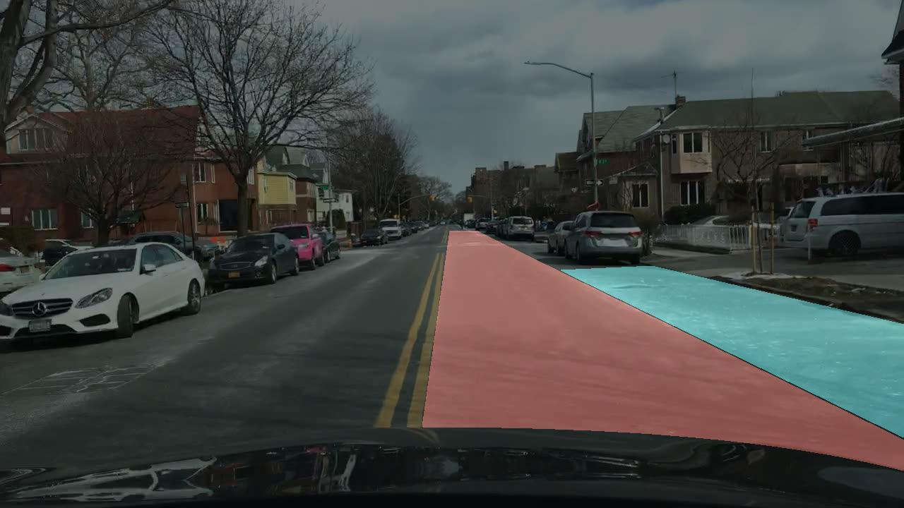

# Drivable Area Models of BDD100K

The drivable area task involves predicting a segmentation mask for each image indicating which areas are directly drivable and alternatively drivable (plus background). The directly drivable area is what the driver is currently driving on. The alternatively drivable area is a lane the driver is currently not driving on, but able to do so via changing lanes. Although the directly and alternatively drivable areas are visually indistinguishable, they are functionally different, and require
the algorithms to recognize blocking objects and scene context.



The BDD100K dataset contains drivable area annotations for 100K images (70K/10K/20K for train/val/test). Each annotation is a segmentation mask containing labels for three classes: directly drivable, alternatively drivable, and background. For details about downloading the data and the annotation format for this task, see the [official documentation](https://doc.bdd100k.com/download.html).

## Model Zoo

For training the models listed below, we follow the same procedure as for our [Semantic Segmentation](../sem_seg/README.md#model-zoo) task.
All models are trained on either 8 GeForce RTX 2080 Ti GPUs or 8 TITAN RTX GPUs with a batch size of 2x8=16.

---

### PSPNet

[Pyramid Scene Parsing Network](https://arxiv.org/abs/1612.01105) [CVPR 2017]

Authors: [Hengshuang Zhao](https://hszhao.github.io/), [Jianping Shi](https://shijianping.me/), [Xiaojuan Qi](https://xjqi.github.io/), [Xiaogang Wang](https://www.ee.cuhk.edu.hk/~xgwang/), [Jiaya Jia](https://jiaya.me/)

<details>
<summary>Abstract</summary>
Scene parsing is challenging for unrestricted open vocabulary and diverse scenes. In this paper, we exploit the capability of global context information by different-region-based context aggregation through our pyramid pooling module together with the proposed pyramid scene parsing network (PSPNet). Our global prior representation is effective to produce good quality results on the scene parsing task, while PSPNet provides a superior framework for pixel-level prediction tasks. The proposed approach achieves state-of-the-art performance on various datasets. It came first in ImageNet scene parsing challenge 2016, PASCAL VOC 2012 benchmark and Cityscapes benchmark. A single PSPNet yields new record of mIoU accuracy 85.4\% on PASCAL VOC 2012 and accuracy 80.2\% on Cityscapes.
</details>

#### Results

| Backbone | Iters |    Input    | mIoU-val |                                                  Scores-val                                                   | mIoU-test |                                                  Scores-test                                                   |                                    Config                                    |                                                                                                     Weights                                                                                                      |                                                 Preds                                                  |                                                  Visuals                                                   |
| :------: | :---: | :---------: | :------: | :-----------------------------------------------------------------------------------------------------------: | :-------: | :------------------------------------------------------------------------------------------------------------: | :--------------------------------------------------------------------------: | :--------------------------------------------------------------------------------------------------------------------------------------------------------------------------------------------------------------: | :----------------------------------------------------------------------------------------------------: | :--------------------------------------------------------------------------------------------------------: |
| R-50-D8  |  40K  | 512 \* 1024 |  83.37   | [scores](https://dl.cv.ethz.ch/bdd100k/drivable/scores-val/pspnet_r50-d8_512x1024_40k_drivable_bdd100k.json)  |   82.91   | [scores](https://dl.cv.ethz.ch/bdd100k/drivable/scores-test/pspnet_r50-d8_512x1024_40k_drivable_bdd100k.json)  | [config](./configs/drivable/pspnet_r50-d8_512x1024_40k_drivable_bdd100k.py)  |  [model](https://dl.cv.ethz.ch/bdd100k/drivable/models/pspnet_r50-d8_512x1024_40k_drivable_bdd100k.pth) \| [MD5](https://dl.cv.ethz.ch/bdd100k/drivable/models/pspnet_r50-d8_512x1024_40k_drivable_bdd100k.md5)  | [preds](https://dl.cv.ethz.ch/bdd100k/drivable/preds/pspnet_r50-d8_512x1024_40k_drivable_bdd100k.zip)  | [visuals](https://dl.cv.ethz.ch/bdd100k/drivable/visuals/pspnet_r50-d8_512x1024_40k_drivable_bdd100k.zip)  |
| R-50-D8  |  80K  | 512 \* 1024 |  83.67   | [scores](https://dl.cv.ethz.ch/bdd100k/drivable/scores-val/pspnet_r50-d8_512x1024_80k_drivable_bdd100k.json)  |   83.43   | [scores](https://dl.cv.ethz.ch/bdd100k/drivable/scores-test/pspnet_r50-d8_512x1024_80k_drivable_bdd100k.json)  | [config](./configs/drivable/pspnet_r50-d8_512x1024_80k_drivable_bdd100k.py)  |  [model](https://dl.cv.ethz.ch/bdd100k/drivable/models/pspnet_r50-d8_512x1024_80k_drivable_bdd100k.pth) \| [MD5](https://dl.cv.ethz.ch/bdd100k/drivable/models/pspnet_r50-d8_512x1024_80k_drivable_bdd100k.md5)  | [preds](https://dl.cv.ethz.ch/bdd100k/drivable/preds/pspnet_r50-d8_512x1024_80k_drivable_bdd100k.zip)  | [visuals](https://dl.cv.ethz.ch/bdd100k/drivable/visuals/pspnet_r50-d8_512x1024_80k_drivable_bdd100k.zip)  |
| R-101-D8 |  80K  | 512 \* 1024 |  84.13   | [scores](https://dl.cv.ethz.ch/bdd100k/drivable/scores-val/pspnet_r101-d8_512x1024_80k_drivable_bdd100k.json) |   83.80   | [scores](https://dl.cv.ethz.ch/bdd100k/drivable/scores-test/pspnet_r101-d8_512x1024_80k_drivable_bdd100k.json) | [config](./configs/drivable/pspnet_r101-d8_512x1024_80k_drivable_bdd100k.py) | [model](https://dl.cv.ethz.ch/bdd100k/drivable/models/pspnet_r101-d8_512x1024_80k_drivable_bdd100k.pth) \| [MD5](https://dl.cv.ethz.ch/bdd100k/drivable/models/pspnet_r101-d8_512x1024_80k_drivable_bdd100k.md5) | [preds](https://dl.cv.ethz.ch/bdd100k/drivable/preds/pspnet_r101-d8_512x1024_80k_drivable_bdd100k.zip) | [visuals](https://dl.cv.ethz.ch/bdd100k/drivable/visuals/pspnet_r101-d8_512x1024_80k_drivable_bdd100k.zip) |

[[Code](https://github.com/hszhao/PSPNet)] [[Usage Instructions](#usage)]

---

### Deeplabv3

[Rethinking Atrous Convolution for Semantic Image Segmentation](https://arxiv.org/abs/1706.05587) [CVPR 2017]

Authors: [Liang-Chieh Chen](http://liangchiehchen.com/), [George Papandreou](https://home.ttic.edu/~gpapan/), [Florian Schroff](https://www.florian-schroff.de/), [Hartwig Adam](https://research.google/people/author37870/)

<details>
<summary>Abstract</summary>
In this work, we revisit atrous convolution, a powerful tool to explicitly adjust filter's field-of-view as well as control the resolution of feature responses computed by Deep Convolutional Neural Networks, in the application of semantic image segmentation. To handle the problem of segmenting objects at multiple scales, we design modules which employ atrous convolution in cascade or in parallel to capture multi-scale context by adopting multiple atrous rates. Furthermore, we propose to augment our previously proposed Atrous Spatial Pyramid Pooling module, which probes convolutional features at multiple scales, with image-level features encoding global context and further boost performance. We also elaborate on implementation details and share our experience on training our system. The proposed'`DeepLabv3' system significantly improves over our previous DeepLab versions without DenseCRF post-processing and attains comparable performance with other state-of-art models on the PASCAL VOC 2012 semantic image segmentation benchmark.
</details>

#### Results

| Backbone | Iters |    Input    | mIoU-val |                                                    Scores-val                                                    | mIoU-test |                                                    Scores-test                                                    |                                     Config                                      |                                                                                                        Weights                                                                                                         |                                                   Preds                                                   |                                                    Visuals                                                    |
| :------: | :---: | :---------: | :------: | :--------------------------------------------------------------------------------------------------------------: | :-------: | :---------------------------------------------------------------------------------------------------------------: | :-----------------------------------------------------------------------------: | :--------------------------------------------------------------------------------------------------------------------------------------------------------------------------------------------------------------------: | :-------------------------------------------------------------------------------------------------------: | :-----------------------------------------------------------------------------------------------------------: |
| R-50-D8  |  40K  | 512 \* 1024 |  84.10   | [scores](https://dl.cv.ethz.ch/bdd100k/drivable/scores-val/deeplabv3_r50-d8_512x1024_40k_drivable_bdd100k.json)  |   83.52   | [scores](https://dl.cv.ethz.ch/bdd100k/drivable/scores-test/deeplabv3_r50-d8_512x1024_40k_drivable_bdd100k.json)  | [config](./configs/drivable/deeplabv3_r50-d8_512x1024_40k_drivable_bdd100k.py)  |  [model](https://dl.cv.ethz.ch/bdd100k/drivable/models/deeplabv3_r50-d8_512x1024_40k_drivable_bdd100k.pth) \| [MD5](https://dl.cv.ethz.ch/bdd100k/drivable/models/deeplabv3_r50-d8_512x1024_40k_drivable_bdd100k.md5)  | [preds](https://dl.cv.ethz.ch/bdd100k/drivable/preds/deeplabv3_r50-d8_512x1024_40k_drivable_bdd100k.zip)  | [visuals](https://dl.cv.ethz.ch/bdd100k/drivable/visuals/deeplabv3_r50-d8_512x1024_40k_drivable_bdd100k.zip)  |
| R-50-D8  |  80K  | 512 \* 1024 |  84.63   | [scores](https://dl.cv.ethz.ch/bdd100k/drivable/scores-val/deeplabv3_r50-d8_512x1024_80k_drivable_bdd100k.json)  |   84.14   | [scores](https://dl.cv.ethz.ch/bdd100k/drivable/scores-test/deeplabv3_r50-d8_512x1024_80k_drivable_bdd100k.json)  | [config](./configs/drivable/deeplabv3_r50-d8_512x1024_80k_drivable_bdd100k.py)  |  [model](https://dl.cv.ethz.ch/bdd100k/drivable/models/deeplabv3_r50-d8_512x1024_80k_drivable_bdd100k.pth) \| [MD5](https://dl.cv.ethz.ch/bdd100k/drivable/models/deeplabv3_r50-d8_512x1024_80k_drivable_bdd100k.md5)  | [preds](https://dl.cv.ethz.ch/bdd100k/drivable/preds/deeplabv3_r50-d8_512x1024_80k_drivable_bdd100k.zip)  | [visuals](https://dl.cv.ethz.ch/bdd100k/drivable/visuals/deeplabv3_r50-d8_512x1024_80k_drivable_bdd100k.zip)  |
| R-101-D8 |  80K  | 512 \* 1024 |  85.15   | [scores](https://dl.cv.ethz.ch/bdd100k/drivable/scores-val/deeplabv3_r101-d8_512x1024_80k_drivable_bdd100k.json) |   84.75   | [scores](https://dl.cv.ethz.ch/bdd100k/drivable/scores-test/deeplabv3_r101-d8_512x1024_80k_drivable_bdd100k.json) | [config](./configs/drivable/deeplabv3_r101-d8_512x1024_80k_drivable_bdd100k.py) | [model](https://dl.cv.ethz.ch/bdd100k/drivable/models/deeplabv3_r101-d8_512x1024_80k_drivable_bdd100k.pth) \| [MD5](https://dl.cv.ethz.ch/bdd100k/drivable/models/deeplabv3_r101-d8_512x1024_80k_drivable_bdd100k.md5) | [preds](https://dl.cv.ethz.ch/bdd100k/drivable/preds/deeplabv3_r101-d8_512x1024_80k_drivable_bdd100k.zip) | [visuals](https://dl.cv.ethz.ch/bdd100k/drivable/visuals/deeplabv3_r101-d8_512x1024_80k_drivable_bdd100k.zip) |

[[Code](https://github.com/tensorflow/models/tree/master/research/deeplab)] [[Usage Instructions](#usage)]

---

### Deeplabv3+

[Encoder-Decoder with Atrous Separable Convolution for Semantic Image Segmentation](https://arxiv.org/abs/1802.02611) [ECCV 2018]

Authors: [Liang-Chieh Chen](http://liangchiehchen.com/), [Yukun Zhu](http://www.cs.toronto.edu/~yukun/), [George Papandreou](https://home.ttic.edu/~gpapan/), [Florian Schroff](https://www.florian-schroff.de/), [Hartwig Adam](https://research.google/people/author37870/)

<details>
<summary>Abstract</summary>
Spatial pyramid pooling module or encode-decoder structure are used in deep neural networks for semantic segmentation task. The former networks are able to encode multi-scale contextual information by probing the incoming features with filters or pooling operations at multiple rates and multiple effective fields-of-view, while the latter networks can capture sharper object boundaries by gradually recovering the spatial information. In this work, we propose to combine the advantages from both methods. Specifically, our proposed model, DeepLabv3+, extends DeepLabv3 by adding a simple yet effective decoder module to refine the segmentation results especially along object boundaries. We further explore the Xception model and apply the depthwise separable convolution to both Atrous Spatial Pyramid Pooling and decoder modules, resulting in a faster and stronger encoder-decoder network. We demonstrate the effectiveness of the proposed model on PASCAL VOC 2012 and Cityscapes datasets, achieving the test set performance of 89.0\% and 82.1\% without any post-processing. Our paper is accompanied with a publicly available reference implementation of the proposed models in Tensorflow at [this https URL](https://github.com/tensorflow/models/tree/master/research/deeplab).
</details>

#### Results

| Backbone | Iters |    Input    | mIoU-val |                                                    Scores-val                                                     | mIoU-test |                                                    Scores-test                                                     |                                      Config                                      |                                                                                                         Weights                                                                                                          |                                                   Preds                                                    |                                                    Visuals                                                     |
| :------: | :---: | :---------: | :------: | :---------------------------------------------------------------------------------------------------------------: | :-------: | :----------------------------------------------------------------------------------------------------------------: | :------------------------------------------------------------------------------: | :----------------------------------------------------------------------------------------------------------------------------------------------------------------------------------------------------------------------: | :--------------------------------------------------------------------------------------------------------: | :------------------------------------------------------------------------------------------------------------: |
| R-50-D8  |  40K  | 512 \* 1024 |  84.12   | [scores](https://dl.cv.ethz.ch/bdd100k/drivable/scores-val/deeplabv3+_r50-d8_512x1024_40k_drivable_bdd100k.json)  |   83.65   | [scores](https://dl.cv.ethz.ch/bdd100k/drivable/scores-test/deeplabv3+_r50-d8_512x1024_40k_drivable_bdd100k.json)  | [config](./configs/drivable/deeplabv3+_r50-d8_512x1024_40k_drivable_bdd100k.py)  |  [model](https://dl.cv.ethz.ch/bdd100k/drivable/models/deeplabv3+_r50-d8_512x1024_40k_drivable_bdd100k.pth) \| [MD5](https://dl.cv.ethz.ch/bdd100k/drivable/models/deeplabv3+_r50-d8_512x1024_40k_drivable_bdd100k.md5)  | [preds](https://dl.cv.ethz.ch/bdd100k/drivable/preds/deeplabv3+_r50-d8_512x1024_40k_drivable_bdd100k.zip)  | [visuals](https://dl.cv.ethz.ch/bdd100k/drivable/visuals/deeplabv3+_r50-d8_512x1024_40k_drivable_bdd100k.zip)  |
| R-50-D8  |  80K  | 512 \* 1024 |  84.35   | [scores](https://dl.cv.ethz.ch/bdd100k/drivable/scores-val/deeplabv3+_r50-d8_512x1024_80k_drivable_bdd100k.json)  |   83.93   | [scores](https://dl.cv.ethz.ch/bdd100k/drivable/scores-test/deeplabv3+_r50-d8_512x1024_80k_drivable_bdd100k.json)  | [config](./configs/drivable/deeplabv3+_r50-d8_512x1024_80k_drivable_bdd100k.py)  |  [model](https://dl.cv.ethz.ch/bdd100k/drivable/models/deeplabv3+_r50-d8_512x1024_80k_drivable_bdd100k.pth) \| [MD5](https://dl.cv.ethz.ch/bdd100k/drivable/models/deeplabv3+_r50-d8_512x1024_80k_drivable_bdd100k.md5)  | [preds](https://dl.cv.ethz.ch/bdd100k/drivable/preds/deeplabv3+_r50-d8_512x1024_80k_drivable_bdd100k.zip)  | [visuals](https://dl.cv.ethz.ch/bdd100k/drivable/visuals/deeplabv3+_r50-d8_512x1024_80k_drivable_bdd100k.zip)  |
| R-101-D8 |  80K  | 512 \* 1024 |  84.73   | [scores](https://dl.cv.ethz.ch/bdd100k/drivable/scores-val/deeplabv3+_r101-d8_512x1024_80k_drivable_bdd100k.json) |   84.41   | [scores](https://dl.cv.ethz.ch/bdd100k/drivable/scores-test/deeplabv3+_r101-d8_512x1024_80k_drivable_bdd100k.json) | [config](./configs/drivable/deeplabv3+_r101-d8_512x1024_80k_drivable_bdd100k.py) | [model](https://dl.cv.ethz.ch/bdd100k/drivable/models/deeplabv3+_r101-d8_512x1024_80k_drivable_bdd100k.pth) \| [MD5](https://dl.cv.ethz.ch/bdd100k/drivable/models/deeplabv3+_r101-d8_512x1024_80k_drivable_bdd100k.md5) | [preds](https://dl.cv.ethz.ch/bdd100k/drivable/preds/deeplabv3+_r101-d8_512x1024_80k_drivable_bdd100k.zip) | [visuals](https://dl.cv.ethz.ch/bdd100k/drivable/visuals/deeplabv3+_r101-d8_512x1024_80k_drivable_bdd100k.zip) |

[[Code](https://github.com/tensorflow/models/tree/master/research/deeplab)] [[Usage Instructions](#usage)]

---

### UPerNet

[Unified Perceptual Parsing for Scene Understanding](https://arxiv.org/abs/1807.10221) [ECCV 2018]

Authors: [Tete Xiao](http://tetexiao.com), [Yingcheng Liu](https://github.com/firstmover), [Bolei Zhou](http://people.csail.mit.edu/bzhou/), [Yuning Jiang](https://yuningjiang.github.io/), [Jian Sun](http://www.jiansun.org/)

<details>
<summary>Abstract</summary>
Humans recognize the visual world at multiple levels: we effortlessly categorize scenes and detect objects inside, while also identifying the textures and surfaces of the objects along with their different compositional parts. In this paper, we study a new task called Unified Perceptual Parsing, which requires the machine vision systems to recognize as many visual concepts as possible from a given image. A multi-task framework called UPerNet and a training strategy are developed to learn from heterogeneous image annotations. We benchmark our framework on Unified Perceptual Parsing and show that it is able to effectively segment a wide range of concepts from images. The trained networks are further applied to discover visual knowledge in natural scenes. Models are available at [this https URL](https://github.com/CSAILVision/unifiedparsing).
</details>

#### Results

| Backbone | Iters |   Input    | mIoU-val |                                                  Scores-val                                                  | mIoU-test |                                                  Scores-test                                                  |                                   Config                                    |                                                                                                    Weights                                                                                                     |                                                 Preds                                                 |                                                  Visuals                                                  |
| :------: | :---: | :--------: | :------: | :----------------------------------------------------------------------------------------------------------: | :-------: | :-----------------------------------------------------------------------------------------------------------: | :-------------------------------------------------------------------------: | :------------------------------------------------------------------------------------------------------------------------------------------------------------------------------------------------------------: | :---------------------------------------------------------------------------------------------------: | :-------------------------------------------------------------------------------------------------------: |
| R-50-D8  |  40K  | 769 \* 769 |  82.65   | [scores](https://dl.cv.ethz.ch/bdd100k/drivable/scores-val/upernet_r50-d8_769x769_40k_drivable_bdd100k.json) |   82.03   | [scores](https://dl.cv.ethz.ch/bdd100k/drivable/scores-test/upernet_r50-d8_769x769_40k_drivable_bdd100k.json) | [config](./configs/drivable/upernet_r50-d8_769x769_40k_drivable_bdd100k.py) | [model](https://dl.cv.ethz.ch/bdd100k/drivable/models/upernet_r50-d8_769x769_40k_drivable_bdd100k.pth) \| [MD5](https://dl.cv.ethz.ch/bdd100k/drivable/models/upernet_r50-d8_769x769_40k_drivable_bdd100k.md5) | [preds](https://dl.cv.ethz.ch/bdd100k/drivable/preds/upernet_r50-d8_769x769_40k_drivable_bdd100k.zip) | [visuals](https://dl.cv.ethz.ch/bdd100k/drivable/visuals/upernet_r50-d8_769x769_40k_drivable_bdd100k.zip) |

[[Code](https://github.com/CSAILVision/unifiedparsing)] [[Usage Instructions](#usage)]

---

### PSANet

[PSANet: Point-wise Spatial Attention Network for Scene Parsing](https://hszhao.github.io/papers/eccv18_psanet.pdf) [ECCV 2018]

Authors: [Hengshuang Zhao\*](https://hszhao.github.io/), [Yi Zhang\*](https://scholar.google.com/citations?user=rYaif-cAAAAJ), [Shu Liu](http://shuliu.me/), [Jianping Shi](https://shijianping.me/), [Chen Change Loy](https://www.mmlab-ntu.com/person/ccloy/), [Dahua Lin](http://dahua.site/), [Jiaya Jia](https://jiaya.me/)

<details>
<summary>Abstract</summary>
Recent studies witnessed that context features can significantly improve the performance of deep semantic segmentation networks. Current context based segmentation methods differ with each other in how to construct context features and perform differently in practice. This paper firstly introduces three desirable properties of context features in segmentation task. Specially, we find that Global-guided Local Affinity (GLA) can play a vital role in constructing effective context features, while this property has been largely ignored in previous works. Based on this analysis, this paper proposes Adaptive Pyramid Context Network (APCNet) for semantic segmentation. APCNet adaptively constructs multi-scale contextual representations with multiple welldesigned Adaptive Context Modules (ACMs). Specifically, each ACM leverages a global image representation as a guidance to estimate the local affinity coefficients for each sub-region, and then calculates a context vector with these affinities. We empirically evaluate our APCNet on three semantic segmentation and scene parsing datasets, including PASCAL VOC 2012, Pascal-Context, and ADE20K dataset. Experimental results show that APCNet achieves state-ofthe-art performance on all three benchmarks, and obtains a new record 84.2\% on PASCAL VOC 2012 test set without MS COCO pre-trained and any post-processing.We notice information flow in convolutional neural networks is restricted inside local neighborhood regions due to the physical design of convolutional filters, which limits the overall understanding of complex scenes. In this paper, we propose the point-wise spatial attention network (PSANet) to relax the local neighborhood constraint. Each position on the feature map is connected to all the other ones through a self-adaptively learned attention mask. Moreover, information propagation in bi-direction for scene parsing is enabled. Information at other positions can be collected to help the prediction of the current position and vice versa, information at the current position can be distributed to assist the prediction of other ones. Our proposed approach achieves top performance on various competitive scene parsing datasets, including ADE20K, PASCAL VOC 2012 and Cityscapes, demonstrating its effectiveness and generality.
</details>

#### Results

| Backbone | Iters |    Input    | mIoU-val |                                                  Scores-val                                                  | mIoU-test |                                                  Scores-test                                                  |                                   Config                                    |                                                                                                    Weights                                                                                                     |                                                 Preds                                                 |                                                  Visuals                                                  |
| :------: | :---: | :---------: | :------: | :----------------------------------------------------------------------------------------------------------: | :-------: | :-----------------------------------------------------------------------------------------------------------: | :-------------------------------------------------------------------------: | :------------------------------------------------------------------------------------------------------------------------------------------------------------------------------------------------------------: | :---------------------------------------------------------------------------------------------------: | :-------------------------------------------------------------------------------------------------------: |
| R-50-D8  |  40K  | 512 \* 1024 |  83.65   | [scores](https://dl.cv.ethz.ch/bdd100k/drivable/scores-val/psanet_r50-d8_512x1024_40k_drivable_bdd100k.json) |   83.19   | [scores](https://dl.cv.ethz.ch/bdd100k/drivable/scores-test/psanet_r50-d8_512x1024_40k_drivable_bdd100k.json) | [config](./configs/drivable/psanet_r50-d8_512x1024_40k_drivable_bdd100k.py) | [model](https://dl.cv.ethz.ch/bdd100k/drivable/models/psanet_r50-d8_512x1024_40k_drivable_bdd100k.pth) \| [MD5](https://dl.cv.ethz.ch/bdd100k/drivable/models/psanet_r50-d8_512x1024_40k_drivable_bdd100k.md5) | [preds](https://dl.cv.ethz.ch/bdd100k/drivable/preds/psanet_r50-d8_512x1024_40k_drivable_bdd100k.zip) | [visuals](https://dl.cv.ethz.ch/bdd100k/drivable/visuals/psanet_r50-d8_512x1024_40k_drivable_bdd100k.zip) |
| R-50-D8  |  80K  | 512 \* 1024 |  83.55   | [scores](https://dl.cv.ethz.ch/bdd100k/drivable/scores-val/psanet_r50-d8_512x1024_80k_drivable_bdd100k.json) |   83.20   | [scores](https://dl.cv.ethz.ch/bdd100k/drivable/scores-test/psanet_r50-d8_512x1024_80k_drivable_bdd100k.json) | [config](./configs/drivable/psanet_r50-d8_512x1024_80k_drivable_bdd100k.py) | [model](https://dl.cv.ethz.ch/bdd100k/drivable/models/psanet_r50-d8_512x1024_80k_drivable_bdd100k.pth) \| [MD5](https://dl.cv.ethz.ch/bdd100k/drivable/models/psanet_r50-d8_512x1024_80k_drivable_bdd100k.md5) | [preds](https://dl.cv.ethz.ch/bdd100k/drivable/preds/psanet_r50-d8_512x1024_80k_drivable_bdd100k.zip) | [visuals](https://dl.cv.ethz.ch/bdd100k/drivable/visuals/psanet_r50-d8_512x1024_80k_drivable_bdd100k.zip) |

[[Code](https://github.com/hszhao/PSANet)] [[Usage Instructions](#usage)]

---

### EMANet

[Expectation-Maximization Attention Networks for Semantic Segmentation](https://arxiv.org/abs/1907.13426) [ICCV 2019]

Authors: [Xia Li](https://xialipku.github.io/), [Zhisheng Zhong](https://zs-zhong.github.io/), [Jianlong Wu](https://jlwu1992.github.io/), [Yibo Yang](https://iboing.github.io/index.html), [Zhouchen Lin](https://zhouchenlin.github.io/), [Hong Liu](https://scholar.google.com/citations?user=4CQKG8oAAAAJ)

<details>
<summary>Abstract</summary>
Self-attention mechanism has been widely used for various tasks. It is designed to compute the representation of each position by a weighted sum of the features at all positions. Thus, it can capture long-range relations for computer vision tasks. However, it is computationally consuming. Since the attention maps are computed w.r.t all other positions. In this paper, we formulate the attention mechanism into an expectation-maximization manner and iteratively estimate a much more compact set of bases upon which the attention maps are computed. By a weighted summation upon these bases, the resulting representation is low-rank and deprecates noisy information from the input. The proposed Expectation-Maximization Attention (EMA) module is robust to the variance of input and is also friendly in memory and computation. Moreover, we set up the bases maintenance and normalization methods to stabilize its training procedure. We conduct extensive experiments on popular semantic segmentation benchmarks including PASCAL VOC, PASCAL Context and COCO Stuff, on which we set new records.
</details>

#### Results

| Backbone | Iters |   Input    | mIoU-val |                                                 Scores-val                                                  | mIoU-test |                                                 Scores-test                                                  |                                   Config                                   |                                                                                                   Weights                                                                                                    |                                                Preds                                                 |                                                 Visuals                                                  |
| :------: | :---: | :--------: | :------: | :---------------------------------------------------------------------------------------------------------: | :-------: | :----------------------------------------------------------------------------------------------------------: | :------------------------------------------------------------------------: | :----------------------------------------------------------------------------------------------------------------------------------------------------------------------------------------------------------: | :--------------------------------------------------------------------------------------------------: | :------------------------------------------------------------------------------------------------------: |
| R-50-D8  |  40K  | 769 \* 769 |  82.18   | [scores](https://dl.cv.ethz.ch/bdd100k/drivable/scores-val/emanet_r50-d8_769x769_40k_drivable_bdd100k.json) |   81.36   | [scores](https://dl.cv.ethz.ch/bdd100k/drivable/scores-test/emanet_r50-d8_769x769_40k_drivable_bdd100k.json) | [config](./configs/drivable/emanet_r50-d8_769x769_40k_drivable_bdd100k.py) | [model](https://dl.cv.ethz.ch/bdd100k/drivable/models/emanet_r50-d8_769x769_40k_drivable_bdd100k.pth) \| [MD5](https://dl.cv.ethz.ch/bdd100k/drivable/models/emanet_r50-d8_769x769_40k_drivable_bdd100k.md5) | [preds](https://dl.cv.ethz.ch/bdd100k/drivable/preds/emanet_r50-d8_769x769_40k_drivable_bdd100k.zip) | [visuals](https://dl.cv.ethz.ch/bdd100k/drivable/visuals/emanet_r50-d8_769x769_40k_drivable_bdd100k.zip) |
| R-50-D8  |  80K  | 769 \* 769 |  83.14   | [scores](https://dl.cv.ethz.ch/bdd100k/drivable/scores-val/emanet_r50-d8_769x769_80k_drivable_bdd100k.json) |   82.55   | [scores](https://dl.cv.ethz.ch/bdd100k/drivable/scores-test/emanet_r50-d8_769x769_80k_drivable_bdd100k.json) | [config](./configs/drivable/emanet_r50-d8_769x769_80k_drivable_bdd100k.py) | [model](https://dl.cv.ethz.ch/bdd100k/drivable/models/emanet_r50-d8_769x769_80k_drivable_bdd100k.pth) \| [MD5](https://dl.cv.ethz.ch/bdd100k/drivable/models/emanet_r50-d8_769x769_80k_drivable_bdd100k.md5) | [preds](https://dl.cv.ethz.ch/bdd100k/drivable/preds/emanet_r50-d8_769x769_80k_drivable_bdd100k.zip) | [visuals](https://dl.cv.ethz.ch/bdd100k/drivable/visuals/emanet_r50-d8_769x769_80k_drivable_bdd100k.zip) |

[[Code](https://github.com/XiaLiPKU/EMANet)] [[Usage Instructions](#usage)]

---

### DMNet

[Dynamic Multi-scale Filters for Semantic Segmentation](https://openaccess.thecvf.com/content_ICCV_2019/papers/He_Dynamic_Multi-Scale_Filters_for_Semantic_Segmentation_ICCV_2019_paper.pdf) [ICCV 2019]

Authors: [Junjun He](https://junjun2016.github.io/), [Zhongying Deng](https://scholar.google.com/citations?user=E2o62dQAAAAJ), [Yu Qiao](http://mmlab.siat.ac.cn/yuqiao)

<details>
<summary>Abstract</summary>
Multi-scale representation provides an effective way to address scale variation of objects and stuff in semantic segmentation. Previous works construct multi-scale representation by utilizing different filter sizes, expanding filter sizes with dilated filters or pooling grids, and the parameters of these filters are fixed after training. These methods often suffer from heavy computational cost or have more parameters, and are not adaptive to the input image during inference. To address these problems, this paper proposes a Dynamic Multi-scale Network (DMNet) to adaptively capture multi-scale contents for predicting pixel-level semantic labels. DMNet is composed of multiple Dynamic Convolutional Modules (DCMs) arranged in parallel, each of which exploits context-aware filters to estimate semantic representation for a specific scale. The outputs of multiple DCMs are further integrated for final segmentation. We conduct extensive experiments to evaluate our DMNet on three challenging semantic segmentation and scene parsing datasets, PASCAL VOC 2012, Pascal-Context, and ADE20K. DMNet achieves a new record 84.4% mIoU on PASCAL VOC 2012 test set without MS COCO pre-trained and post-processing, and also obtains state-of-the-art performance on PascalContext and ADE20K.
</details>

#### Results

| Backbone | Iters |   Input    | mIoU-val |                                                 Scores-val                                                 | mIoU-test |                                                 Scores-test                                                 |                                  Config                                   |                                                                                                  Weights                                                                                                   |                                                Preds                                                |                                                 Visuals                                                 |
| :------: | :---: | :--------: | :------: | :--------------------------------------------------------------------------------------------------------: | :-------: | :---------------------------------------------------------------------------------------------------------: | :-----------------------------------------------------------------------: | :--------------------------------------------------------------------------------------------------------------------------------------------------------------------------------------------------------: | :-------------------------------------------------------------------------------------------------: | :-----------------------------------------------------------------------------------------------------: |
| R-50-D8  |  40K  | 769 \* 769 |  83.07   | [scores](https://dl.cv.ethz.ch/bdd100k/drivable/scores-val/dmnet_r50-d8_769x769_40k_drivable_bdd100k.json) |   82.39   | [scores](https://dl.cv.ethz.ch/bdd100k/drivable/scores-test/dmnet_r50-d8_769x769_40k_drivable_bdd100k.json) | [config](./configs/drivable/dmnet_r50-d8_769x769_40k_drivable_bdd100k.py) | [model](https://dl.cv.ethz.ch/bdd100k/drivable/models/dmnet_r50-d8_769x769_40k_drivable_bdd100k.pth) \| [MD5](https://dl.cv.ethz.ch/bdd100k/drivable/models/dmnet_r50-d8_769x769_40k_drivable_bdd100k.md5) | [preds](https://dl.cv.ethz.ch/bdd100k/drivable/preds/dmnet_r50-d8_769x769_40k_drivable_bdd100k.zip) | [visuals](https://dl.cv.ethz.ch/bdd100k/drivable/visuals/dmnet_r50-d8_769x769_40k_drivable_bdd100k.zip) |

[[Code](https://github.com/Junjun2016/DMNet)] [[Usage Instructions](#usage)]

---

### APCNet

[Adaptive Pyramid Context Network for Semantic Segmentation](https://openaccess.thecvf.com/content_CVPR_2019/papers/He_Adaptive_Pyramid_Context_Network_for_Semantic_Segmentation_CVPR_2019_paper.pdf) [CVPR 2019]

Authors: [Junjun He](https://junjun2016.github.io/), [Zhongying Deng](https://scholar.google.com/citations?user=E2o62dQAAAAJ), Lei Zhou, [Yali Wang](https://scholar.google.com/citations?user=hD948dkAAAAJ), [Yu Qiao](http://mmlab.siat.ac.cn/yuqiao)

<details>
<summary>Abstract</summary>
Recent studies witnessed that context features can significantly improve the performance of deep semantic segmentation networks. Current context based segmentation methods differ with each other in how to construct context features and perform differently in practice. This paper firstly introduces three desirable properties of context features in segmentation task. Specially, we find that Global-guided Local Affinity (GLA) can play a vital role in constructing effective context features, while this property has been largely ignored in previous works. Based on this analysis, this paper proposes Adaptive Pyramid Context Network (APCNet) for semantic segmentation. APCNet adaptively constructs multi-scale contextual representations with multiple welldesigned Adaptive Context Modules (ACMs). Specifically, each ACM leverages a global image representation as a guidance to estimate the local affinity coefficients for each sub-region, and then calculates a context vector with these affinities. We empirically evaluate our APCNet on three semantic segmentation and scene parsing datasets, including PASCAL VOC 2012, Pascal-Context, and ADE20K dataset. Experimental results show that APCNet achieves state-ofthe-art performance on all three benchmarks, and obtains a new record 84.2\% on PASCAL VOC 2012 test set without MS COCO pre-trained and any post-processing.
</details>

#### Results

| Backbone | Iters |    Input    | mIoU-val |                                                  Scores-val                                                  | mIoU-test |                                                  Scores-test                                                  |                                   Config                                    |                                                                                                    Weights                                                                                                     |                                                 Preds                                                 |                                                  Visuals                                                  |
| :------: | :---: | :---------: | :------: | :----------------------------------------------------------------------------------------------------------: | :-------: | :-----------------------------------------------------------------------------------------------------------: | :-------------------------------------------------------------------------: | :------------------------------------------------------------------------------------------------------------------------------------------------------------------------------------------------------------: | :---------------------------------------------------------------------------------------------------: | :-------------------------------------------------------------------------------------------------------: |
| R-50-D8  |  40K  | 512 \* 1024 |  83.39   | [scores](https://dl.cv.ethz.ch/bdd100k/drivable/scores-val/apcnet_r50-d8_512x1024_40k_drivable_bdd100k.json) |   82.90   | [scores](https://dl.cv.ethz.ch/bdd100k/drivable/scores-test/apcnet_r50-d8_512x1024_40k_drivable_bdd100k.json) | [config](./configs/drivable/apcnet_r50-d8_512x1024_40k_drivable_bdd100k.py) | [model](https://dl.cv.ethz.ch/bdd100k/drivable/models/apcnet_r50-d8_512x1024_40k_drivable_bdd100k.pth) \| [MD5](https://dl.cv.ethz.ch/bdd100k/drivable/models/apcnet_r50-d8_512x1024_40k_drivable_bdd100k.md5) | [preds](https://dl.cv.ethz.ch/bdd100k/drivable/preds/apcnet_r50-d8_512x1024_40k_drivable_bdd100k.zip) | [visuals](https://dl.cv.ethz.ch/bdd100k/drivable/visuals/apcnet_r50-d8_512x1024_40k_drivable_bdd100k.zip) |
| R-50-D8  |  80K  | 512 \* 1024 |  83.29   | [scores](https://dl.cv.ethz.ch/bdd100k/drivable/scores-val/apcnet_r50-d8_512x1024_80k_drivable_bdd100k.json) |   82.81   | [scores](https://dl.cv.ethz.ch/bdd100k/drivable/scores-test/apcnet_r50-d8_512x1024_80k_drivable_bdd100k.json) | [config](./configs/drivable/apcnet_r50-d8_512x1024_80k_drivable_bdd100k.py) | [model](https://dl.cv.ethz.ch/bdd100k/drivable/models/apcnet_r50-d8_512x1024_80k_drivable_bdd100k.pth) \| [MD5](https://dl.cv.ethz.ch/bdd100k/drivable/models/apcnet_r50-d8_512x1024_80k_drivable_bdd100k.md5) | [preds](https://dl.cv.ethz.ch/bdd100k/drivable/preds/apcnet_r50-d8_512x1024_80k_drivable_bdd100k.zip) | [visuals](https://dl.cv.ethz.ch/bdd100k/drivable/visuals/apcnet_r50-d8_512x1024_80k_drivable_bdd100k.zip) |

[[Code](https://github.com/Junjun2016/APCNet)] [[Usage Instructions](#usage)]

---

### GCNet

[GCNet: Non-local Networks Meet Squeeze-Excitation Networks and Beyond](https://arxiv.org/abs/1904.11492) [TPAMI 2020]

Authors: [Yue Cao](http://yue-cao.me), [Jiarui Xu](http://jerryxu.net), [Stephen Lin](https://scholar.google.com/citations?user=c3PYmxUAAAAJ&hl=en), [Fangyun Wei](https://scholar.google.com/citations?user=-ncz2s8AAAAJ), [Han Hu](https://sites.google.com/site/hanhushomepage/)

<details>
<summary>Abstract</summary>
The Non-Local Network (NLNet) presents a pioneering approach for capturing long-range dependencies, via aggregating query-specific global context to each query position. However, through a rigorous empirical analysis, we have found that the global contexts modeled by non-local network are almost the same for different query positions within an image. In this paper, we take advantage of this finding to create a simplified network based on a query-independent formulation, which maintains the accuracy of NLNet but with significantly less computation. We further observe that this simplified design shares similar structure with Squeeze-Excitation Network (SENet). Hence we unify them into a three-step general framework for global context modeling. Within the general framework, we design a better instantiation, called the global context (GC) block, which is lightweight and can effectively model the global context. The lightweight property allows us to apply it for multiple layers in a backbone network to construct a global context network (GCNet), which generally outperforms both simplified NLNet and SENet on major benchmarks for various recognition tasks. The code and configurations are released at [this https URL](https://github.com/xvjiarui/GCNet).
</details>

#### Results

| Backbone | Iters |   Input    | mIoU-val |                                                 Scores-val                                                 | mIoU-test |                                                 Scores-test                                                 |                                  Config                                   |                                                                                                  Weights                                                                                                   |                                                Preds                                                |                                                 Visuals                                                 |
| :------: | :---: | :--------: | :------: | :--------------------------------------------------------------------------------------------------------: | :-------: | :---------------------------------------------------------------------------------------------------------: | :-----------------------------------------------------------------------: | :--------------------------------------------------------------------------------------------------------------------------------------------------------------------------------------------------------: | :-------------------------------------------------------------------------------------------------: | :-----------------------------------------------------------------------------------------------------: |
| R-50-D8  |  40K  | 769 \* 769 |  82.95   | [scores](https://dl.cv.ethz.ch/bdd100k/drivable/scores-val/gcnet_r50-d8_769x769_40k_drivable_bdd100k.json) |   82.08   | [scores](https://dl.cv.ethz.ch/bdd100k/drivable/scores-test/gcnet_r50-d8_769x769_40k_drivable_bdd100k.json) | [config](./configs/drivable/gcnet_r50-d8_769x769_40k_drivable_bdd100k.py) | [model](https://dl.cv.ethz.ch/bdd100k/drivable/models/gcnet_r50-d8_769x769_40k_drivable_bdd100k.pth) \| [MD5](https://dl.cv.ethz.ch/bdd100k/drivable/models/gcnet_r50-d8_769x769_40k_drivable_bdd100k.md5) | [preds](https://dl.cv.ethz.ch/bdd100k/drivable/preds/gcnet_r50-d8_769x769_40k_drivable_bdd100k.zip) | [visuals](https://dl.cv.ethz.ch/bdd100k/drivable/visuals/gcnet_r50-d8_769x769_40k_drivable_bdd100k.zip) |

[[Code](https://github.com/xvjiarui/GCNet)] [[Usage Instructions](#usage)]

---

### HRNet

[Deep High-Resolution Representation Learning for Visual Recognition](https://arxiv.org/abs/1908.07919) [CVPR 2019 / TPAMI 2020]

Authors: [Jingdong Wang](https://jingdongwang2017.github.io/), [Ke Sun](https://github.com/sunke123), [Tianheng Cheng](https://scholar.google.com/citations?user=PH8rJHYAAAAJ), Borui Jiang, Chaorui Deng, [Yang Zhao](https://yangyangkiki.github.io/), Dong Liu, [Yadong Mu](http://www.muyadong.com/), Mingkui Tan, [Xinggang Wang](https://xinggangw.info/), [Wenyu Liu](http://eic.hust.edu.cn/professor/liuwenyu/), [Bin Xiao](https://www.microsoft.com/en-us/research/people/bixi/)

<details>
<summary>Abstract</summary>
High-resolution representations are essential for position-sensitive vision problems, such as human pose estimation, semantic segmentation, and object detection. Existing state-of-the-art frameworks first encode the input image as a low-resolution representation through a subnetwork that is formed by connecting high-to-low resolution convolutions in series (e.g., ResNet, VGGNet), and then recover the high-resolution representation from the encoded low-resolution representation. Instead, our proposed network, named as High-Resolution Network (HRNet), maintains high-resolution representations through the whole process. There are two key characteristics: (i) Connect the high-to-low resolution convolution streams in parallel; (ii) Repeatedly exchange the information across resolutions. The benefit is that the resulting representation is semantically richer and spatially more precise. We show the superiority of the proposed HRNet in a wide range of applications, including human pose estimation, semantic segmentation, and object detection, suggesting that the HRNet is a stronger backbone for computer vision problems. All the codes are available at [this https URL](https://github.com/HRNet).
</details>

#### Results

| Backbone | Iters |    Input    | mIoU-val |                                               Scores-val                                                | mIoU-test |                                               Scores-test                                                |                                 Config                                 |                                                                                               Weights                                                                                                |                                              Preds                                               |                                               Visuals                                                |
| :------: | :---: | :---------: | :------: | :-----------------------------------------------------------------------------------------------------: | :-------: | :------------------------------------------------------------------------------------------------------: | :--------------------------------------------------------------------: | :--------------------------------------------------------------------------------------------------------------------------------------------------------------------------------------------------: | :----------------------------------------------------------------------------------------------: | :--------------------------------------------------------------------------------------------------: |
| HRNet48  |  40K  | 512 \* 1024 |  83.24   | [scores](https://dl.cv.ethz.ch/bdd100k/drivable/scores-val/fcn_hr48_512x1024_40k_drivable_bdd100k.json) |   82.70   | [scores](https://dl.cv.ethz.ch/bdd100k/drivable/scores-test/fcn_hr48_512x1024_40k_drivable_bdd100k.json) | [config](./configs/drivable/fcn_hr48_512x1024_40k_drivable_bdd100k.py) | [model](https://dl.cv.ethz.ch/bdd100k/drivable/models/fcn_hr48_512x1024_40k_drivable_bdd100k.pth) \| [MD5](https://dl.cv.ethz.ch/bdd100k/drivable/models/fcn_hr48_512x1024_40k_drivable_bdd100k.md5) | [preds](https://dl.cv.ethz.ch/bdd100k/drivable/preds/fcn_hr48_512x1024_40k_drivable_bdd100k.zip) | [visuals](https://dl.cv.ethz.ch/bdd100k/drivable/visuals/fcn_hr48_512x1024_40k_drivable_bdd100k.zip) |
| HRNet48  |  80K  | 512 \* 1024 |  83.27   | [scores](https://dl.cv.ethz.ch/bdd100k/drivable/scores-val/fcn_hr48_512x1024_80k_drivable_bdd100k.json) |   82.87   | [scores](https://dl.cv.ethz.ch/bdd100k/drivable/scores-test/fcn_hr48_512x1024_80k_drivable_bdd100k.json) | [config](./configs/drivable/fcn_hr48_512x1024_80k_drivable_bdd100k.py) | [model](https://dl.cv.ethz.ch/bdd100k/drivable/models/fcn_hr48_512x1024_80k_drivable_bdd100k.pth) \| [MD5](https://dl.cv.ethz.ch/bdd100k/drivable/models/fcn_hr48_512x1024_80k_drivable_bdd100k.md5) | [preds](https://dl.cv.ethz.ch/bdd100k/drivable/preds/fcn_hr48_512x1024_80k_drivable_bdd100k.zip) | [visuals](https://dl.cv.ethz.ch/bdd100k/drivable/visuals/fcn_hr48_512x1024_80k_drivable_bdd100k.zip) |

[[Code](https://github.com/HRNet)] [[Usage Instructions](#usage)]

---

### CCNet

[CCNet: Criss-Cross Attention for Semantic Segmentation](https://arxiv.org/abs/1811.11721) [ICCV 2019 / TPAMI 2020]

Authors: [Zilong Huang](https://speedinghzl.github.io/), [Xinggang Wang](https://xinggangw.info/), [Yunchao Wei](https://weiyc.github.io/), [Lichao Huang](https://www.linkedin.com/in/alanhuang1990/), [Humphrey Shi](https://www.humphreyshi.com/), [Wenyu Liu](http://eic.hust.edu.cn/professor/liuwenyu/), [Thomas S. Huang](http://ifp-uiuc.github.io/)

<details>
<summary>Abstract</summary>
Contextual information is vital in visual understanding problems, such as semantic segmentation and object detection. We propose a Criss-Cross Network (CCNet) for obtaining full-image contextual information in a very effective and efficient way. Concretely, for each pixel, a novel criss-cross attention module harvests the contextual information of all the pixels on its criss-cross path. By taking a further recurrent operation, each pixel can finally capture the full-image dependencies. Besides, a category consistent loss is proposed to enforce the criss-cross attention module to produce more discriminative features. Overall, CCNet is with the following merits: 1) GPU memory friendly. Compared with the non-local block, the proposed recurrent criss-cross attention module requires 11x less GPU memory usage. 2) High computational efficiency. The recurrent criss-cross attention significantly reduces FLOPs by about 85% of the non-local block. 3) The state-of-the-art performance. We conduct extensive experiments on semantic segmentation benchmarks including Cityscapes, ADE20K, human parsing benchmark LIP, instance segmentation benchmark COCO, video segmentation benchmark CamVid. In particular, our CCNet achieves the mIoU scores of 81.9%, 45.76% and 55.47% on the Cityscapes test set, the ADE20K validation set and the LIP validation set respectively, which are the new state-of-the-art results. The source codes are available at [this https URL](https://github.com/speedinghzl/CCNet).
</details>

#### Results

| Backbone | Iters |    Input    | mIoU-val |                                                  Scores-val                                                  | mIoU-test |                                                  Scores-test                                                  |                                   Config                                    |                                                                                                    Weights                                                                                                     |                                                 Preds                                                 |                                                  Visuals                                                  |
| :------: | :---: | :---------: | :------: | :----------------------------------------------------------------------------------------------------------: | :-------: | :-----------------------------------------------------------------------------------------------------------: | :-------------------------------------------------------------------------: | :------------------------------------------------------------------------------------------------------------------------------------------------------------------------------------------------------------: | :---------------------------------------------------------------------------------------------------: | :-------------------------------------------------------------------------------------------------------: |
| R-50-D8  |  40K  | 512 \* 1024 |  83.69   | [scores](https://dl.cv.ethz.ch/bdd100k/drivable/scores-val/ccnet_r50-d8_512x1024_40k_drivable_bdd100k.json)  |   83.32   | [scores](https://dl.cv.ethz.ch/bdd100k/drivable/scores-test/ccnet_r50-d8_512x1024_40k_drivable_bdd100k.json)  | [config](./configs/drivable/ccnet_r50-d8_512x1024_40k_drivable_bdd100k.py)  |  [model](https://dl.cv.ethz.ch/bdd100k/drivable/models/ccnet_r50-d8_512x1024_40k_drivable_bdd100k.pth) \| [MD5](https://dl.cv.ethz.ch/bdd100k/drivable/models/ccnet_r50-d8_512x1024_40k_drivable_bdd100k.md5)  | [preds](https://dl.cv.ethz.ch/bdd100k/drivable/preds/ccnet_r50-d8_512x1024_40k_drivable_bdd100k.zip)  | [visuals](https://dl.cv.ethz.ch/bdd100k/drivable/visuals/ccnet_r50-d8_512x1024_40k_drivable_bdd100k.zip)  |
| R-50-D8  |  80K  | 512 \* 1024 |  84.18   | [scores](https://dl.cv.ethz.ch/bdd100k/drivable/scores-val/ccnet_r50-d8_512x1024_80k_drivable_bdd100k.json)  |   83.86   | [scores](https://dl.cv.ethz.ch/bdd100k/drivable/scores-test/ccnet_r50-d8_512x1024_80k_drivable_bdd100k.json)  | [config](./configs/drivable/ccnet_r50-d8_512x1024_80k_drivable_bdd100k.py)  |  [model](https://dl.cv.ethz.ch/bdd100k/drivable/models/ccnet_r50-d8_512x1024_80k_drivable_bdd100k.pth) \| [MD5](https://dl.cv.ethz.ch/bdd100k/drivable/models/ccnet_r50-d8_512x1024_80k_drivable_bdd100k.md5)  | [preds](https://dl.cv.ethz.ch/bdd100k/drivable/preds/ccnet_r50-d8_512x1024_80k_drivable_bdd100k.zip)  | [visuals](https://dl.cv.ethz.ch/bdd100k/drivable/visuals/ccnet_r50-d8_512x1024_80k_drivable_bdd100k.zip)  |
| R-101-D8 |  80K  | 512 \* 1024 |  84.17   | [scores](https://dl.cv.ethz.ch/bdd100k/drivable/scores-val/ccnet_r101-d8_512x1024_80k_drivable_bdd100k.json) |   83.66   | [scores](https://dl.cv.ethz.ch/bdd100k/drivable/scores-test/ccnet_r101-d8_512x1024_80k_drivable_bdd100k.json) | [config](./configs/drivable/ccnet_r101-d8_512x1024_80k_drivable_bdd100k.py) | [model](https://dl.cv.ethz.ch/bdd100k/drivable/models/ccnet_r101-d8_512x1024_80k_drivable_bdd100k.pth) \| [MD5](https://dl.cv.ethz.ch/bdd100k/drivable/models/ccnet_r101-d8_512x1024_80k_drivable_bdd100k.md5) | [preds](https://dl.cv.ethz.ch/bdd100k/drivable/preds/ccnet_r101-d8_512x1024_80k_drivable_bdd100k.zip) | [visuals](https://dl.cv.ethz.ch/bdd100k/drivable/visuals/ccnet_r101-d8_512x1024_80k_drivable_bdd100k.zip) |

[[Code](https://github.com/speedinghzl/CCNet)] [[Usage Instructions](#usage)]

---

### DNLNet

[Disentangled Non-Local Neural Networks](https://arxiv.org/abs/2006.06668) [ECCV 2020]

Authors: [Minghao Yin](https://scholar.google.com/citations?user=QAeUfiIAAAAJ), [Zhuliang Yao](https://scholar.google.com/citations?user=J3kgC1QAAAAJ), [Yue Cao](http://yue-cao.me), [Xiu Li](https://scholar.google.com/citations?user=Xrh1OIUAAAAJ), [Zheng Zhang](https://stupidzz.github.io/), [Stephen Lin](https://scholar.google.com/citations?user=c3PYmxUAAAAJ&hl=en), [Han Hu](https://sites.google.com/site/hanhushomepage/)

<details>
<summary>Abstract</summary>
The non-local block is a popular module for strengthening the context modeling ability of a regular convolutional neural network. This paper first studies the non-local block in depth, where we find that its attention computation can be split into two terms, a whitened pairwise term accounting for the relationship between two pixels and a unary term representing the saliency of every pixel. We also observe that the two terms trained alone tend to model different visual clues, e.g. the whitened pairwise term learns within-region relationships while the unary term learns salient boundaries. However, the two terms are tightly coupled in the non-local block, which hinders the learning of each. Based on these findings, we present the disentangled non-local block, where the two terms are decoupled to facilitate learning for both terms. We demonstrate the effectiveness of the decoupled design on various tasks, such as semantic segmentation on Cityscapes, ADE20K and PASCAL Context, object detection on COCO, and action recognition on Kinetics.
</details>

#### Results

| Backbone | Iters |    Input    | mIoU-val |                                                 Scores-val                                                 | mIoU-test |                                                 Scores-test                                                 |                                  Config                                   |                                                                                                  Weights                                                                                                   |                                                Preds                                                |                                                 Visuals                                                 |
| :------: | :---: | :---------: | :------: | :--------------------------------------------------------------------------------------------------------: | :-------: | :---------------------------------------------------------------------------------------------------------: | :-----------------------------------------------------------------------: | :--------------------------------------------------------------------------------------------------------------------------------------------------------------------------------------------------------: | :-------------------------------------------------------------------------------------------------: | :-----------------------------------------------------------------------------------------------------: |
| R-50-D8  |  40K  | 512 \* 1024 |  84.21   | [scores](https://dl.cv.ethz.ch/bdd100k/drivable/scores-val/dnl_r50-d8_512x1024_40k_drivable_bdd100k.json)  |   83.70   | [scores](https://dl.cv.ethz.ch/bdd100k/drivable/scores-test/dnl_r50-d8_512x1024_40k_drivable_bdd100k.json)  | [config](./configs/drivable/dnl_r50-d8_512x1024_40k_drivable_bdd100k.py)  |  [model](https://dl.cv.ethz.ch/bdd100k/drivable/models/dnl_r50-d8_512x1024_40k_drivable_bdd100k.pth) \| [MD5](https://dl.cv.ethz.ch/bdd100k/drivable/models/dnl_r50-d8_512x1024_40k_drivable_bdd100k.md5)  | [preds](https://dl.cv.ethz.ch/bdd100k/drivable/preds/dnl_r50-d8_512x1024_40k_drivable_bdd100k.zip)  | [visuals](https://dl.cv.ethz.ch/bdd100k/drivable/visuals/dnl_r50-d8_512x1024_40k_drivable_bdd100k.zip)  |
| R-50-D8  |  80K  | 512 \* 1024 |  84.76   | [scores](https://dl.cv.ethz.ch/bdd100k/drivable/scores-val/dnl_r50-d8_512x1024_80k_drivable_bdd100k.json)  |   84.27   | [scores](https://dl.cv.ethz.ch/bdd100k/drivable/scores-test/dnl_r50-d8_512x1024_80k_drivable_bdd100k.json)  | [config](./configs/drivable/dnl_r50-d8_512x1024_80k_drivable_bdd100k.py)  |  [model](https://dl.cv.ethz.ch/bdd100k/drivable/models/dnl_r50-d8_512x1024_80k_drivable_bdd100k.pth) \| [MD5](https://dl.cv.ethz.ch/bdd100k/drivable/models/dnl_r50-d8_512x1024_80k_drivable_bdd100k.md5)  | [preds](https://dl.cv.ethz.ch/bdd100k/drivable/preds/dnl_r50-d8_512x1024_80k_drivable_bdd100k.zip)  | [visuals](https://dl.cv.ethz.ch/bdd100k/drivable/visuals/dnl_r50-d8_512x1024_80k_drivable_bdd100k.zip)  |
| R-101-D8 |  80K  | 512 \* 1024 |  84.35   | [scores](https://dl.cv.ethz.ch/bdd100k/drivable/scores-val/dnl_r101-d8_512x1024_80k_drivable_bdd100k.json) |   83.84   | [scores](https://dl.cv.ethz.ch/bdd100k/drivable/scores-test/dnl_r101-d8_512x1024_80k_drivable_bdd100k.json) | [config](./configs/drivable/dnl_r101-d8_512x1024_80k_drivable_bdd100k.py) | [model](https://dl.cv.ethz.ch/bdd100k/drivable/models/dnl_r101-d8_512x1024_80k_drivable_bdd100k.pth) \| [MD5](https://dl.cv.ethz.ch/bdd100k/drivable/models/dnl_r101-d8_512x1024_80k_drivable_bdd100k.md5) | [preds](https://dl.cv.ethz.ch/bdd100k/drivable/preds/dnl_r101-d8_512x1024_80k_drivable_bdd100k.zip) | [visuals](https://dl.cv.ethz.ch/bdd100k/drivable/visuals/dnl_r101-d8_512x1024_80k_drivable_bdd100k.zip) |

[[Code](https://github.com/yinmh17/DNL-Semantic-Segmentation)] [[Usage Instructions](#usage)]

---

## Install

a. Create a conda virtual environment and activate it.

```shell
conda create -n bdd100k-mmseg python=3.8
conda activate bdd100k-mmseg
```

b. Install PyTorch and torchvision following the [official instructions](https://pytorch.org/), e.g.,

```shell
conda install pytorch torchvision -c pytorch
```

Note: Make sure that your compilation CUDA version and runtime CUDA version match.
You can check the supported CUDA version for precompiled packages on the [PyTorch website](https://pytorch.org/).

c. Install mmcv and mmsegmentation.

```shell
pip install mmcv-full
pip install mmsegmentation
```

You can also refer to the [official installation instructions](https://github.com/open-mmlab/mmsegmentation/blob/master/docs/get_started.md#installation).

## Usage

### Model Inference

Single GPU inference:

```shell
python ./test.py ${CONFIG_FILE} --format-only --format-dir ${OUTPUT_DIR} [--options]
```

Multiple GPU inference:

```shell
CUDA_VISIBLE_DEVICES=0,1,2,3 python -m torch.distributed.launch \
    --nproc_per_node=4 --master_port=12000 ./test.py $CFG_FILE \
    --format-only --format-dir ${OUTPUT_DIR} [--options] \
    --launcher pytorch
```

Note: This will save 10K bitmasks for the validation set or 20K bitmasks for the test set to `${OUTPUT_DIR}`.

### Output Evaluation

#### Validation Set

To evaluate the drivable area performance on the BDD100K validation set, you can follow the official evaluation [scripts](https://doc.bdd100k.com/evaluate.html) provided by BDD100K:

```bash
python -m bdd100k.eval.run -t drivable \
    -g ../data/bdd100k/labels/drivable/masks/${SET_NAME} \
    -r ${OUTPUT_DIR} [--out-file ${RESULTS_FILE}] [--nproc ${NUM_PROCESS}]
```

#### Test Set

You can obtain the performance on the BDD100K test set by submitting your model predictions to our [evaluation server](https://eval.ai/web/challenges/challenge-page/1280) hosted on EvalAI.

### Colorful Visualization

For visualization, please follow the official colorize scripts provided by bdd100k [scripts](https://doc.bdd100k.com/format.html#to-color).

To colorize the bitmasks, you can run:

```bash
python -m bdd100k.label.to_color -m drivable -i ${OUTPUT_DIR} \
    -o ${COLOR_DIR} [--nproc ${NUM_PROCESS}]
```

Afterwards, you can use our provided visualization script to overlay the colorized bitmasks on the original images:

```bash
python vis.py -i ../data/bdd100k/images/100k/${SET_NAME} -c ${COLOR_DIR} \
    -o ${VIS_DIR} -n 1000 [--nproc ${NUM_PROCESS}]
```

## Contribution

**You can include your models in this repo as well!** Please follow the [contribution](../doc/CONTRIBUTING.md) instructions.
