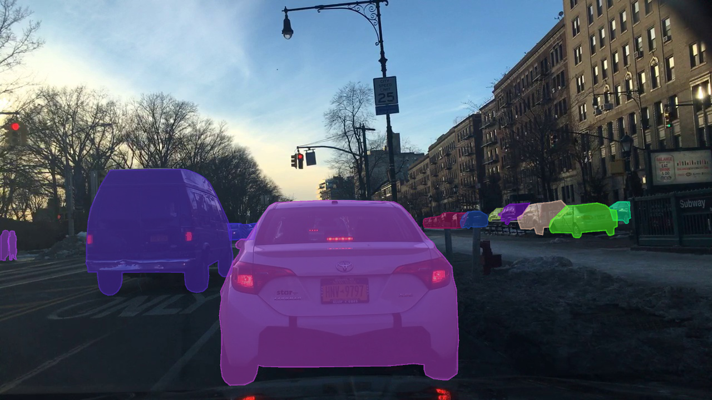

# Instance Segmentation Models of BDD100K

The instance segmentation task involves detecting and segmenting each distinct object of interest in the scene.



The BDD100K dataset contains object segmentation annotations for 10K images (7K/1K/2K for train/val/test). Each annotation contains labels for 8 object classes. For details about downloading the data and the annotation format for this task, see the [official documentation](https://doc.bdd100k.com/download.html).

## Model Zoo

For training the models listed below, we follow the common settings used by MMDetection (details [here](https://github.com/open-mmlab/mmdetection/blob/master/docs/model_zoo.md#common-settings)), unless otherwise stated.
All models are trained on either 8 GeForce RTX 2080 Ti GPUs or 8 TITAN RTX GPUs with a batch size of 2x8=16.
See the config files for the detailed setting for each model.

---

### Mask R-CNN

[Mask R-CNN](https://arxiv.org/abs/1703.06870) [ICCV 2017]

Authors: [Kaiming He](http://kaiminghe.com/), [Georgia Gkioxari](https://gkioxari.github.io/), [Piotr Dollár](https://pdollar.github.io/), [Ross Girshick](https://www.rossgirshick.info/)

<details>
<summary>Abstract</summary>
We present a conceptually simple, flexible, and general framework for object instance segmentation. Our approach efficiently detects objects in an image while simultaneously generating a high-quality segmentation mask for each instance. The method, called Mask R-CNN, extends Faster R-CNN by adding a branch for predicting an object mask in parallel with the existing branch for bounding box recognition. Mask R-CNN is simple to train and adds only a small overhead to Faster R-CNN, running at 5 fps. Moreover, Mask R-CNN is easy to generalize to other tasks, e.g., allowing us to estimate human poses in the same framework. We show top results in all three tracks of the COCO suite of challenges, including instance segmentation, bounding-box object detection, and person keypoint detection. Without bells and whistles, Mask R-CNN outperforms all existing, single-model entries on every task, including the COCO 2016 challenge winners. We hope our simple and effective approach will serve as a solid baseline and help ease future research in instance-level recognition. Code has been made available at: [this https URL](https://github.com/facebookresearch/detectron2).
</details>

#### Results

| Backbone | Batch Size | Lr schd | MS-train | Mask AP-val | Box AP-val | Scores-val | Mask AP-test | Box AP-test | Scores-test | Config | Weights | Preds | Visuals |
| :-: | :-: | :-: | :-: | :-: | :-: | :-: | :-: | :-: | :-: | :-: | :-: | :-: | :-: |
| R-50-FPN | 16 | 1x |  | 16.24 | 22.34 | [scores](https://dl.cv.ethz.ch/bdd100k/ins_seg/scores-val/mask_rcnn_r50_fpn_1x_ins_seg_bdd100k.json) | 14.86 |  19.59 |[scores](https://dl.cv.ethz.ch/bdd100k/ins_seg/scores-test/mask_rcnn_r50_fpn_1x_ins_seg_bdd100k.json) | [config](./configs/ins_seg/mask_rcnn_r50_fpn_1x_ins_seg_bdd100k.py) | [model](https://dl.cv.ethz.ch/bdd100k/ins_seg/models/mask_rcnn_r50_fpn_1x_ins_seg_bdd100k.pth) \| [MD5](https://dl.cv.ethz.ch/bdd100k/ins_seg/models/mask_rcnn_r50_fpn_1x_ins_seg_bdd100k.md5) | [preds](https://dl.cv.ethz.ch/bdd100k/ins_seg/preds/mask_rcnn_r50_fpn_1x_ins_seg_bdd100k.zip) | [visuals](https://dl.cv.ethz.ch/bdd100k/ins_seg/visuals/mask_rcnn_r50_fpn_1x_ins_seg_bdd100k.zip) |
| R-50-FPN | 16 | 3x | ✓ | 19.88 | 25.93 | [scores](https://dl.cv.ethz.ch/bdd100k/ins_seg/scores-val/mask_rcnn_r50_fpn_3x_ins_seg_bdd100k.json) | 17.46 |  22.32 |[scores](https://dl.cv.ethz.ch/bdd100k/ins_seg/scores-test/mask_rcnn_r50_fpn_3x_ins_seg_bdd100k.json) | [config](./configs/ins_seg/mask_rcnn_r50_fpn_3x_ins_seg_bdd100k.py) | [model](https://dl.cv.ethz.ch/bdd100k/ins_seg/models/mask_rcnn_r50_fpn_3x_ins_seg_bdd100k.pth) \| [MD5](https://dl.cv.ethz.ch/bdd100k/ins_seg/models/mask_rcnn_r50_fpn_3x_ins_seg_bdd100k.md5) | [preds](https://dl.cv.ethz.ch/bdd100k/ins_seg/preds/mask_rcnn_r50_fpn_3x_ins_seg_bdd100k.zip) | [visuals](https://dl.cv.ethz.ch/bdd100k/ins_seg/visuals/mask_rcnn_r50_fpn_3x_ins_seg_bdd100k.zip) |
| R-101-FPN | 16 | 3x | ✓ | 20.51 | 26.08 | [scores](https://dl.cv.ethz.ch/bdd100k/ins_seg/scores-val/mask_rcnn_r101_fpn_3x_ins_seg_bdd100k.json) | 17.88 |  22.01 |[scores](https://dl.cv.ethz.ch/bdd100k/ins_seg/scores-test/mask_rcnn_r101_fpn_3x_ins_seg_bdd100k.json) | [config](./configs/ins_seg/mask_rcnn_r101_fpn_3x_ins_seg_bdd100k.py) | [model](https://dl.cv.ethz.ch/bdd100k/ins_seg/models/mask_rcnn_r101_fpn_3x_ins_seg_bdd100k.pth) \| [MD5](https://dl.cv.ethz.ch/bdd100k/ins_seg/models/mask_rcnn_r101_fpn_3x_ins_seg_bdd100k.md5) | [preds](https://dl.cv.ethz.ch/bdd100k/ins_seg/preds/mask_rcnn_r101_fpn_3x_ins_seg_bdd100k.zip) | [visuals](https://dl.cv.ethz.ch/bdd100k/ins_seg/visuals/mask_rcnn_r101_fpn_3x_ins_seg_bdd100k.zip) |
| R-50-FPN | 32 | 1x |  | 16.15 | 21.54 | [scores](https://dl.cv.ethz.ch/bdd100k/ins_seg/scores-val/mask_rcnn_r50_fpn_1x_32bs_ins_seg_bdd100k.json) | 14.90 |  19.24 |[scores](https://dl.cv.ethz.ch/bdd100k/ins_seg/scores-test/mask_rcnn_r50_fpn_1x_32bs_ins_seg_bdd100k.json) | [config](./configs/ins_seg/mask_rcnn_r50_fpn_1x_32bs_ins_seg_bdd100k.py) | [model](https://dl.cv.ethz.ch/bdd100k/ins_seg/models/mask_rcnn_r50_fpn_1x_32bs_ins_seg_bdd100k.pth) \| [MD5](https://dl.cv.ethz.ch/bdd100k/ins_seg/models/mask_rcnn_r50_fpn_1x_32bs_ins_seg_bdd100k.md5) | [preds](https://dl.cv.ethz.ch/bdd100k/ins_seg/preds/mask_rcnn_r50_fpn_1x_32bs_ins_seg_bdd100k.zip) | [visuals](https://dl.cv.ethz.ch/bdd100k/ins_seg/visuals/mask_rcnn_r50_fpn_1x_32bs_ins_seg_bdd100k.zip) |
| R-50-FPN | 32 | 3x | ✓ | 20.20 | 26.14 | [scores](https://dl.cv.ethz.ch/bdd100k/ins_seg/scores-val/mask_rcnn_r50_fpn_3x_32bs_ins_seg_bdd100k.json) | 17.60 |  22.03 |[scores](https://dl.cv.ethz.ch/bdd100k/ins_seg/scores-test/mask_rcnn_r50_fpn_3x_32bs_ins_seg_bdd100k.json) | [config](./configs/ins_seg/mask_rcnn_r50_fpn_3x_32bs_ins_seg_bdd100k.py) | [model](https://dl.cv.ethz.ch/bdd100k/ins_seg/models/mask_rcnn_r50_fpn_3x_32bs_ins_seg_bdd100k.pth) \| [MD5](https://dl.cv.ethz.ch/bdd100k/ins_seg/models/mask_rcnn_r50_fpn_3x_32bs_ins_seg_bdd100k.md5) | [preds](https://dl.cv.ethz.ch/bdd100k/ins_seg/preds/mask_rcnn_r50_fpn_3x_32bs_ins_seg_bdd100k.zip) | [visuals](https://dl.cv.ethz.ch/bdd100k/ins_seg/visuals/mask_rcnn_r50_fpn_3x_32bs_ins_seg_bdd100k.zip) |
| R-101-FPN | 32 | 3x | ✓ | 20.48 | 25.70 | [scores](https://dl.cv.ethz.ch/bdd100k/ins_seg/scores-val/mask_rcnn_r101_fpn_3x_32bs_ins_seg_bdd100k.json) | 17.71 |  21.94 |[scores](https://dl.cv.ethz.ch/bdd100k/ins_seg/scores-test/mask_rcnn_r101_fpn_3x_32bs_ins_seg_bdd100k.json) | [config](./configs/ins_seg/mask_rcnn_r101_fpn_3x_32bs_ins_seg_bdd100k.py) | [model](https://dl.cv.ethz.ch/bdd100k/ins_seg/models/mask_rcnn_r101_fpn_3x_32bs_ins_seg_bdd100k.pth) \| [MD5](https://dl.cv.ethz.ch/bdd100k/ins_seg/models/mask_rcnn_r101_fpn_3x_32bs_ins_seg_bdd100k.md5) | [preds](https://dl.cv.ethz.ch/bdd100k/ins_seg/preds/mask_rcnn_r101_fpn_3x_32bs_ins_seg_bdd100k.zip) | [visuals](https://dl.cv.ethz.ch/bdd100k/ins_seg/visuals/mask_rcnn_r101_fpn_3x_32bs_ins_seg_bdd100k.zip) |

[[Code](https://github.com/facebookresearch/detectron2)] [[Usage Instructions](#usage)]

---

### Cascade Mask R-CNN

[Cascade R-CNN: High Quality Object Detection and Instance Segmentation](https://arxiv.org/abs/1703.06870) [TPAMI 2019]

Authors: [Zhaowei Cai](https://zhaoweicai.github.io/), [Nuno Vasconcelos](http://www.svcl.ucsd.edu/~nuno/)

<details>
<summary>Abstract</summary>
In object detection, the intersection over union (IoU) threshold is frequently used to define positives/negatives. The threshold used to train a detector defines its quality. While the commonly used threshold of 0.5 leads to noisy (low-quality) detections, detection performance frequently degrades for larger thresholds. This paradox of high-quality detection has two causes: 1) overfitting, due to vanishing positive samples for large thresholds, and 2) inference-time quality mismatch between detector and test hypotheses. A multi-stage object detection architecture, the Cascade R-CNN, composed of a sequence of detectors trained with increasing IoU thresholds, is proposed to address these problems. The detectors are trained sequentially, using the output of a detector as training set for the next. This resampling progressively improves hypotheses quality, guaranteeing a positive training set of equivalent size for all detectors and minimizing overfitting. The same cascade is applied at inference, to eliminate quality mismatches between hypotheses and detectors. An implementation of the Cascade R-CNN without bells or whistles achieves state-of-the-art performance on the COCO dataset, and significantly improves high-quality detection on generic and specific object detection datasets, including VOC, KITTI, CityPerson, and WiderFace. Finally, the Cascade R-CNN is generalized to instance segmentation, with nontrivial improvements over the Mask R-CNN. To facilitate future research, two implementations are made available at [this https URL](https://github.com/zhaoweicai/cascade-rcnn) (Caffe) and [this https URL](https://github.com/zhaoweicai/Detectron-Cascade-RCNN) (Detectron).
</details>

#### Results

| Backbone | Batch Size | Lr schd | MS-train | Mask AP-val | Box AP-val | Scores-val | Mask AP-test | Box AP-test | Scores-test | Config | Weights | Preds | Visuals |
| :-: | :-: | :-: | :-: | :-: | :-: | :-: | :-: | :-: | :-: | :-: | :-: | :-: | :-: |
| R-50-FPN | 16 | 1x |  | 18.63 | 25.97 | [scores](https://dl.cv.ethz.ch/bdd100k/ins_seg/scores-val/cascade_mask_rcnn_r50_fpn_1x_ins_seg_bdd100k.json) | 15.89 |  21.55 |[scores](https://dl.cv.ethz.ch/bdd100k/ins_seg/scores-test/cascade_mask_rcnn_r50_fpn_1x_ins_seg_bdd100k.json) | [config](./configs/ins_seg/cascade_mask_rcnn_r50_fpn_1x_ins_seg_bdd100k.py) | [model](https://dl.cv.ethz.ch/bdd100k/ins_seg/models/cascade_mask_rcnn_r50_fpn_1x_ins_seg_bdd100k.pth) \| [MD5](https://dl.cv.ethz.ch/bdd100k/ins_seg/models/cascade_mask_rcnn_r50_fpn_1x_ins_seg_bdd100k.md5) | [preds](https://dl.cv.ethz.ch/bdd100k/ins_seg/preds/cascade_mask_rcnn_r50_fpn_1x_ins_seg_bdd100k.zip) | [visuals](https://dl.cv.ethz.ch/bdd100k/ins_seg/visuals/cascade_mask_rcnn_r50_fpn_1x_ins_seg_bdd100k.zip) |
| R-50-FPN | 16 | 3x | ✓ | 19.43 | 25.26 | [scores](https://dl.cv.ethz.ch/bdd100k/ins_seg/scores-val/cascade_mask_rcnn_r50_fpn_3x_ins_seg_bdd100k.json) | 16.18 |  20.46 |[scores](https://dl.cv.ethz.ch/bdd100k/ins_seg/scores-test/cascade_mask_rcnn_r50_fpn_3x_ins_seg_bdd100k.json) | [config](./configs/ins_seg/cascade_mask_rcnn_r50_fpn_3x_ins_seg_bdd100k.py) | [model](https://dl.cv.ethz.ch/bdd100k/ins_seg/models/cascade_mask_rcnn_r50_fpn_3x_ins_seg_bdd100k.pth) \| [MD5](https://dl.cv.ethz.ch/bdd100k/ins_seg/models/cascade_mask_rcnn_r50_fpn_3x_ins_seg_bdd100k.md5) | [preds](https://dl.cv.ethz.ch/bdd100k/ins_seg/preds/cascade_mask_rcnn_r50_fpn_3x_ins_seg_bdd100k.zip) | [visuals](https://dl.cv.ethz.ch/bdd100k/ins_seg/visuals/cascade_mask_rcnn_r50_fpn_3x_ins_seg_bdd100k.zip) |
| R-101-FPN | 16 | 3x | ✓ | 19.79 | 24.79 | [scores](https://dl.cv.ethz.ch/bdd100k/ins_seg/scores-val/cascade_mask_rcnn_r101_fpn_3x_ins_seg_bdd100k.json) | 16.65 |  20.63 |[scores](https://dl.cv.ethz.ch/bdd100k/ins_seg/scores-test/cascade_mask_rcnn_r101_fpn_3x_ins_seg_bdd100k.json) | [config](./configs/ins_seg/cascade_mask_rcnn_r101_fpn_3x_ins_seg_bdd100k.py) | [model](https://dl.cv.ethz.ch/bdd100k/ins_seg/models/cascade_mask_rcnn_r101_fpn_3x_ins_seg_bdd100k.pth) \| [MD5](https://dl.cv.ethz.ch/bdd100k/ins_seg/models/cascade_mask_rcnn_r101_fpn_3x_ins_seg_bdd100k.md5) | [preds](https://dl.cv.ethz.ch/bdd100k/ins_seg/preds/cascade_mask_rcnn_r101_fpn_3x_ins_seg_bdd100k.zip) | [visuals](https://dl.cv.ethz.ch/bdd100k/ins_seg/visuals/cascade_mask_rcnn_r101_fpn_3x_ins_seg_bdd100k.zip) |
| R-50-FPN | 32 | 1x |  | 17.67 | 25.67 | [scores](https://dl.cv.ethz.ch/bdd100k/ins_seg/scores-val/cascade_mask_rcnn_r50_fpn_1x_32bs_ins_seg_bdd100k.json) | 15.73 |  21.40 |[scores](https://dl.cv.ethz.ch/bdd100k/ins_seg/scores-test/cascade_mask_rcnn_r50_fpn_1x_32bs_ins_seg_bdd100k.json) | [config](./configs/ins_seg/cascade_mask_rcnn_r50_fpn_1x_32bs_ins_seg_bdd100k.py) | [model](https://dl.cv.ethz.ch/bdd100k/ins_seg/models/cascade_mask_rcnn_r50_fpn_1x_32bs_ins_seg_bdd100k.pth) \| [MD5](https://dl.cv.ethz.ch/bdd100k/ins_seg/models/cascade_mask_rcnn_r50_fpn_1x_32bs_ins_seg_bdd100k.md5) | [preds](https://dl.cv.ethz.ch/bdd100k/ins_seg/preds/cascade_mask_rcnn_r50_fpn_1x_32bs_ins_seg_bdd100k.zip) | [visuals](https://dl.cv.ethz.ch/bdd100k/ins_seg/visuals/cascade_mask_rcnn_r50_fpn_1x_32bs_ins_seg_bdd100k.zip) |
| R-50-FPN | 32 | 3x | ✓ | 18.58 | 24.63 | [scores](https://dl.cv.ethz.ch/bdd100k/ins_seg/scores-val/cascade_mask_rcnn_r50_fpn_3x_32bs_ins_seg_bdd100k.json) | 16.34 |  20.75 |[scores](https://dl.cv.ethz.ch/bdd100k/ins_seg/scores-test/cascade_mask_rcnn_r50_fpn_3x_32bs_ins_seg_bdd100k.json) | [config](./configs/ins_seg/cascade_mask_rcnn_r50_fpn_3x_32bs_ins_seg_bdd100k.py) | [model](https://dl.cv.ethz.ch/bdd100k/ins_seg/models/cascade_mask_rcnn_r50_fpn_3x_32bs_ins_seg_bdd100k.pth) \| [MD5](https://dl.cv.ethz.ch/bdd100k/ins_seg/models/cascade_mask_rcnn_r50_fpn_3x_32bs_ins_seg_bdd100k.md5) | [preds](https://dl.cv.ethz.ch/bdd100k/ins_seg/preds/cascade_mask_rcnn_r50_fpn_3x_32bs_ins_seg_bdd100k.zip) | [visuals](https://dl.cv.ethz.ch/bdd100k/ins_seg/visuals/cascade_mask_rcnn_r50_fpn_3x_32bs_ins_seg_bdd100k.zip) |

[[Code](https://github.com/zhaoweicai/Detectron-Cascade-RCNN)] [[Usage Instructions](#usage)]

---

### Deformable ConvNets v2

[Deformable ConvNets v2: More Deformable, Better Results](https://arxiv.org/abs/1811.11168) [CVPR 2019]

Authors: [Xizhou Zhu](https://scholar.google.com/citations?user=02RXI00AAAAJ), [Han Hu](https://sites.google.com/site/hanhushomepage/), [Stephen Lin](https://scholar.google.com/citations?user=c3PYmxUAAAAJ&hl=en), [Jifeng Dai](https://jifengdai.org/)

<details>
<summary>Abstract</summary>
The superior performance of Deformable Convolutional Networks arises from its ability to adapt to the geometric variations of objects. Through an examination of its adaptive behavior, we observe that while the spatial support for its neural features conforms more closely than regular ConvNets to object structure, this support may nevertheless extend well beyond the region of interest, causing features to be influenced by irrelevant image content. To address this problem, we present a reformulation of Deformable ConvNets that improves its ability to focus on pertinent image regions, through increased modeling power and stronger training. The modeling power is enhanced through a more comprehensive integration of deformable convolution within the network, and by introducing a modulation mechanism that expands the scope of deformation modeling. To effectively harness this enriched modeling capability, we guide network training via a proposed feature mimicking scheme that helps the network to learn features that reflect the object focus and classification power of R-CNN features. With the proposed contributions, this new version of Deformable ConvNets yields significant performance gains over the original model and produces leading results on the COCO benchmark for object detection and instance segmentation.
</details>

#### Results

| Backbone | Batch Size | Lr schd | MS-train | Mask AP-val | Box AP-val | Scores-val | Mask AP-test | Box AP-test | Scores-test | Config | Weights | Preds | Visuals |
| :-: | :-: | :-: | :-: | :-: | :-: | :-: | :-: | :-: | :-: | :-: | :-: | :-: | :-: |
| R-50-FPN | 16 | 1x |  | 17.72 | 23.37 | [scores](https://dl.cv.ethz.ch/bdd100k/ins_seg/scores-val/mask_rcnn_r50_fpn_dconv_1x_ins_seg_bdd100k.json) | 15.80 |  20.73 |[scores](https://dl.cv.ethz.ch/bdd100k/ins_seg/scores-test/mask_rcnn_r50_fpn_dconv_1x_ins_seg_bdd100k.json) | [config](./configs/ins_seg/mask_rcnn_r50_fpn_dconv_1x_ins_seg_bdd100k.py) | [model](https://dl.cv.ethz.ch/bdd100k/ins_seg/models/mask_rcnn_r50_fpn_dconv_1x_ins_seg_bdd100k.pth) \| [MD5](https://dl.cv.ethz.ch/bdd100k/ins_seg/models/mask_rcnn_r50_fpn_dconv_1x_ins_seg_bdd100k.md5) | [preds](https://dl.cv.ethz.ch/bdd100k/ins_seg/preds/mask_rcnn_r50_fpn_dconv_1x_ins_seg_bdd100k.zip) | [visuals](https://dl.cv.ethz.ch/bdd100k/ins_seg/visuals/mask_rcnn_r50_fpn_dconv_1x_ins_seg_bdd100k.zip) |
| R-50-FPN | 16 | 3x | ✓ | 20.89 | 27.17 | [scores](https://dl.cv.ethz.ch/bdd100k/ins_seg/scores-val/mask_rcnn_r50_fpn_dconv_3x_ins_seg_bdd100k.json) | 18.29 |  22.88 |[scores](https://dl.cv.ethz.ch/bdd100k/ins_seg/scores-test/mask_rcnn_r50_fpn_dconv_3x_ins_seg_bdd100k.json) | [config](./configs/ins_seg/mask_rcnn_r50_fpn_dconv_3x_ins_seg_bdd100k.py) | [model](https://dl.cv.ethz.ch/bdd100k/ins_seg/models/mask_rcnn_r50_fpn_dconv_3x_ins_seg_bdd100k.pth) \| [MD5](https://dl.cv.ethz.ch/bdd100k/ins_seg/models/mask_rcnn_r50_fpn_dconv_3x_ins_seg_bdd100k.md5) | [preds](https://dl.cv.ethz.ch/bdd100k/ins_seg/preds/mask_rcnn_r50_fpn_dconv_3x_ins_seg_bdd100k.zip) | [visuals](https://dl.cv.ethz.ch/bdd100k/ins_seg/visuals/mask_rcnn_r50_fpn_dconv_3x_ins_seg_bdd100k.zip) |
| R-101-FPN | 16 | 3x | ✓ | 20.98 | 25.99 | [scores](https://dl.cv.ethz.ch/bdd100k/ins_seg/scores-val/mask_rcnn_r101_fpn_dconv_3x_ins_seg_bdd100k.json) | 18.74 |  22.73 |[scores](https://dl.cv.ethz.ch/bdd100k/ins_seg/scores-test/mask_rcnn_r101_fpn_dconv_3x_ins_seg_bdd100k.json) | [config](./configs/ins_seg/mask_rcnn_r101_fpn_dconv_3x_ins_seg_bdd100k.py) | [model](https://dl.cv.ethz.ch/bdd100k/ins_seg/models/mask_rcnn_r101_fpn_dconv_3x_ins_seg_bdd100k.pth) \| [MD5](https://dl.cv.ethz.ch/bdd100k/ins_seg/models/mask_rcnn_r101_fpn_dconv_3x_ins_seg_bdd100k.md5) | [preds](https://dl.cv.ethz.ch/bdd100k/ins_seg/preds/mask_rcnn_r101_fpn_dconv_3x_ins_seg_bdd100k.zip) | [visuals](https://dl.cv.ethz.ch/bdd100k/ins_seg/visuals/mask_rcnn_r101_fpn_dconv_3x_ins_seg_bdd100k.zip) |
| R-50-FPN | 32 | 1x |  | 17.50 | 23.16 | [scores](https://dl.cv.ethz.ch/bdd100k/ins_seg/scores-val/mask_rcnn_r50_fpn_dconv_1x_32bs_ins_seg_bdd100k.json) | 15.53 |  20.66 |[scores](https://dl.cv.ethz.ch/bdd100k/ins_seg/scores-test/mask_rcnn_r50_fpn_dconv_1x_32bs_ins_seg_bdd100k.json) | [config](./configs/ins_seg/mask_rcnn_r50_fpn_dconv_1x_32bs_ins_seg_bdd100k.py) | [model](https://dl.cv.ethz.ch/bdd100k/ins_seg/models/mask_rcnn_r50_fpn_dconv_1x_32bs_ins_seg_bdd100k.pth) \| [MD5](https://dl.cv.ethz.ch/bdd100k/ins_seg/models/mask_rcnn_r50_fpn_dconv_1x_32bs_ins_seg_bdd100k.md5) | [preds](https://dl.cv.ethz.ch/bdd100k/ins_seg/preds/mask_rcnn_r50_fpn_dconv_1x_32bs_ins_seg_bdd100k.zip) | [visuals](https://dl.cv.ethz.ch/bdd100k/ins_seg/visuals/mask_rcnn_r50_fpn_dconv_1x_32bs_ins_seg_bdd100k.zip) |
| R-50-FPN | 32 | 3x | ✓ | 20.72 | 27.51 | [scores](https://dl.cv.ethz.ch/bdd100k/ins_seg/scores-val/mask_rcnn_r50_fpn_dconv_3x_32bs_ins_seg_bdd100k.json) | 18.40 |  22.80 |[scores](https://dl.cv.ethz.ch/bdd100k/ins_seg/scores-test/mask_rcnn_r50_fpn_dconv_3x_32bs_ins_seg_bdd100k.json) | [config](./configs/ins_seg/mask_rcnn_r50_fpn_dconv_3x_32bs_ins_seg_bdd100k.py) | [model](https://dl.cv.ethz.ch/bdd100k/ins_seg/models/mask_rcnn_r50_fpn_dconv_3x_32bs_ins_seg_bdd100k.pth) \| [MD5](https://dl.cv.ethz.ch/bdd100k/ins_seg/models/mask_rcnn_r50_fpn_dconv_3x_32bs_ins_seg_bdd100k.md5) | [preds](https://dl.cv.ethz.ch/bdd100k/ins_seg/preds/mask_rcnn_r50_fpn_dconv_3x_32bs_ins_seg_bdd100k.zip) | [visuals](https://dl.cv.ethz.ch/bdd100k/ins_seg/visuals/mask_rcnn_r50_fpn_dconv_3x_32bs_ins_seg_bdd100k.zip) |
| R-101-FPN | 32 | 3x | ✓ | 20.91 | 25.87 | [scores](https://dl.cv.ethz.ch/bdd100k/ins_seg/scores-val/mask_rcnn_r101_fpn_dconv_3x_32bs_ins_seg_bdd100k.json) | 18.60 |  22.83 |[scores](https://dl.cv.ethz.ch/bdd100k/ins_seg/scores-test/mask_rcnn_r101_fpn_dconv_3x_32bs_ins_seg_bdd100k.json) | [config](./configs/ins_seg/mask_rcnn_r101_fpn_dconv_3x_32bs_ins_seg_bdd100k.py) | [model](https://dl.cv.ethz.ch/bdd100k/ins_seg/models/mask_rcnn_r101_fpn_dconv_3x_32bs_ins_seg_bdd100k.pth) \| [MD5](https://dl.cv.ethz.ch/bdd100k/ins_seg/models/mask_rcnn_r101_fpn_dconv_3x_32bs_ins_seg_bdd100k.md5) | [preds](https://dl.cv.ethz.ch/bdd100k/ins_seg/preds/mask_rcnn_r101_fpn_dconv_3x_32bs_ins_seg_bdd100k.zip) | [visuals](https://dl.cv.ethz.ch/bdd100k/ins_seg/visuals/mask_rcnn_r101_fpn_dconv_3x_32bs_ins_seg_bdd100k.zip) |

[[Code](https://github.com/msracver/Deformable-ConvNets)] [[Usage Instructions](#usage)]

---

### GCNet

[GCNet: Non-local Networks Meet Squeeze-Excitation Networks and Beyond](https://arxiv.org/abs/1904.11492) [TPAMI 2020]

Authors: [Yue Cao](http://yue-cao.me), [Jiarui Xu](http://jerryxu.net), [Stephen Lin](https://scholar.google.com/citations?user=c3PYmxUAAAAJ&hl=en), [Fangyun Wei](https://scholar.google.com/citations?user=-ncz2s8AAAAJ), [Han Hu](https://sites.google.com/site/hanhushomepage/)

<details>
<summary>Abstract</summary>
The Non-Local Network (NLNet) presents a pioneering approach for capturing long-range dependencies, via aggregating query-specific global context to each query position. However, through a rigorous empirical analysis, we have found that the global contexts modeled by non-local network are almost the same for different query positions within an image. In this paper, we take advantage of this finding to create a simplified network based on a query-independent formulation, which maintains the accuracy of NLNet but with significantly less computation. We further observe that this simplified design shares similar structure with Squeeze-Excitation Network (SENet). Hence we unify them into a three-step general framework for global context modeling. Within the general framework, we design a better instantiation, called the global context (GC) block, which is lightweight and can effectively model the global context. The lightweight property allows us to apply it for multiple layers in a backbone network to construct a global context network (GCNet), which generally outperforms both simplified NLNet and SENet on major benchmarks for various recognition tasks. The code and configurations are released at [this https URL](https://github.com/xvjiarui/GCNet).
</details>

#### Results

| Backbone | Lr schd | MS-train | Mask AP-val | Box AP-val | Scores-val | Mask AP-test | Box AP-test | Scores-test | Config | Weights | Preds | Visuals |
| :-: | :-: | :-: | :-: | :-: | :-: | :-: | :-: | :-: | :-: | :-: | :-: | :-: |
| R-50-FPN | 1x |  | 16.12 | 22.41 | [scores](https://dl.cv.ethz.ch/bdd100k/ins_seg/scores-val/gcnet_mask_rcnn_r50_fpn_1x_ins_seg_bdd100k.json) | 14.96 |  19.43 |[scores](https://dl.cv.ethz.ch/bdd100k/ins_seg/scores-test/gcnet_mask_rcnn_r50_fpn_1x_ins_seg_bdd100k.json) | [config](./configs/ins_seg/gcnet_mask_rcnn_r50_fpn_1x_ins_seg_bdd100k.py) | [model](https://dl.cv.ethz.ch/bdd100k/ins_seg/models/gcnet_mask_rcnn_r50_fpn_1x_ins_seg_bdd100k.pth) \| [MD5](https://dl.cv.ethz.ch/bdd100k/ins_seg/models/gcnet_mask_rcnn_r50_fpn_1x_ins_seg_bdd100k.md5) | [preds](https://dl.cv.ethz.ch/bdd100k/ins_seg/preds/gcnet_mask_rcnn_r50_fpn_1x_ins_seg_bdd100k.zip) | [visuals](https://dl.cv.ethz.ch/bdd100k/ins_seg/visuals/gcnet_mask_rcnn_r50_fpn_1x_ins_seg_bdd100k.zip) |
| R-50-FPN | 3x | ✓ | 20.07 | 26.34 | [scores](https://dl.cv.ethz.ch/bdd100k/ins_seg/scores-val/gcnet_mask_rcnn_r50_fpn_3x_ins_seg_bdd100k.json) | 17.82 |  22.26 |[scores](https://dl.cv.ethz.ch/bdd100k/ins_seg/scores-test/gcnet_mask_rcnn_r50_fpn_3x_ins_seg_bdd100k.json) | [config](./configs/ins_seg/gcnet_mask_rcnn_r50_fpn_3x_ins_seg_bdd100k.py) | [model](https://dl.cv.ethz.ch/bdd100k/ins_seg/models/gcnet_mask_rcnn_r50_fpn_3x_ins_seg_bdd100k.pth) \| [MD5](https://dl.cv.ethz.ch/bdd100k/ins_seg/models/gcnet_mask_rcnn_r50_fpn_3x_ins_seg_bdd100k.md5) | [preds](https://dl.cv.ethz.ch/bdd100k/ins_seg/preds/gcnet_mask_rcnn_r50_fpn_3x_ins_seg_bdd100k.zip) | [visuals](https://dl.cv.ethz.ch/bdd100k/ins_seg/visuals/gcnet_mask_rcnn_r50_fpn_3x_ins_seg_bdd100k.zip) |
| R-101-FPN | 3x | ✓ | 20.77 | 26.27 | [scores](https://dl.cv.ethz.ch/bdd100k/ins_seg/scores-val/gcnet_mask_rcnn_r101_fpn_3x_ins_seg_bdd100k.json) | 17.76 |  22.21 |[scores](https://dl.cv.ethz.ch/bdd100k/ins_seg/scores-test/gcnet_mask_rcnn_r101_fpn_3x_ins_seg_bdd100k.json) | [config](./configs/ins_seg/gcnet_mask_rcnn_r101_fpn_3x_ins_seg_bdd100k.py) | [model](https://dl.cv.ethz.ch/bdd100k/ins_seg/models/gcnet_mask_rcnn_r101_fpn_3x_ins_seg_bdd100k.pth) \| [MD5](https://dl.cv.ethz.ch/bdd100k/ins_seg/models/gcnet_mask_rcnn_r101_fpn_3x_ins_seg_bdd100k.md5) | [preds](https://dl.cv.ethz.ch/bdd100k/ins_seg/preds/gcnet_mask_rcnn_r101_fpn_3x_ins_seg_bdd100k.zip) | [visuals](https://dl.cv.ethz.ch/bdd100k/ins_seg/visuals/gcnet_mask_rcnn_r101_fpn_3x_ins_seg_bdd100k.zip) |

[[Code](https://github.com/xvjiarui/GCNet)] [[Usage Instructions](#usage)]

---

### HRNet

[Deep High-Resolution Representation Learning for Visual Recognition](https://arxiv.org/abs/1908.07919) [CVPR 2019 / TPAMI 2020]

Authors: [Jingdong Wang](https://jingdongwang2017.github.io/), [Ke Sun](https://github.com/sunke123), [Tianheng Cheng](https://scholar.google.com/citations?user=PH8rJHYAAAAJ), Borui Jiang, Chaorui Deng, [Yang Zhao](https://yangyangkiki.github.io/), Dong Liu, [Yadong Mu](http://www.muyadong.com/), Mingkui Tan, [Xinggang Wang](https://xinggangw.info/), [Wenyu Liu](http://eic.hust.edu.cn/professor/liuwenyu/), [Bin Xiao](https://www.microsoft.com/en-us/research/people/bixi/)

<details>
<summary>Abstract</summary>
High-resolution representations are essential for position-sensitive vision problems, such as human pose estimation, semantic segmentation, and object detection. Existing state-of-the-art frameworks first encode the input image as a low-resolution representation through a subnetwork that is formed by connecting high-to-low resolution convolutions in series (e.g., ResNet, VGGNet), and then recover the high-resolution representation from the encoded low-resolution representation. Instead, our proposed network, named as High-Resolution Network (HRNet), maintains high-resolution representations through the whole process. There are two key characteristics: (i) Connect the high-to-low resolution convolution streams in parallel; (ii) Repeatedly exchange the information across resolutions. The benefit is that the resulting representation is semantically richer and spatially more precise. We show the superiority of the proposed HRNet in a wide range of applications, including human pose estimation, semantic segmentation, and object detection, suggesting that the HRNet is a stronger backbone for computer vision problems. All the codes are available at [this https URL](https://github.com/HRNet).
</details>

#### Results

| Backbone | Lr schd | MS-train | Mask AP-val | Box AP-val | Scores-val | Mask AP-test | Box AP-test | Scores-test | Config | Weights | Preds | Visuals |
| :-: | :-: | :-: | :-: | :-: | :-: | :-: | :-: | :-: | :-: | :-: | :-: | :-: |
| HRNet-w18 | 1x |  | 16.54 | 22.97 | [scores](https://dl.cv.ethz.ch/bdd100k/ins_seg/scores-val/mask_rcnn_hrnetv2p_w18_1x_ins_seg_bdd100k.json) | 14.62 |  19.81 |[scores](https://dl.cv.ethz.ch/bdd100k/ins_seg/scores-test/mask_rcnn_hrnetv2p_w18_1x_ins_seg_bdd100k.json) | [config](./configs/ins_seg/mask_rcnn_hrnetv2p_w18_1x_ins_seg_bdd100k.py) | [model](https://dl.cv.ethz.ch/bdd100k/ins_seg/models/mask_rcnn_hrnetv2p_w18_1x_ins_seg_bdd100k.pth) \| [MD5](https://dl.cv.ethz.ch/bdd100k/ins_seg/models/mask_rcnn_hrnetv2p_w18_1x_ins_seg_bdd100k.md5) | [preds](https://dl.cv.ethz.ch/bdd100k/ins_seg/preds/mask_rcnn_hrnetv2p_w18_1x_ins_seg_bdd100k.zip) | [visuals](https://dl.cv.ethz.ch/bdd100k/ins_seg/visuals/mask_rcnn_hrnetv2p_w18_1x_ins_seg_bdd100k.zip) |
| HRNet-w18 | 3x | ✓ | 21.28 | 27.53 | [scores](https://dl.cv.ethz.ch/bdd100k/ins_seg/scores-val/mask_rcnn_hrnetv2p_w18_3x_ins_seg_bdd100k.json) | 17.74 |  22.98 |[scores](https://dl.cv.ethz.ch/bdd100k/ins_seg/scores-test/mask_rcnn_hrnetv2p_w18_3x_ins_seg_bdd100k.json) | [config](./configs/ins_seg/mask_rcnn_hrnetv2p_w18_3x_ins_seg_bdd100k.py) | [model](https://dl.cv.ethz.ch/bdd100k/ins_seg/models/mask_rcnn_hrnetv2p_w18_3x_ins_seg_bdd100k.pth) \| [MD5](https://dl.cv.ethz.ch/bdd100k/ins_seg/models/mask_rcnn_hrnetv2p_w18_3x_ins_seg_bdd100k.md5) | [preds](https://dl.cv.ethz.ch/bdd100k/ins_seg/preds/mask_rcnn_hrnetv2p_w18_3x_ins_seg_bdd100k.zip) | [visuals](https://dl.cv.ethz.ch/bdd100k/ins_seg/visuals/mask_rcnn_hrnetv2p_w18_3x_ins_seg_bdd100k.zip) |
| HRNet-w32 | 1x |  | 18.69 | 24.75 | [scores](https://dl.cv.ethz.ch/bdd100k/ins_seg/scores-val/mask_rcnn_hrnetv2p_w32_1x_ins_seg_bdd100k.json) | 16.35 |  21.52 |[scores](https://dl.cv.ethz.ch/bdd100k/ins_seg/scores-test/mask_rcnn_hrnetv2p_w32_1x_ins_seg_bdd100k.json) | [config](./configs/ins_seg/mask_rcnn_hrnetv2p_w32_1x_ins_seg_bdd100k.py) | [model](https://dl.cv.ethz.ch/bdd100k/ins_seg/models/mask_rcnn_hrnetv2p_w32_1x_ins_seg_bdd100k.pth) \| [MD5](https://dl.cv.ethz.ch/bdd100k/ins_seg/models/mask_rcnn_hrnetv2p_w32_1x_ins_seg_bdd100k.md5) | [preds](https://dl.cv.ethz.ch/bdd100k/ins_seg/preds/mask_rcnn_hrnetv2p_w32_1x_ins_seg_bdd100k.zip) | [visuals](https://dl.cv.ethz.ch/bdd100k/ins_seg/visuals/mask_rcnn_hrnetv2p_w32_1x_ins_seg_bdd100k.zip) |
| HRNet-w32 | 3x | ✓ | 22.45 | 28.16 | [scores](https://dl.cv.ethz.ch/bdd100k/ins_seg/scores-val/mask_rcnn_hrnetv2p_w32_3x_ins_seg_bdd100k.json) | 18.76 |  23.48 |[scores](https://dl.cv.ethz.ch/bdd100k/ins_seg/scores-test/mask_rcnn_hrnetv2p_w32_3x_ins_seg_bdd100k.json) | [config](./configs/ins_seg/mask_rcnn_hrnetv2p_w32_3x_ins_seg_bdd100k.py) | [model](https://dl.cv.ethz.ch/bdd100k/ins_seg/models/mask_rcnn_hrnetv2p_w32_3x_ins_seg_bdd100k.pth) \| [MD5](https://dl.cv.ethz.ch/bdd100k/ins_seg/models/mask_rcnn_hrnetv2p_w32_3x_ins_seg_bdd100k.md5) | [preds](https://dl.cv.ethz.ch/bdd100k/ins_seg/preds/mask_rcnn_hrnetv2p_w32_3x_ins_seg_bdd100k.zip) | [visuals](https://dl.cv.ethz.ch/bdd100k/ins_seg/visuals/mask_rcnn_hrnetv2p_w32_3x_ins_seg_bdd100k.zip) |
| HRNet-w40 | 1x |  | 19.65 | 25.46 | [scores](https://dl.cv.ethz.ch/bdd100k/ins_seg/scores-val/mask_rcnn_hrnetv2p_w40_1x_ins_seg_bdd100k.json) | 16.64 |  21.98 |[scores](https://dl.cv.ethz.ch/bdd100k/ins_seg/scores-test/mask_rcnn_hrnetv2p_w40_1x_ins_seg_bdd100k.json) | [config](./configs/ins_seg/mask_rcnn_hrnetv2p_w40_1x_ins_seg_bdd100k.py) | [model](https://dl.cv.ethz.ch/bdd100k/ins_seg/models/mask_rcnn_hrnetv2p_w40_1x_ins_seg_bdd100k.pth) \| [MD5](https://dl.cv.ethz.ch/bdd100k/ins_seg/models/mask_rcnn_hrnetv2p_w40_1x_ins_seg_bdd100k.md5) | [preds](https://dl.cv.ethz.ch/bdd100k/ins_seg/preds/mask_rcnn_hrnetv2p_w40_1x_ins_seg_bdd100k.zip) | [visuals](https://dl.cv.ethz.ch/bdd100k/ins_seg/visuals/mask_rcnn_hrnetv2p_w40_1x_ins_seg_bdd100k.zip) |
| HRNet-w40 | 3x | ✓ | 22.57 | 28.17 | [scores](https://dl.cv.ethz.ch/bdd100k/ins_seg/scores-val/mask_rcnn_hrnetv2p_w40_3x_ins_seg_bdd100k.json) | 19.38 |  24.37 |[scores](https://dl.cv.ethz.ch/bdd100k/ins_seg/scores-test/mask_rcnn_hrnetv2p_w40_3x_ins_seg_bdd100k.json) | [config](./configs/ins_seg/mask_rcnn_hrnetv2p_w40_3x_ins_seg_bdd100k.py) | [model](https://dl.cv.ethz.ch/bdd100k/ins_seg/models/mask_rcnn_hrnetv2p_w40_3x_ins_seg_bdd100k.pth) \| [MD5](https://dl.cv.ethz.ch/bdd100k/ins_seg/models/mask_rcnn_hrnetv2p_w40_3x_ins_seg_bdd100k.md5) | [preds](https://dl.cv.ethz.ch/bdd100k/ins_seg/preds/mask_rcnn_hrnetv2p_w40_3x_ins_seg_bdd100k.zip) | [visuals](https://dl.cv.ethz.ch/bdd100k/ins_seg/visuals/mask_rcnn_hrnetv2p_w40_3x_ins_seg_bdd100k.zip) |

[[Code](https://github.com/HRNet)] [[Usage Instructions](#usage)]

---

## Install

a. Create a conda virtual environment and activate it.

```shell
conda create -n bdd100k-mmdet python=3.8
conda activate bdd100k-mmdet
```

b. Install PyTorch and torchvision following the [official instructions](https://pytorch.org/), e.g.,

```shell
conda install pytorch torchvision -c pytorch
```

Note: Make sure that your compilation CUDA version and runtime CUDA version match.
You can check the supported CUDA version for precompiled packages on the [PyTorch website](https://pytorch.org/).

c. Install mmcv and mmdetection.

```shell
pip install mmcv-full
pip install mmdet
```

You can also refer to the [official instructions](https://github.com/open-mmlab/mmdetection/blob/master/docs/install.md).

Note that mmdetection uses their forked version of pycocotools via the github repo instead of pypi for better compatibility. If you meet issues, you may need to re-install the cocoapi through

```shell
pip uninstall pycocotools
pip install git+https://github.com/open-mmlab/cocoapi.git#subdirectory=pycocotools
```

## Usage

### Model Inference

Single GPU inference:

```shell
python ./test.py ${CONFIG_FILE} --format-only --format-dir ${OUTPUT_DIR} [--cfg-options]
```

Multiple GPU inference:

```shell
CUDA_VISIBLE_DEVICES=0,1,2,3 python -m torch.distributed.launch \
    --nproc_per_node=4 --master_port=12000 ./test.py $CFG_FILE \
    --format-only --format-dir ${OUTPUT_DIR} [--cfg-options] \
    --launcher pytorch
```

Note: This will save 1K bitmasks for the validation set or 2K bitmasks for the test set to `${OUTPUT_DIR}`.

### Output Evaluation

#### Validation Set

To evaluate the instance segmentation performance on the BDD100K validation set, you can follow the official evaluation [scripts](https://doc.bdd100k.com/evaluate.html) provided by BDD100K:

```bash
python -m bdd100k.eval.run -t ins_seg \
    -g ../data/bdd100k/labels/ins_seg/bitmasks/${SET_NAME} \
    -r ${OUTPUT_DIR}/bitmasks \
    --score-file ${OUTPUT_DIR}/score.json \
    [--out-file ${RESULTS_FILE}] [--nproc ${NUM_PROCESS}]
```

#### Test Set

You can obtain the performance on the BDD100K test set by submitting your model predictions to our [evaluation server](https://eval.ai/web/challenges/challenge-page/1294) hosted on EvalAI.

### Colorful Visualization

For visualization, please follow the official colorize scripts provided by BDD100K [scripts](https://doc.bdd100k.com/format.html#to-color).

To colorize the bitmasks, you can run:

```bash
python -m bdd100k.label.to_color -m ins_seg -i ${OUTPUT_DIR}/bitmasks \
    -o ${COLOR_DIR} [--nproc ${NUM_PROCESS}]
```

Afterwards, you can use our provided visualization script to overlay the colorized bitmasks on the original images:

```bash
python vis.py -i ../data/bdd100k/images/10k/${SET_NAME} -c ${COLOR_DIR} \
    -o ${VIS_DIR} [--nproc ${NUM_PROCESS}]
```

## Contribution

**You can include your models in this repo as well!** Please follow the [contribution](../doc/CONTRIBUTING.md) instructions.
