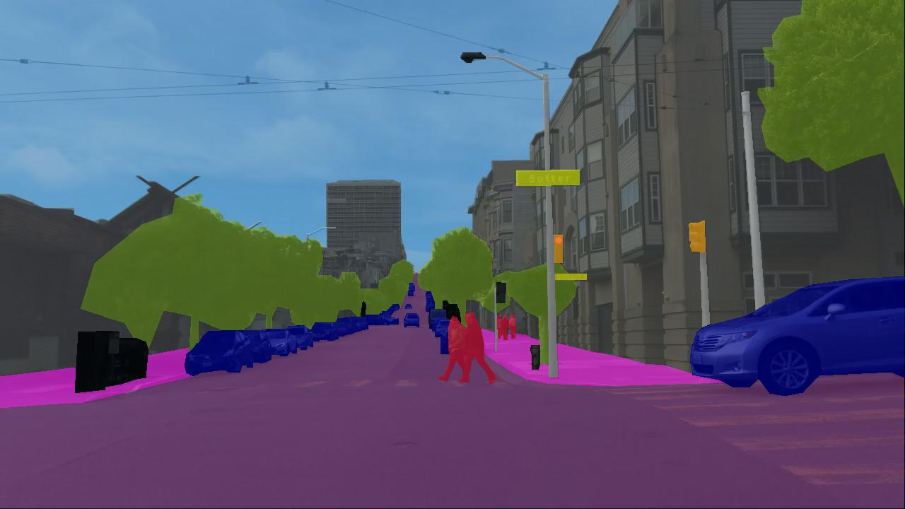

# Panoptic Segmentation Models of BDD100K

The panoptic segmentation task combines the semantic and instance segmentation tasks and involves predicting both semantic label and instance identity for each pixel.



The BDD100K dataset contains panoptic segmentation annotations for 10K images (7K/1K/2K for train/val/test). Each annotation is a panoptic mask containing labels for 40 diverse object classes, split into 10 foreground classes and 30 background classes. For details about downloading the data and the annotation format for this task, see the [official documentation](https://doc.bdd100k.com/download.html).

## Model Zoo

For training the models listed below, we follow the common settings used by MMDetection (details [here](https://github.com/open-mmlab/mmdetection/blob/master/docs/en/model_zoo.md#common-settings)), unless otherwise stated.
All models are trained on either 8 GeForce RTX 2080 Ti GPUs or 8 TITAN RTX GPUs with a batch size of 2x8=16.

## Table of Contents

   * [Models](#model-zoo)
      * [Panoptic FPN](#panoptic-fpn)
   * [Usage](#usage)
   * [Contribution](#contribution)

---

### Panoptic FPN

[Panoptic Feature Pyramid Networks](https://arxiv.org/abs/1901.02446) [CVPR 2019]

Authors: [Alexander Kirillov](https://alexander-kirillov.github.io/), [Ross Girshick](https://www.rossgirshick.info/), [Kaiming He](http://kaiminghe.com/), [Piotr Dollár](https://pdollar.github.io/)

<details>
<summary>Abstract</summary>
The recently introduced panoptic segmentation task has renewed our community's interest in unifying the tasks of instance segmentation (for thing classes) and semantic segmentation (for stuff classes). However, current state-of-the-art methods for this joint task use separate and dissimilar networks for instance and semantic segmentation, without performing any shared computation. In this work, we aim to unify these methods at the architectural level, designing a single network for both tasks. Our approach is to endow Mask R-CNN, a popular instance segmentation method, with a semantic segmentation branch using a shared Feature Pyramid Network (FPN) backbone. Surprisingly, this simple baseline not only remains effective for instance segmentation, but also yields a lightweight, top-performing method for semantic segmentation. In this work, we perform a detailed study of this minimally extended version of Mask R-CNN with FPN, which we refer to as Panoptic FPN, and show it is a robust and accurate baseline for both tasks. Given its effectiveness and conceptual simplicity, we hope our method can serve as a strong baseline and aid future research in panoptic segmentation.
</details>

#### Results

| Backbone | Lr schd | MS-train | PQ-val | Scores-val | PQ-test | Scores-test | Config | Weights | Preds | Visuals |
| :-: | :-: | :-: | :-: | :-: | :-: | :-: | :-: | :-: | :-: | :-: |
| R-50-FPN | 1x |  | 21.52 | [scores](https://dl.cv.ethz.ch/bdd100k/pan_seg/scores-val/panoptic_fpn_r50_fpn_1x_pan_seg_bdd100k.json) | 20.59 | [scores](https://dl.cv.ethz.ch/bdd100k/pan_seg/scores-test/panoptic_fpn_r50_fpn_1x_pan_seg_bdd100k.json) | [config](./configs/pan_seg/panoptic_fpn_r50_fpn_1x_pan_seg_bdd100k.py) | [model](https://dl.cv.ethz.ch/bdd100k/pan_seg/models/panoptic_fpn_r50_fpn_1x_pan_seg_bdd100k.pth) \| [MD5](https://dl.cv.ethz.ch/bdd100k/pan_seg/models/panoptic_fpn_r50_fpn_1x_pan_seg_bdd100k.md5) | [preds](https://dl.cv.ethz.ch/bdd100k/pan_seg/preds/panoptic_fpn_r50_fpn_1x_pan_seg_bdd100k.json) | [visuals](https://dl.cv.ethz.ch/bdd100k/pan_seg/visuals/panoptic_fpn_r50_fpn_1x_pan_seg_bdd100k.zip) |
| R-50-FPN | 3x | ✓ | 22.39 | [scores](https://dl.cv.ethz.ch/bdd100k/pan_seg/scores-val/panoptic_fpn_r50_fpn_3x_pan_seg_bdd100k.json) | 21.76 | [scores](https://dl.cv.ethz.ch/bdd100k/pan_seg/scores-test/panoptic_fpn_r50_fpn_3x_pan_seg_bdd100k.json) | [config](./configs/pan_seg/panoptic_fpn_r50_fpn_3x_pan_seg_bdd100k.py) | [model](https://dl.cv.ethz.ch/bdd100k/pan_seg/models/panoptic_fpn_r50_fpn_3x_pan_seg_bdd100k.pth) \| [MD5](https://dl.cv.ethz.ch/bdd100k/pan_seg/models/panoptic_fpn_r50_fpn_3x_pan_seg_bdd100k.md5) | [preds](https://dl.cv.ethz.ch/bdd100k/pan_seg/preds/panoptic_fpn_r50_fpn_3x_pan_seg_bdd100k.json) | [visuals](https://dl.cv.ethz.ch/bdd100k/pan_seg/visuals/panoptic_fpn_r50_fpn_3x_pan_seg_bdd100k.zip) |
| R-50-FPN | 5x | ✓ | 23.38 | [scores](https://dl.cv.ethz.ch/bdd100k/pan_seg/scores-val/panoptic_fpn_r50_fpn_5x_pan_seg_bdd100k.json) | 22.04 | [scores](https://dl.cv.ethz.ch/bdd100k/pan_seg/scores-test/panoptic_fpn_r50_fpn_5x_pan_seg_bdd100k.json) | [config](./configs/pan_seg/panoptic_fpn_r50_fpn_5x_pan_seg_bdd100k.py) | [model](https://dl.cv.ethz.ch/bdd100k/pan_seg/models/panoptic_fpn_r50_fpn_5x_pan_seg_bdd100k.pth) \| [MD5](https://dl.cv.ethz.ch/bdd100k/pan_seg/models/panoptic_fpn_r50_fpn_5x_pan_seg_bdd100k.md5) | [preds](https://dl.cv.ethz.ch/bdd100k/pan_seg/preds/panoptic_fpn_r50_fpn_5x_pan_seg_bdd100k.json) | [visuals](https://dl.cv.ethz.ch/bdd100k/pan_seg/visuals/panoptic_fpn_r50_fpn_5x_pan_seg_bdd100k.zip) |
| R-101-FPN | 3x | ✓ | 22.61 | [scores](https://dl.cv.ethz.ch/bdd100k/pan_seg/scores-val/panoptic_fpn_r101_fpn_3x_pan_seg_bdd100k.json) | 22.34 | [scores](https://dl.cv.ethz.ch/bdd100k/pan_seg/scores-test/panoptic_fpn_r101_fpn_3x_pan_seg_bdd100k.json) | [config](./configs/pan_seg/panoptic_fpn_r101_fpn_3x_pan_seg_bdd100k.py) | [model](https://dl.cv.ethz.ch/bdd100k/pan_seg/models/panoptic_fpn_r101_fpn_3x_pan_seg_bdd100k.pth) \| [MD5](https://dl.cv.ethz.ch/bdd100k/pan_seg/models/panoptic_fpn_r101_fpn_3x_pan_seg_bdd100k.md5) | [preds](https://dl.cv.ethz.ch/bdd100k/pan_seg/preds/panoptic_fpn_r101_fpn_3x_pan_seg_bdd100k.json) | [visuals](https://dl.cv.ethz.ch/bdd100k/pan_seg/visuals/panoptic_fpn_r101_fpn_3x_pan_seg_bdd100k.zip) |
| R-101-FPN | 5x | ✓ | 23.90 | [scores](https://dl.cv.ethz.ch/bdd100k/pan_seg/scores-val/panoptic_fpn_r101_fpn_5x_pan_seg_bdd100k.json) | 22.50 | [scores](https://dl.cv.ethz.ch/bdd100k/pan_seg/scores-test/panoptic_fpn_r101_fpn_5x_pan_seg_bdd100k.json) | [config](./configs/pan_seg/panoptic_fpn_r101_fpn_5x_pan_seg_bdd100k.py) | [model](https://dl.cv.ethz.ch/bdd100k/pan_seg/models/panoptic_fpn_r101_fpn_5x_pan_seg_bdd100k.pth) \| [MD5](https://dl.cv.ethz.ch/bdd100k/pan_seg/models/panoptic_fpn_r101_fpn_5x_pan_seg_bdd100k.md5) | [preds](https://dl.cv.ethz.ch/bdd100k/pan_seg/preds/panoptic_fpn_r101_fpn_5x_pan_seg_bdd100k.json) | [visuals](https://dl.cv.ethz.ch/bdd100k/pan_seg/visuals/panoptic_fpn_r101_fpn_5x_pan_seg_bdd100k.zip) |

[[Code](https://github.com/facebookresearch/detectron2)] [[Usage Instructions](#usage)]

---


## Install

a. Create a conda virtual environment and activate it.
```shell
conda create -n bdd100k-mmdet python=3.8
conda activate bdd100k-mmdet
```

b. Install PyTorch and torchvision following the [official instructions](https://pytorch.org/), e.g.,

```shell
conda install pytorch torchvision -c pytorch
```

Note: Make sure that your compilation CUDA version and runtime CUDA version match.
You can check the supported CUDA version for precompiled packages on the [PyTorch website](https://pytorch.org/).

c. Install mmcv and mmdetection.

```shell
pip install mmcv-full
pip install mmdetection
```

You can also refer to the [official installation instructions](https://github.com/open-mmlab/mmdetection/blob/master/docs/en/get_started.md/#Installation).


## Usage

### Model Inference

Single GPU inference:
```shell
python ./test.py ${CONFIG_FILE} --format-only --format-dir ${OUTPUT_DIR} [--options]
```

Multiple GPU inference:
```shell
CUDA_VISIBLE_DEVICES=0,1,2,3 python -m torch.distributed.launch \
    --nproc_per_node=4 --master_port=12000 ./test.py $CFG_FILE \
    --format-only --format-dir ${OUTPUT_DIR} [--options] \
    --launcher pytorch
```

### Output Evaluation

#### Validation Set

To evaluate the panoptic segmentation performance on the BDD100K validation set, you can follow the official evaluation [scripts](https://doc.bdd100k.com/evaluate.html) provided by BDD100K:

```bash
python -m bdd100k.eval.run -t pan_seg \
    -g ../data/bdd100k/labels/pan_seg_${SET_NAME}.json \
    -r ${OUTPUT_DIR}/pan_seg.json \
    [--out-file ${RESULTS_FILE}] [--nproc ${NUM_PROCESS}]
```

#### Test Set

You can obtain the performance on the BDD100K test set by submitting your model predictions to our [evaluation server]() hosted on EvalAI (coming soon).

### Output Visualization

For visualization, you can use the visualization tool provided by [Scalabel](https://doc.scalabel.ai/visual.html).

Below is an example:

```python
import os
import numpy as np
from PIL import Image
from bdd100k.common.utils import load_bdd100k_config
from scalabel.label.io import load
from scalabel.vis.label import LabelViewer

# load prediction frames
frames = load('$OUTPUT_DIR/pan_seg.json').frames

viewer = LabelViewer(label_cfg=load_bdd100k_config('pan_seg'))
for frame in frames:
    img = np.array(Image.open(os.path.join('$IMG_DIR', frame.name)))
    viewer.draw(img, frame)
    viewer.save(os.path.join('$VIS_DIR', frame.name))
```

## Contribution

**You can include your models in this repo as well!** Please follow the [contribution](../doc/CONTRIBUTING.md) instructions.
