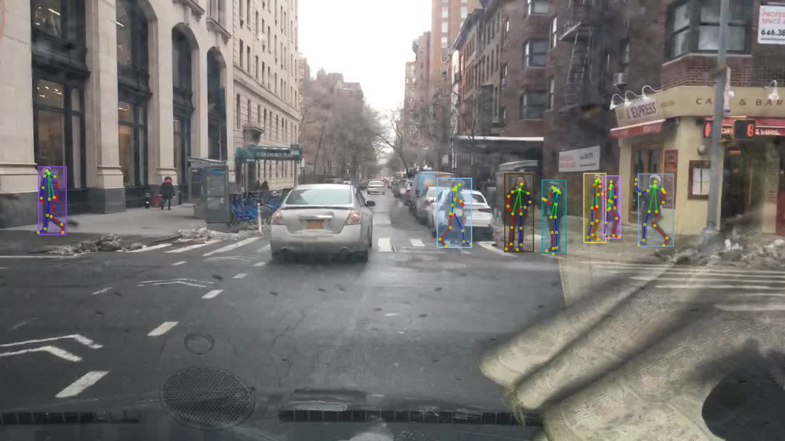

# Pose Estimation Models of BDD100K

The pose estimation task involves predicting the 2D position of human body keypoints of every person in each image.



The BDD100K dataset contains 2D human pose annotations for 14K images (10K/1.5K/2.5K for train/val/test). Each annotation contains labels for 18 body keypoints. For details about downloading the data and the annotation format for this task, see the [official documentation](https://doc.bdd100k.com/download.html).

## Model Zoo

For training the models listed below, we follow the common settings used by MMPose (model zoo [here](https://mmpose.readthedocs.io/en/latest/topics/body%282d%2Ckpt%2Cimg%29.html)), unless otherwise stated. See the config files for the detailed setting for each model. All models are trained on either 4 GeForce RTX 2080 Ti GPUs or 4 TITAN RTX GPUs with a batch size of 4x64=256.

## Top-down Methods

Top-down methods first detect human bounding boxes and then estimate the keypoint locations for each human.

For the models below, we use a Cascade R-CNN with R-101-FPN backbone as the human detector, which can achieve 32.69 AP on humans on the BDD100K detection validation set (model [here](https://github.com/SysCV/bdd100k-models/tree/master/det#cascade-r-cnn)).
You can find the human detections for the validation set [here](https://dl.cv.ethz.ch/bdd100k/pose/person_dets/person_det_for_bdd100k_val.json) and test set [here](https://dl.cv.ethz.ch/bdd100k/pose/person_dets/person_det_for_bdd100k_test.json).

---

### ResNet

[Deep Residual Learning for Image Recognition](https://arxiv.org/abs/1512.03385) [CVPR 2016]

Authors: [Kaiming He](http://kaiminghe.com/), [Xiangyu Zhang](https://scholar.google.com/citations?user=yuB-cfoAAAAJ), [Shaoqing Ren](https://www.shaoqingren.com/), [Jian Sun](http://www.jiansun.org/)

<details>
<summary>Abstract</summary>
Deeper neural networks are more difficult to train. We present a residual learning framework to ease the training of networks that are substantially deeper than those used previously. We explicitly reformulate the layers as learning residual functions with reference to the layer inputs, instead of learning unreferenced functions. We provide comprehensive empirical evidence showing that these residual networks are easier to optimize, and can gain accuracy from considerably increased depth. On the ImageNet dataset we evaluate residual nets with a depth of up to 152 layers---8x deeper than VGG nets but still having lower complexity. An ensemble of these residual nets achieves 3.57% error on the ImageNet test set. This result won the 1st place on the ILSVRC 2015 classification task. We also present analysis on CIFAR-10 with 100 and 1000 layers. The depth of representations is of central importance for many visual recognition tasks. Solely due to our extremely deep representations, we obtain a 28\% relative improvement on the COCO object detection dataset. Deep residual nets are foundations of our submissions to ILSVRC & COCO 2015 competitions, where we also won the 1st places on the tasks of ImageNet detection, ImageNet localization, COCO detection, and COCO segmentation.
</details>

#### Results

| Backbone | Input Size | Pose AP-val | Scores-val | Pose AP-test | Scores-test | Config | Weights | Preds | Visuals |
| :-: | :-: | :-: | :-: | :-: | :-: | :-: | :-: | :-: | :-: |
| ResNet-50 | 256 * 192 | 46.15 | [scores](https://dl.cv.ethz.ch/bdd100k/pose/scores-val/res50_256x192_1x_pose_bdd100k.json) | 43.73 | [scores](https://dl.cv.ethz.ch/bdd100k/pose/scores-test/res50_256x192_1x_pose_bdd100k.json) | [config](./configs/pose/res50_256x192_1x_pose_bdd100k.py) | [model](https://dl.cv.ethz.ch/bdd100k/pose/models/res50_256x192_1x_pose_bdd100k.pth) \| [MD5](https://dl.cv.ethz.ch/bdd100k/pose/models/res50_256x192_1x_pose_bdd100k.md5) | [preds](https://dl.cv.ethz.ch/bdd100k/pose/preds/res50_256x192_1x_pose_bdd100k.json) | [visuals](https://dl.cv.ethz.ch/bdd100k/pose/visuals/res50_256x192_1x_pose_bdd100k.zip) |
| ResNet-101 | 256 * 192 | 46.87 | [scores](https://dl.cv.ethz.ch/bdd100k/pose/scores-val/res101_256x192_1x_pose_bdd100k.json) | 43.48 | [scores](https://dl.cv.ethz.ch/bdd100k/pose/scores-test/res101_256x192_1x_pose_bdd100k.json) | [config](./configs/pose/res101_256x192_1x_pose_bdd100k.py) | [model](https://dl.cv.ethz.ch/bdd100k/pose/models/res101_256x192_1x_pose_bdd100k.pth) \| [MD5](https://dl.cv.ethz.ch/bdd100k/pose/models/res101_256x192_1x_pose_bdd100k.md5) | [preds](https://dl.cv.ethz.ch/bdd100k/pose/preds/res101_256x192_1x_pose_bdd100k.json) | [visuals](https://dl.cv.ethz.ch/bdd100k/pose/visuals/res101_256x192_1x_pose_bdd100k.zip) |
| ResNet-50 | 320 * 256 | 47.44 | [scores](https://dl.cv.ethz.ch/bdd100k/pose/scores-val/res50_320x256_1x_pose_bdd100k.json) | 44.36 | [scores](https://dl.cv.ethz.ch/bdd100k/pose/scores-test/res50_320x256_1x_pose_bdd100k.json) | [config](./configs/pose/res50_320x256_1x_pose_bdd100k.py) | [model](https://dl.cv.ethz.ch/bdd100k/pose/models/res50_320x256_1x_pose_bdd100k.pth) \| [MD5](https://dl.cv.ethz.ch/bdd100k/pose/models/res50_320x256_1x_pose_bdd100k.md5) | [preds](https://dl.cv.ethz.ch/bdd100k/pose/preds/res50_320x256_1x_pose_bdd100k.json) | [visuals](https://dl.cv.ethz.ch/bdd100k/pose/visuals/res50_320x256_1x_pose_bdd100k.zip) |
| ResNet-101 | 320 * 256 | 48.08 | [scores](https://dl.cv.ethz.ch/bdd100k/pose/scores-val/res101_320x256_1x_pose_bdd100k.json) | 44.93 | [scores](https://dl.cv.ethz.ch/bdd100k/pose/scores-test/res101_320x256_1x_pose_bdd100k.json) | [config](./configs/pose/res101_320x256_1x_pose_bdd100k.py) | [model](https://dl.cv.ethz.ch/bdd100k/pose/models/res101_320x256_1x_pose_bdd100k.pth) \| [MD5](https://dl.cv.ethz.ch/bdd100k/pose/models/res101_320x256_1x_pose_bdd100k.md5) | [preds](https://dl.cv.ethz.ch/bdd100k/pose/preds/res101_320x256_1x_pose_bdd100k.json) | [visuals](https://dl.cv.ethz.ch/bdd100k/pose/visuals/res101_320x256_1x_pose_bdd100k.zip) |

[[Code](https://pytorch.org/vision/stable/models.html)] [[Usage Instructions](#usage)]

---

### MobileNetV2

[MobileNetV2: Inverted Residuals and Linear Bottlenecks](https://arxiv.org/abs/1801.04381) [CVPR 2018]

Authors: [Mark Sandler](https://research.google/people/author2357/), [Andrew Howard](https://scholar.google.com/citations?user=_9l8vD8AAAAJ), [Menglong Zhu](http://dreamdragon.github.io/), [Andrey Zhmoginov](https://scholar.google.com/citations?user=jj6IfzEAAAAJ), [Liang-Chieh Chen](http://liangchiehchen.com/)

<details>
<summary>Abstract</summary>
In this paper we describe a new mobile architecture, MobileNetV2, that improves the state of the art performance of mobile models on multiple tasks and benchmarks as well as across a spectrum of different model sizes. We also describe efficient ways of applying these mobile models to object detection in a novel framework we call SSDLite. Additionally, we demonstrate how to build mobile semantic segmentation models through a reduced form of DeepLabv3 which we call Mobile DeepLabv3. The MobileNetV2 architecture is based on an inverted residual structure where the input and output of the residual block are thin bottleneck layers opposite to traditional residual models which use expanded representations in the input an MobileNetV2 uses lightweight depthwise convolutions to filter features in the intermediate expansion layer. Additionally, we find that it is important to remove non-linearities in the narrow layers in order to maintain representational power. We demonstrate that this improves performance and provide an intuition that led to this design. Finally, our approach allows decoupling of the input/output domains from the expressiveness of the transformation, which provides a convenient framework for further analysis. We measure our performance on Imagenet classification, COCO object detection, VOC image segmentation. We evaluate the trade-offs between accuracy, and number of operations measured by multiply-adds (MAdd), as well as the number of parameters.
</details>

#### Results

| Backbone | Input Size | Pose AP-val | Scores-val | Pose AP-test | Scores-test | Config | Weights | Preds | Visuals |
| :-: | :-: | :-: | :-: | :-: | :-: | :-: | :-: | :-: | :-: |
| MobileNetV2 | 256 * 192 | 43.82 | [scores](https://dl.cv.ethz.ch/bdd100k/pose/scores-val/mobilenetv2_256x192_1x_pose_bdd100k.json) | 41.02 | [scores](https://dl.cv.ethz.ch/bdd100k/pose/scores-test/mobilenetv2_256x192_1x_pose_bdd100k.json) | [config](./configs/pose/mobilenetv2_256x192_1x_pose_bdd100k.py) | [model](https://dl.cv.ethz.ch/bdd100k/pose/models/mobilenetv2_256x192_1x_pose_bdd100k.pth) \| [MD5](https://dl.cv.ethz.ch/bdd100k/pose/models/mobilenetv2_256x192_1x_pose_bdd100k.md5) | [preds](https://dl.cv.ethz.ch/bdd100k/pose/preds/mobilenetv2_256x192_1x_pose_bdd100k.json) | [visuals](https://dl.cv.ethz.ch/bdd100k/pose/visuals/mobilenetv2_256x192_1x_pose_bdd100k.zip) |
| MobileNetV2 | 320 * 256 | 45.15 | [scores](https://dl.cv.ethz.ch/bdd100k/pose/scores-val/mobilenetv2_320x256_1x_pose_bdd100k.json) | 42.32 | [scores](https://dl.cv.ethz.ch/bdd100k/pose/scores-test/mobilenetv2_320x256_1x_pose_bdd100k.json) | [config](./configs/pose/mobilenetv2_320x256_1x_pose_bdd100k.py) | [model](https://dl.cv.ethz.ch/bdd100k/pose/models/mobilenetv2_320x256_1x_pose_bdd100k.pth) \| [MD5](https://dl.cv.ethz.ch/bdd100k/pose/models/mobilenetv2_320x256_1x_pose_bdd100k.md5) | [preds](https://dl.cv.ethz.ch/bdd100k/pose/preds/mobilenetv2_320x256_1x_pose_bdd100k.json) | [visuals](https://dl.cv.ethz.ch/bdd100k/pose/visuals/mobilenetv2_320x256_1x_pose_bdd100k.zip) |

[[Code](https://github.com/pytorch/vision/blob/main/torchvision/models/mobilenetv2.py)] [[Usage Instructions](#usage)]

---

### HRNet

[Deep High-Resolution Representation Learning for Visual Recognition](https://arxiv.org/abs/1908.07919) [CVPR 2019 / TPAMI 2020]

Authors: [Jingdong Wang](https://jingdongwang2017.github.io/), [Ke Sun](https://github.com/sunke123), [Tianheng Cheng](https://scholar.google.com/citations?user=PH8rJHYAAAAJ), Borui Jiang, Chaorui Deng, [Yang Zhao](https://yangyangkiki.github.io/), Dong Liu, [Yadong Mu](http://www.muyadong.com/), Mingkui Tan, [Xinggang Wang](https://xinggangw.info/), [Wenyu Liu](http://eic.hust.edu.cn/professor/liuwenyu/), [Bin Xiao](https://www.microsoft.com/en-us/research/people/bixi/)

<details>
<summary>Abstract</summary>
High-resolution representations are essential for position-sensitive vision problems, such as human pose estimation, semantic segmentation, and object detection. Existing state-of-the-art frameworks first encode the input image as a low-resolution representation through a subnetwork that is formed by connecting high-to-low resolution convolutions in series (e.g., ResNet, VGGNet), and then recover the high-resolution representation from the encoded low-resolution representation. Instead, our proposed network, named as High-Resolution Network (HRNet), maintains high-resolution representations through the whole process. There are two key characteristics: (i) Connect the high-to-low resolution convolution streams in parallel; (ii) Repeatedly exchange the information across resolutions. The benefit is that the resulting representation is semantically richer and spatially more precise. We show the superiority of the proposed HRNet in a wide range of applications, including human pose estimation, semantic segmentation, and object detection, suggesting that the HRNet is a stronger backbone for computer vision problems. All the codes are available at [this https URL](https://github.com/HRNet).
</details>

#### Results

| Backbone | Input Size | Pose AP-val | Scores-val | Pose AP-test | Scores-test | Config | Weights | Preds | Visuals |
| :-: | :-: | :-: | :-: | :-: | :-: | :-: | :-: | :-: | :-: |
| HRNet-w32 | 256 * 192 | 48.83 | [scores](https://dl.cv.ethz.ch/bdd100k/pose/scores-val/hrnet_w32_256x192_1x_pose_bdd100k.json) | 46.13 | [scores](https://dl.cv.ethz.ch/bdd100k/pose/scores-test/hrnet_w32_256x192_1x_pose_bdd100k.json) | [config](./configs/pose/hrnet_w32_256x192_1x_pose_bdd100k.py) | [model](https://dl.cv.ethz.ch/bdd100k/pose/models/hrnet_w32_256x192_1x_pose_bdd100k.pth) \| [MD5](https://dl.cv.ethz.ch/bdd100k/pose/models/hrnet_w32_256x192_1x_pose_bdd100k.md5) | [preds](https://dl.cv.ethz.ch/bdd100k/pose/preds/hrnet_w32_256x192_1x_pose_bdd100k.json) | [visuals](https://dl.cv.ethz.ch/bdd100k/pose/visuals/hrnet_w32_256x192_1x_pose_bdd100k.zip) |
| HRNet-w48 | 256 * 192 | 50.32 | [scores](https://dl.cv.ethz.ch/bdd100k/pose/scores-val/hrnet_w48_256x192_1x_pose_bdd100k.json) | 47.36 | [scores](https://dl.cv.ethz.ch/bdd100k/pose/scores-test/hrnet_w48_256x192_1x_pose_bdd100k.json) | [config](./configs/pose/hrnet_w48_256x192_1x_pose_bdd100k.py) | [model](https://dl.cv.ethz.ch/bdd100k/pose/models/hrnet_w48_256x192_1x_pose_bdd100k.pth) \| [MD5](https://dl.cv.ethz.ch/bdd100k/pose/models/hrnet_w48_256x192_1x_pose_bdd100k.md5) | [preds](https://dl.cv.ethz.ch/bdd100k/pose/preds/hrnet_w48_256x192_1x_pose_bdd100k.json) | [visuals](https://dl.cv.ethz.ch/bdd100k/pose/visuals/hrnet_w48_256x192_1x_pose_bdd100k.zip) |
| HRNet-w32 | 320 * 256 | 49.86 | [scores](https://dl.cv.ethz.ch/bdd100k/pose/scores-val/hrnet_w32_320x256_1x_pose_bdd100k.json) | 46.90 | [scores](https://dl.cv.ethz.ch/bdd100k/pose/scores-test/hrnet_w32_320x256_1x_pose_bdd100k.json) | [config](./configs/pose/hrnet_w32_320x256_1x_pose_bdd100k.py) | [model](https://dl.cv.ethz.ch/bdd100k/pose/models/hrnet_w32_320x256_1x_pose_bdd100k.pth) \| [MD5](https://dl.cv.ethz.ch/bdd100k/pose/models/hrnet_w32_320x256_1x_pose_bdd100k.md5) | [preds](https://dl.cv.ethz.ch/bdd100k/pose/preds/hrnet_w32_320x256_1x_pose_bdd100k.json) | [visuals](https://dl.cv.ethz.ch/bdd100k/pose/visuals/hrnet_w32_320x256_1x_pose_bdd100k.zip) |
| HRNet-w48 | 320 * 256 | 50.16 | [scores](https://dl.cv.ethz.ch/bdd100k/pose/scores-val/hrnet_w48_320x256_1x_pose_bdd100k.json) | 47.32 | [scores](https://dl.cv.ethz.ch/bdd100k/pose/scores-test/hrnet_w48_320x256_1x_pose_bdd100k.json) | [config](./configs/pose/hrnet_w48_320x256_1x_pose_bdd100k.py) | [model](https://dl.cv.ethz.ch/bdd100k/pose/models/hrnet_w48_320x256_1x_pose_bdd100k.pth) \| [MD5](https://dl.cv.ethz.ch/bdd100k/pose/models/hrnet_w48_320x256_1x_pose_bdd100k.md5) | [preds](https://dl.cv.ethz.ch/bdd100k/pose/preds/hrnet_w48_320x256_1x_pose_bdd100k.json) | [visuals](https://dl.cv.ethz.ch/bdd100k/pose/visuals/hrnet_w48_320x256_1x_pose_bdd100k.zip) |

[[Code](https://github.com/HRNet)] [[Usage Instructions](#usage)]

---

### DARK

[Distribution-Aware Coordinate Representation for Human Pose Estimation](https://arxiv.org/abs/1910.06278) [CVPR 2020]

Authors: Feng Zhang, [Xiatian Zhu](https://xiatian-zhu.github.io/), Hanbin Dai, Mao Ye, [Ce Zhu](http://www.avc2-lab.net/~eczhu/)

<details>
<summary>Abstract</summary>
While being the de facto standard coordinate representation in human pose estimation, heatmap is never systematically investigated in the literature, to our best knowledge. This work fills this gap by studying the coordinate representation with a particular focus on the heatmap. Interestingly, we found that the process of decoding the predicted heatmaps into the final joint coordinates in the original image space is surprisingly significant for human pose estimation performance, which nevertheless was not recognised before. In light of the discovered importance, we further probe the design limitations of the standard coordinate decoding method widely used by existing methods, and propose a more principled distribution-aware decoding method. Meanwhile, we improve the standard coordinate encoding process (i.e. transforming ground-truth coordinates to heatmaps) by generating accurate heatmap distributions for unbiased model training. Taking the two together, we formulate a novel Distribution-Aware coordinate Representation of Keypoint (DARK) method. Serving as a model-agnostic plug-in, DARK significantly improves the performance of a variety of state-of-the-art human pose estimation models. Extensive experiments show that DARK yields the best results on two common benchmarks, MPII and COCO, consistently validating the usefulness and effectiveness of our novel coordinate representation idea.
</details>

#### Results

| Backbone | Input Size | Pose AP-val | Scores-val | Pose AP-test | Scores-test | Config | Weights | Preds | Visuals |
| :-: | :-: | :-: | :-: | :-: | :-: | :-: | :-: | :-: | :-: |
| ResNet-50 | 256 * 192 | 47.07 | [scores](https://dl.cv.ethz.ch/bdd100k/pose/scores-val/res50_dark_256x192_1x_pose_bdd100k.json) | 44.05 | [scores](https://dl.cv.ethz.ch/bdd100k/pose/scores-test/res50_dark_256x192_1x_pose_bdd100k.json) | [config](./configs/pose/res50_dark_256x192_1x_pose_bdd100k.py) | [model](https://dl.cv.ethz.ch/bdd100k/pose/models/res50_dark_256x192_1x_pose_bdd100k.pth) \| [MD5](https://dl.cv.ethz.ch/bdd100k/pose/models/res50_dark_256x192_1x_pose_bdd100k.md5) | [preds](https://dl.cv.ethz.ch/bdd100k/pose/preds/res50_dark_256x192_1x_pose_bdd100k.json) | [visuals](https://dl.cv.ethz.ch/bdd100k/pose/visuals/res50_dark_256x192_1x_pose_bdd100k.zip) |
| ResNet-101 | 256 * 192 | 47.43 | [scores](https://dl.cv.ethz.ch/bdd100k/pose/scores-val/res101_dark_256x192_1x_pose_bdd100k.json) | 43.98 | [scores](https://dl.cv.ethz.ch/bdd100k/pose/scores-test/res101_dark_256x192_1x_pose_bdd100k.json) | [config](./configs/pose/res101_dark_256x192_1x_pose_bdd100k.py) | [model](https://dl.cv.ethz.ch/bdd100k/pose/models/res101_dark_256x192_1x_pose_bdd100k.pth) \| [MD5](https://dl.cv.ethz.ch/bdd100k/pose/models/res101_dark_256x192_1x_pose_bdd100k.md5) | [preds](https://dl.cv.ethz.ch/bdd100k/pose/preds/res101_dark_256x192_1x_pose_bdd100k.json) | [visuals](https://dl.cv.ethz.ch/bdd100k/pose/visuals/res101_dark_256x192_1x_pose_bdd100k.zip) |
| ResNet-50 | 320 * 256 | 47.55 | [scores](https://dl.cv.ethz.ch/bdd100k/pose/scores-val/res50_dark_320x256_1x_pose_bdd100k.json) | 44.73 | [scores](https://dl.cv.ethz.ch/bdd100k/pose/scores-test/res50_dark_320x256_1x_pose_bdd100k.json) | [config](./configs/pose/res50_dark_320x256_1x_pose_bdd100k.py) | [model](https://dl.cv.ethz.ch/bdd100k/pose/models/res50_dark_320x256_1x_pose_bdd100k.pth) \| [MD5](https://dl.cv.ethz.ch/bdd100k/pose/models/res50_dark_320x256_1x_pose_bdd100k.md5) | [preds](https://dl.cv.ethz.ch/bdd100k/pose/preds/res50_dark_320x256_1x_pose_bdd100k.json) | [visuals](https://dl.cv.ethz.ch/bdd100k/pose/visuals/res50_dark_320x256_1x_pose_bdd100k.zip) |
| ResNet-101 | 320 * 256 | 48.44 | [scores](https://dl.cv.ethz.ch/bdd100k/pose/scores-val/res101_dark_320x256_1x_pose_bdd100k.json) | 45.06 | [scores](https://dl.cv.ethz.ch/bdd100k/pose/scores-test/res101_dark_320x256_1x_pose_bdd100k.json) | [config](./configs/pose/res101_dark_320x256_1x_pose_bdd100k.py) | [model](https://dl.cv.ethz.ch/bdd100k/pose/models/res101_dark_320x256_1x_pose_bdd100k.pth) \| [MD5](https://dl.cv.ethz.ch/bdd100k/pose/models/res101_dark_320x256_1x_pose_bdd100k.md5) | [preds](https://dl.cv.ethz.ch/bdd100k/pose/preds/res101_dark_320x256_1x_pose_bdd100k.json) | [visuals](https://dl.cv.ethz.ch/bdd100k/pose/visuals/res101_dark_320x256_1x_pose_bdd100k.zip) |
| MobileNetV2 | 256 * 192 | 44.44 | [scores](https://dl.cv.ethz.ch/bdd100k/pose/scores-val/mobilenetv2_dark_256x192_1x_pose_bdd100k.json) | 41.25 | [scores](https://dl.cv.ethz.ch/bdd100k/pose/scores-test/mobilenetv2_dark_256x192_1x_pose_bdd100k.json) | [config](./configs/pose/mobilenetv2_dark_256x192_1x_pose_bdd100k.py) | [model](https://dl.cv.ethz.ch/bdd100k/pose/models/mobilenetv2_dark_256x192_1x_pose_bdd100k.pth) \| [MD5](https://dl.cv.ethz.ch/bdd100k/pose/models/mobilenetv2_dark_256x192_1x_pose_bdd100k.md5) | [preds](https://dl.cv.ethz.ch/bdd100k/pose/preds/mobilenetv2_dark_256x192_1x_pose_bdd100k.json) | [visuals](https://dl.cv.ethz.ch/bdd100k/pose/visuals/mobilenetv2_dark_256x192_1x_pose_bdd100k.zip) |
| MobileNetV2 | 320 * 256 | 45.02 | [scores](https://dl.cv.ethz.ch/bdd100k/pose/scores-val/mobilenetv2_dark_320x256_1x_pose_bdd100k.json) | 42.26 | [scores](https://dl.cv.ethz.ch/bdd100k/pose/scores-test/mobilenetv2_dark_320x256_1x_pose_bdd100k.json) | [config](./configs/pose/mobilenetv2_dark_320x256_1x_pose_bdd100k.py) | [model](https://dl.cv.ethz.ch/bdd100k/pose/models/mobilenetv2_dark_320x256_1x_pose_bdd100k.pth) \| [MD5](https://dl.cv.ethz.ch/bdd100k/pose/models/mobilenetv2_dark_320x256_1x_pose_bdd100k.md5) | [preds](https://dl.cv.ethz.ch/bdd100k/pose/preds/mobilenetv2_dark_320x256_1x_pose_bdd100k.json) | [visuals](https://dl.cv.ethz.ch/bdd100k/pose/visuals/mobilenetv2_dark_320x256_1x_pose_bdd100k.zip) |
| HRNet-w32 | 256 * 192 | 48.92 | [scores](https://dl.cv.ethz.ch/bdd100k/pose/scores-val/hrnet_w32_dark_256x192_1x_pose_bdd100k.json) | 46.02 | [scores](https://dl.cv.ethz.ch/bdd100k/pose/scores-test/hrnet_w32_dark_256x192_1x_pose_bdd100k.json) | [config](./configs/pose/hrnet_w32_dark_256x192_1x_pose_bdd100k.py) | [model](https://dl.cv.ethz.ch/bdd100k/pose/models/hrnet_w32_dark_256x192_1x_pose_bdd100k.pth) \| [MD5](https://dl.cv.ethz.ch/bdd100k/pose/models/hrnet_w32_dark_256x192_1x_pose_bdd100k.md5) | [preds](https://dl.cv.ethz.ch/bdd100k/pose/preds/hrnet_w32_dark_256x192_1x_pose_bdd100k.json) | [visuals](https://dl.cv.ethz.ch/bdd100k/pose/visuals/hrnet_w32_dark_256x192_1x_pose_bdd100k.zip) |
| HRNet-w48 | 256 * 192 | 50.08 | [scores](https://dl.cv.ethz.ch/bdd100k/pose/scores-val/hrnet_w48_dark_256x192_1x_pose_bdd100k.json) | 47.30 | [scores](https://dl.cv.ethz.ch/bdd100k/pose/scores-test/hrnet_w48_dark_256x192_1x_pose_bdd100k.json) | [config](./configs/pose/hrnet_w48_dark_256x192_1x_pose_bdd100k.py) | [model](https://dl.cv.ethz.ch/bdd100k/pose/models/hrnet_w48_dark_256x192_1x_pose_bdd100k.pth) \| [MD5](https://dl.cv.ethz.ch/bdd100k/pose/models/hrnet_w48_dark_256x192_1x_pose_bdd100k.md5) | [preds](https://dl.cv.ethz.ch/bdd100k/pose/preds/hrnet_w48_dark_256x192_1x_pose_bdd100k.json) | [visuals](https://dl.cv.ethz.ch/bdd100k/pose/visuals/hrnet_w48_dark_256x192_1x_pose_bdd100k.zip) |
| HRNet-w32 | 320 * 256 | 49.84 | [scores](https://dl.cv.ethz.ch/bdd100k/pose/scores-val/hrnet_w32_dark_320x256_1x_pose_bdd100k.json) | 46.95 | [scores](https://dl.cv.ethz.ch/bdd100k/pose/scores-test/hrnet_w32_dark_320x256_1x_pose_bdd100k.json) | [config](./configs/pose/hrnet_w32_dark_320x256_1x_pose_bdd100k.py) | [model](https://dl.cv.ethz.ch/bdd100k/pose/models/hrnet_w32_dark_320x256_1x_pose_bdd100k.pth) \| [MD5](https://dl.cv.ethz.ch/bdd100k/pose/models/hrnet_w32_dark_320x256_1x_pose_bdd100k.md5) | [preds](https://dl.cv.ethz.ch/bdd100k/pose/preds/hrnet_w32_dark_320x256_1x_pose_bdd100k.json) | [visuals](https://dl.cv.ethz.ch/bdd100k/pose/visuals/hrnet_w32_dark_320x256_1x_pose_bdd100k.zip) |
| HRNet-w48 | 320 * 256 | 50.31 | [scores](https://dl.cv.ethz.ch/bdd100k/pose/scores-val/hrnet_w48_dark_320x256_1x_pose_bdd100k.json) | 46.91 | [scores](https://dl.cv.ethz.ch/bdd100k/pose/scores-test/hrnet_w48_dark_320x256_1x_pose_bdd100k.json) | [config](./configs/pose/hrnet_w48_dark_320x256_1x_pose_bdd100k.py) | [model](https://dl.cv.ethz.ch/bdd100k/pose/models/hrnet_w48_dark_320x256_1x_pose_bdd100k.pth) \| [MD5](https://dl.cv.ethz.ch/bdd100k/pose/models/hrnet_w48_dark_320x256_1x_pose_bdd100k.md5) | [preds](https://dl.cv.ethz.ch/bdd100k/pose/preds/hrnet_w48_dark_320x256_1x_pose_bdd100k.json) | [visuals](https://dl.cv.ethz.ch/bdd100k/pose/visuals/hrnet_w48_dark_320x256_1x_pose_bdd100k.zip) |

[[Code](https://github.com/ilovepose/DarkPose)] [[Usage Instructions](#usage)]

---

### UDP

[The Devil Is in the Details: Delving Into Unbiased Data Processing for Human Pose Estimation](https://arxiv.org/abs/1911.07524) [CVPR 2020]

Authors: [Junjie Huang](https://huangjunjie2017.github.io/), Zheng Zhu, Feng Guo, Guan Huang

<details>
<summary>Abstract</summary>
Being a fundamental component in training and inference, data processing has not been systematically considered in human pose estimation community, to the best of our knowledge. In this paper, we focus on this problem and find that the devil of human pose estimation evolution is in the biased data processing. Specifically, by investigating the standard data processing in state-of-the-art approaches mainly including coordinate system transformation and keypoint format transformation (i.e., encoding and decoding), we find that the results obtained by common flipping strategy are unaligned with the original ones in inference. Moreover, there is a statistical error in some keypoint format transformation methods. Two problems couple together, significantly degrade the pose estimation performance and thus lay a trap for the research community. This trap has given bone to many suboptimal remedies, which are always unreported, confusing but influential. By causing failure in reproduction and unfair in comparison, the unreported remedies seriously impedes the technological development. To tackle this dilemma from the source, we propose Unbiased Data Processing (UDP) consist of two technique aspect for the two aforementioned problems respectively (i.e., unbiased coordinate system transformation and unbiased keypoint format transformation). As a model-agnostic approach and a superior solution, UDP successfully pushes the performance boundary of human pose estimation and offers a higher and more reliable baseline for research community. Code is public available in [this https URL](https://github.com/HuangJunJie2017/UDP-Pose).
</details>

#### Results

| Backbone | Input Size | Pose AP-val | Scores-val | Pose AP-test | Scores-test | Config | Weights | Preds | Visuals |
| :-: | :-: | :-: | :-: | :-: | :-: | :-: | :-: | :-: | :-: |
| ResNet-50 | 256 * 192 | 46.38 | [scores](https://dl.cv.ethz.ch/bdd100k/pose/scores-val/res50_udp_256x192_1x_pose_bdd100k.json) | 44.17 | [scores](https://dl.cv.ethz.ch/bdd100k/pose/scores-test/res50_udp_256x192_1x_pose_bdd100k.json) | [config](./configs/pose/res50_udp_256x192_1x_pose_bdd100k.py) | [model](https://dl.cv.ethz.ch/bdd100k/pose/models/res50_udp_256x192_1x_pose_bdd100k.pth) \| [MD5](https://dl.cv.ethz.ch/bdd100k/pose/models/res50_udp_256x192_1x_pose_bdd100k.md5) | [preds](https://dl.cv.ethz.ch/bdd100k/pose/preds/res50_udp_256x192_1x_pose_bdd100k.json) | [visuals](https://dl.cv.ethz.ch/bdd100k/pose/visuals/res50_udp_256x192_1x_pose_bdd100k.zip) |
| ResNet-101 | 256 * 192 | 46.27 | [scores](https://dl.cv.ethz.ch/bdd100k/pose/scores-val/res101_udp_256x192_1x_pose_bdd100k.json) | 43.72 | [scores](https://dl.cv.ethz.ch/bdd100k/pose/scores-test/res101_udp_256x192_1x_pose_bdd100k.json) | [config](./configs/pose/res101_udp_256x192_1x_pose_bdd100k.py) | [model](https://dl.cv.ethz.ch/bdd100k/pose/models/res101_udp_256x192_1x_pose_bdd100k.pth) \| [MD5](https://dl.cv.ethz.ch/bdd100k/pose/models/res101_udp_256x192_1x_pose_bdd100k.md5) | [preds](https://dl.cv.ethz.ch/bdd100k/pose/preds/res101_udp_256x192_1x_pose_bdd100k.json) | [visuals](https://dl.cv.ethz.ch/bdd100k/pose/visuals/res101_udp_256x192_1x_pose_bdd100k.zip) |
| ResNet-50 | 320 * 256 | 47.45 | [scores](https://dl.cv.ethz.ch/bdd100k/pose/scores-val/res50_udp_320x256_1x_pose_bdd100k.json) | 44.66 | [scores](https://dl.cv.ethz.ch/bdd100k/pose/scores-test/res50_udp_320x256_1x_pose_bdd100k.json) | [config](./configs/pose/res50_udp_320x256_1x_pose_bdd100k.py) | [model](https://dl.cv.ethz.ch/bdd100k/pose/models/res50_udp_320x256_1x_pose_bdd100k.pth) \| [MD5](https://dl.cv.ethz.ch/bdd100k/pose/models/res50_udp_320x256_1x_pose_bdd100k.md5) | [preds](https://dl.cv.ethz.ch/bdd100k/pose/preds/res50_udp_320x256_1x_pose_bdd100k.json) | [visuals](https://dl.cv.ethz.ch/bdd100k/pose/visuals/res50_udp_320x256_1x_pose_bdd100k.zip) |
| MobileNetV2 | 256 * 192 | 43.97 | [scores](https://dl.cv.ethz.ch/bdd100k/pose/scores-val/mobilenetv2_udp_256x192_1x_pose_bdd100k.json) | 41.03 | [scores](https://dl.cv.ethz.ch/bdd100k/pose/scores-test/mobilenetv2_udp_256x192_1x_pose_bdd100k.json) | [config](./configs/pose/mobilenetv2_udp_256x192_1x_pose_bdd100k.py) | [model](https://dl.cv.ethz.ch/bdd100k/pose/models/mobilenetv2_udp_256x192_1x_pose_bdd100k.pth) \| [MD5](https://dl.cv.ethz.ch/bdd100k/pose/models/mobilenetv2_udp_256x192_1x_pose_bdd100k.md5) | [preds](https://dl.cv.ethz.ch/bdd100k/pose/preds/mobilenetv2_udp_256x192_1x_pose_bdd100k.json) | [visuals](https://dl.cv.ethz.ch/bdd100k/pose/visuals/mobilenetv2_udp_256x192_1x_pose_bdd100k.zip) |
| MobileNetV2 | 320 * 256 | 45.98 | [scores](https://dl.cv.ethz.ch/bdd100k/pose/scores-val/mobilenetv2_udp_320x256_1x_pose_bdd100k.json) | 42.59 | [scores](https://dl.cv.ethz.ch/bdd100k/pose/scores-test/mobilenetv2_udp_320x256_1x_pose_bdd100k.json) | [config](./configs/pose/mobilenetv2_udp_320x256_1x_pose_bdd100k.py) | [model](https://dl.cv.ethz.ch/bdd100k/pose/models/mobilenetv2_udp_320x256_1x_pose_bdd100k.pth) \| [MD5](https://dl.cv.ethz.ch/bdd100k/pose/models/mobilenetv2_udp_320x256_1x_pose_bdd100k.md5) | [preds](https://dl.cv.ethz.ch/bdd100k/pose/preds/mobilenetv2_udp_320x256_1x_pose_bdd100k.json) | [visuals](https://dl.cv.ethz.ch/bdd100k/pose/visuals/mobilenetv2_udp_320x256_1x_pose_bdd100k.zip) |
| HRNet-w32 | 256 * 192 | 49.52 | [scores](https://dl.cv.ethz.ch/bdd100k/pose/scores-val/hrnet_w32_udp_256x192_1x_pose_bdd100k.json) | 46.42 | [scores](https://dl.cv.ethz.ch/bdd100k/pose/scores-test/hrnet_w32_udp_256x192_1x_pose_bdd100k.json) | [config](./configs/pose/hrnet_w32_udp_256x192_1x_pose_bdd100k.py) | [model](https://dl.cv.ethz.ch/bdd100k/pose/models/hrnet_w32_udp_256x192_1x_pose_bdd100k.pth) \| [MD5](https://dl.cv.ethz.ch/bdd100k/pose/models/hrnet_w32_udp_256x192_1x_pose_bdd100k.md5) | [preds](https://dl.cv.ethz.ch/bdd100k/pose/preds/hrnet_w32_udp_256x192_1x_pose_bdd100k.json) | [visuals](https://dl.cv.ethz.ch/bdd100k/pose/visuals/hrnet_w32_udp_256x192_1x_pose_bdd100k.zip) |

[[Code](https://github.com/HuangJunJie2017/UDP-Pose)] [[Usage Instructions](#usage)]

---

## Install

a. Create a conda virtual environment and activate it.

```shell
conda create -n bdd100k-mmpose python=3.8
conda activate bdd100k-mmpose
```

b. Install PyTorch and torchvision following the [official instructions](https://pytorch.org/), e.g.,

```shell
conda install pytorch torchvision -c pytorch
```

Note: Make sure that your compilation CUDA version and runtime CUDA version match.
You can check the supported CUDA version for precompiled packages on the [PyTorch website](https://pytorch.org/).

c. Install mmcv and mmpose.

```shell
pip install mmcv-full
pip install mmpose==0.18.0
```

You can also refer to the [official instructions](https://github.com/open-mmlab/mmpose/blob/master/docs/install.md).

## Usage

### Model Inference

Single GPU inference:

```shell
python ./test.py ${CONFIG_FILE} --format-dir ${OUTPUT_DIR} [--cfg-options]
```

Multiple GPU inference:

```shell
CUDA_VISIBLE_DEVICES=0,1,2,3 python -m torch.distributed.launch \
	--nproc_per_node=4 --master_port=12000 ./test.py $CFG_FILE \
	--format-dir ${OUTPUT_DIR} [--cfg-options] --launcher pytorch
```

### Output Evaluation

#### Validation Set

To evaluate the pose estimation performance on the BDD100K validation set, you can follow the official evaluation [scripts](https://doc.bdd100k.com/evaluate.html) provided by BDD100K:

```bash
python -m bdd100k.eval.run -t pose \
    -g ../data/bdd100k/labels/pose/pose_${SET_NAME}.json \
    -r ${OUTPUT_DIR}/result_keypoints.json \
    [--out-file ${RESULTS_FILE}] [--nproc ${NUM_PROCESS}]
```

#### Test Set

You can obtain the performance on the BDD100K test set by submitting your model predictions to our [evaluation server](https://eval.ai/web/challenges/challenge-page/1392) hosted on EvalAI.

### Colorful Visualization

For visualization, you can use the visualization tool provided by [Scalabel](https://doc.scalabel.ai/visual.html).

Below is an example:

```python
import os
import numpy as np
from PIL import Image
from scalabel.label.io import load
from scalabel.vis.label import LabelViewer

# load prediction frames
frames = load('$OUTPUT_DIR/result_keypoints.json').frames

viewer = LabelViewer()
for frame in frames:
    img = np.array(Image.open(os.path.join('$IMG_DIR', frame.name)))
    viewer.draw(img, frame)
    viewer.save(os.path.join('$VIS_DIR', frame.name))
```

## Contribution

**You can include your models in this repo as well!** Please follow the [contribution](../doc/CONTRIBUTING.md) instructions.
