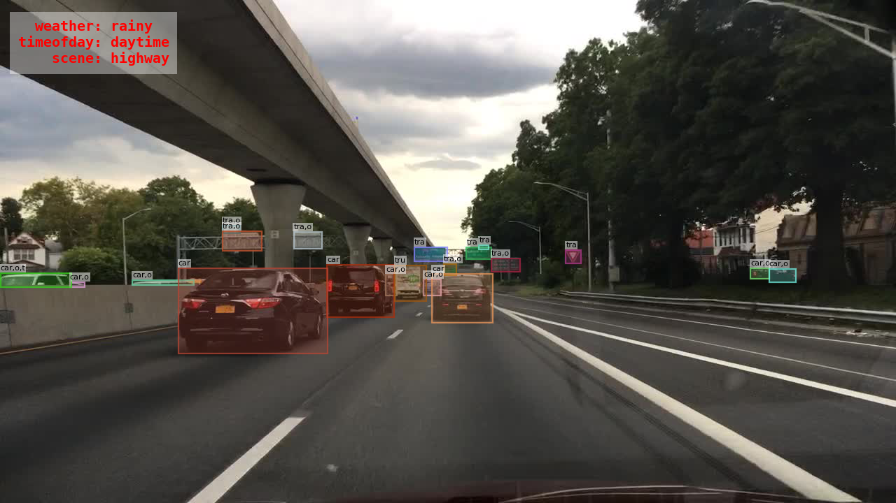

# Image Tagging Models of BDD100K

The image tagging task involves predicting the attributes of each image. We provide classification models for weather condition prediction and scene type prediction.



The BDD100K dataset contains image tagging annotations for 100K diverse images (70K/10K/20K for train/val/test). Each annotation contains image attributes regarding the weather condition (6 classes), the type of scene (6 classes), and the time of day (3 classes). For details about downloading the data and the annotation format for this task, see the [official documentation](https://doc.bdd100k.com/download.html).

## Model Zoo

For training the models listed below, we follow the common settings used by [MMClassification](https://github.com/open-mmlab/mmclassification).
All models are trained on 4 GeForce RTX 2080 Ti GPUs.
Training parameters can be found in the config files.

## Weather Tagging

Six classes: rainy, snowy, clear, overcast, partly cloudy, and foggy (plus undefined).

### VGG

[Very Deep Convolutional Networks for Large-Scale Image Recognition](https://arxiv.org/abs/1409.1556) [ICLR 2015]

Authors: [Karen Simonyan](https://www.robots.ox.ac.uk/~karen/), [Andrew Zisserman](https://www.robots.ox.ac.uk/~az/)

<details>
<summary>Abstract</summary>
In this work we investigate the effect of the convolutional network depth on its accuracy in the large-scale image recognition setting. Our main contribution is a thorough evaluation of networks of increasing depth using an architecture with very small (3x3) convolution filters, which shows that a significant improvement on the prior-art configurations can be achieved by pushing the depth to 16-19 weight layers. These findings were the basis of our ImageNet Challenge 2014 submission, where our team secured the first and the second places in the localisation and classification tracks respectively. We also show that our representations generalise well to other datasets, where they achieve state-of-the-art results. We have made our two best-performing ConvNet models publicly available to facilitate further research on the use of deep visual representations in computer vision.
</details>

#### Results

| Backbone |   Input    | Acc-val |                                                  Scores-val                                                  | Acc-test |                                                  Scores-test                                                  |                               Config                                |                                                                                                    Weights                                                                                                     |                                                 Preds                                                  |                                                  Visuals                                                  |
| :------: | :--------: | :-----: | :----------------------------------------------------------------------------------------------------------: | :------: | :-----------------------------------------------------------------------------------------------------------: | :-----------------------------------------------------------------: | :------------------------------------------------------------------------------------------------------------------------------------------------------------------------------------------------------------: | :----------------------------------------------------------------------------------------------------: | :-------------------------------------------------------------------------------------------------------: |
|  VGG-11  | 224 \* 224 |  80.92  | [scores](https://dl.cv.ethz.ch/bdd100k/tagging/weather/scores-val/vgg11_5x_224x224_weather_tag_bdd100k.json) |  80.62   | [scores](https://dl.cv.ethz.ch/bdd100k/tagging/weather/scores-test/vgg11_5x_224x224_weather_tag_bdd100k.json) | [config](./configs/weather/vgg11_5x_224x224_weather_tag_bdd100k.py) | [model](https://dl.cv.ethz.ch/bdd100k/tagging/weather/models/vgg11_5x_224x224_weather_tag_bdd100k.pth) \| [MD5](https://dl.cv.ethz.ch/bdd100k/tagging/weather/models/vgg11_5x_224x224_weather_tag_bdd100k.md5) | [preds](https://dl.cv.ethz.ch/bdd100k/tagging/weather/preds/vgg11_5x_224x224_weather_tag_bdd100k.json) | [visuals](https://dl.cv.ethz.ch/bdd100k/tagging/weather/visuals/vgg11_5x_224x224_weather_tag_bdd100k.zip) |
|  VGG-13  | 224 \* 224 |  80.84  | [scores](https://dl.cv.ethz.ch/bdd100k/tagging/weather/scores-val/vgg13_5x_224x224_weather_tag_bdd100k.json) |  80.71   | [scores](https://dl.cv.ethz.ch/bdd100k/tagging/weather/scores-test/vgg13_5x_224x224_weather_tag_bdd100k.json) | [config](./configs/weather/vgg13_5x_224x224_weather_tag_bdd100k.py) | [model](https://dl.cv.ethz.ch/bdd100k/tagging/weather/models/vgg13_5x_224x224_weather_tag_bdd100k.pth) \| [MD5](https://dl.cv.ethz.ch/bdd100k/tagging/weather/models/vgg13_5x_224x224_weather_tag_bdd100k.md5) | [preds](https://dl.cv.ethz.ch/bdd100k/tagging/weather/preds/vgg13_5x_224x224_weather_tag_bdd100k.json) | [visuals](https://dl.cv.ethz.ch/bdd100k/tagging/weather/visuals/vgg13_5x_224x224_weather_tag_bdd100k.zip) |
|  VGG-16  | 224 \* 224 |  80.77  | [scores](https://dl.cv.ethz.ch/bdd100k/tagging/weather/scores-val/vgg16_5x_224x224_weather_tag_bdd100k.json) |  80.70   | [scores](https://dl.cv.ethz.ch/bdd100k/tagging/weather/scores-test/vgg16_5x_224x224_weather_tag_bdd100k.json) | [config](./configs/weather/vgg16_5x_224x224_weather_tag_bdd100k.py) | [model](https://dl.cv.ethz.ch/bdd100k/tagging/weather/models/vgg16_5x_224x224_weather_tag_bdd100k.pth) \| [MD5](https://dl.cv.ethz.ch/bdd100k/tagging/weather/models/vgg16_5x_224x224_weather_tag_bdd100k.md5) | [preds](https://dl.cv.ethz.ch/bdd100k/tagging/weather/preds/vgg16_5x_224x224_weather_tag_bdd100k.json) | [visuals](https://dl.cv.ethz.ch/bdd100k/tagging/weather/visuals/vgg16_5x_224x224_weather_tag_bdd100k.zip) |

[[Code](https://pytorch.org/vision/stable/models.html)] [[Usage Instructions](#usage)]

---

### ResNet

[Deep Residual Learning for Image Recognition](https://arxiv.org/abs/1512.03385) [CVPR 2016]

Authors: [Kaiming He](http://kaiminghe.com/), [Xiangyu Zhang](https://scholar.google.com/citations?user=yuB-cfoAAAAJ), [Shaoqing Ren](https://www.shaoqingren.com/), [Jian Sun](http://www.jiansun.org/)

<details>
<summary>Abstract</summary>
Deeper neural networks are more difficult to train. We present a residual learning framework to ease the training of networks that are substantially deeper than those used previously. We explicitly reformulate the layers as learning residual functions with reference to the layer inputs, instead of learning unreferenced functions. We provide comprehensive empirical evidence showing that these residual networks are easier to optimize, and can gain accuracy from considerably increased depth. On the ImageNet dataset we evaluate residual nets with a depth of up to 152 layers---8x deeper than VGG nets but still having lower complexity. An ensemble of these residual nets achieves 3.57% error on the ImageNet test set. This result won the 1st place on the ILSVRC 2015 classification task. We also present analysis on CIFAR-10 with 100 and 1000 layers. The depth of representations is of central importance for many visual recognition tasks. Solely due to our extremely deep representations, we obtain a 28\% relative improvement on the COCO object detection dataset. Deep residual nets are foundations of our submissions to ILSVRC & COCO 2015 competitions, where we also won the 1st places on the tasks of ImageNet detection, ImageNet localization, COCO detection, and COCO segmentation.
</details>

#### Results

|  Backbone  |   Input    | Acc-val |                                                    Scores-val                                                    | Acc-test |                                                    Scores-test                                                    |                                 Config                                  |                                                                                                        Weights                                                                                                         |                                                   Preds                                                    |                                                    Visuals                                                    |
| :--------: | :--------: | :-----: | :--------------------------------------------------------------------------------------------------------------: | :------: | :---------------------------------------------------------------------------------------------------------------: | :---------------------------------------------------------------------: | :--------------------------------------------------------------------------------------------------------------------------------------------------------------------------------------------------------------------: | :--------------------------------------------------------------------------------------------------------: | :-----------------------------------------------------------------------------------------------------------: |
| ResNet-18  | 640 \* 640 |  81.57  |     [scores](https://dl.cv.ethz.ch/bdd100k/tagging/weather/scores-val/resnet18_4x_weather_tag_bdd100k.json)      |  81.39   |     [scores](https://dl.cv.ethz.ch/bdd100k/tagging/weather/scores-test/resnet18_4x_weather_tag_bdd100k.json)      |     [config](./configs/weather/resnet18_4x_weather_tag_bdd100k.py)      |          [model](https://dl.cv.ethz.ch/bdd100k/tagging/weather/models/resnet18_4x_weather_tag_bdd100k.pth) \| [MD5](https://dl.cv.ethz.ch/bdd100k/tagging/weather/models/resnet18_4x_weather_tag_bdd100k.md5)          |     [preds](https://dl.cv.ethz.ch/bdd100k/tagging/weather/preds/resnet18_4x_weather_tag_bdd100k.json)      |     [visuals](https://dl.cv.ethz.ch/bdd100k/tagging/weather/visuals/resnet18_4x_weather_tag_bdd100k.zip)      |
| ResNet-34  | 640 \* 640 |  81.48  |     [scores](https://dl.cv.ethz.ch/bdd100k/tagging/weather/scores-val/resnet34_4x_weather_tag_bdd100k.json)      |  81.05   |     [scores](https://dl.cv.ethz.ch/bdd100k/tagging/weather/scores-test/resnet34_4x_weather_tag_bdd100k.json)      |     [config](./configs/weather/resnet34_4x_weather_tag_bdd100k.py)      |          [model](https://dl.cv.ethz.ch/bdd100k/tagging/weather/models/resnet34_4x_weather_tag_bdd100k.pth) \| [MD5](https://dl.cv.ethz.ch/bdd100k/tagging/weather/models/resnet34_4x_weather_tag_bdd100k.md5)          |     [preds](https://dl.cv.ethz.ch/bdd100k/tagging/weather/preds/resnet34_4x_weather_tag_bdd100k.json)      |     [visuals](https://dl.cv.ethz.ch/bdd100k/tagging/weather/visuals/resnet34_4x_weather_tag_bdd100k.zip)      |
| ResNet-50  | 640 \* 640 |  81.94  |     [scores](https://dl.cv.ethz.ch/bdd100k/tagging/weather/scores-val/resnet50_5x_weather_tag_bdd100k.json)      |  81.56   |     [scores](https://dl.cv.ethz.ch/bdd100k/tagging/weather/scores-test/resnet50_5x_weather_tag_bdd100k.json)      |     [config](./configs/weather/resnet50_5x_weather_tag_bdd100k.py)      |          [model](https://dl.cv.ethz.ch/bdd100k/tagging/weather/models/resnet50_5x_weather_tag_bdd100k.pth) \| [MD5](https://dl.cv.ethz.ch/bdd100k/tagging/weather/models/resnet50_5x_weather_tag_bdd100k.md5)          |     [preds](https://dl.cv.ethz.ch/bdd100k/tagging/weather/preds/resnet50_5x_weather_tag_bdd100k.json)      |     [visuals](https://dl.cv.ethz.ch/bdd100k/tagging/weather/visuals/resnet50_5x_weather_tag_bdd100k.zip)      |
| ResNet-101 | 640 \* 640 |  81.73  |     [scores](https://dl.cv.ethz.ch/bdd100k/tagging/weather/scores-val/resnet101_5x_weather_tag_bdd100k.json)     |  81.22   |     [scores](https://dl.cv.ethz.ch/bdd100k/tagging/weather/scores-test/resnet101_5x_weather_tag_bdd100k.json)     |     [config](./configs/weather/resnet101_5x_weather_tag_bdd100k.py)     |         [model](https://dl.cv.ethz.ch/bdd100k/tagging/weather/models/resnet101_5x_weather_tag_bdd100k.pth) \| [MD5](https://dl.cv.ethz.ch/bdd100k/tagging/weather/models/resnet101_5x_weather_tag_bdd100k.md5)         |     [preds](https://dl.cv.ethz.ch/bdd100k/tagging/weather/preds/resnet101_5x_weather_tag_bdd100k.json)     |     [visuals](https://dl.cv.ethz.ch/bdd100k/tagging/weather/visuals/resnet101_5x_weather_tag_bdd100k.zip)     |
| ResNet-18  | 224 \* 224 |  81.66  | [scores](https://dl.cv.ethz.ch/bdd100k/tagging/weather/scores-val/resnet18_5x_224x224_weather_tag_bdd100k.json)  |  81.14   | [scores](https://dl.cv.ethz.ch/bdd100k/tagging/weather/scores-test/resnet18_5x_224x224_weather_tag_bdd100k.json)  | [config](./configs/weather/resnet18_5x_224x224_weather_tag_bdd100k.py)  |  [model](https://dl.cv.ethz.ch/bdd100k/tagging/weather/models/resnet18_5x_224x224_weather_tag_bdd100k.pth) \| [MD5](https://dl.cv.ethz.ch/bdd100k/tagging/weather/models/resnet18_5x_224x224_weather_tag_bdd100k.md5)  | [preds](https://dl.cv.ethz.ch/bdd100k/tagging/weather/preds/resnet18_5x_224x224_weather_tag_bdd100k.json)  | [visuals](https://dl.cv.ethz.ch/bdd100k/tagging/weather/visuals/resnet18_5x_224x224_weather_tag_bdd100k.zip)  |
| ResNet-34  | 224 \* 224 |  81.61  | [scores](https://dl.cv.ethz.ch/bdd100k/tagging/weather/scores-val/resnet34_5x_224x224_weather_tag_bdd100k.json)  |  81.06   | [scores](https://dl.cv.ethz.ch/bdd100k/tagging/weather/scores-test/resnet34_5x_224x224_weather_tag_bdd100k.json)  | [config](./configs/weather/resnet34_5x_224x224_weather_tag_bdd100k.py)  |  [model](https://dl.cv.ethz.ch/bdd100k/tagging/weather/models/resnet34_5x_224x224_weather_tag_bdd100k.pth) \| [MD5](https://dl.cv.ethz.ch/bdd100k/tagging/weather/models/resnet34_5x_224x224_weather_tag_bdd100k.md5)  | [preds](https://dl.cv.ethz.ch/bdd100k/tagging/weather/preds/resnet34_5x_224x224_weather_tag_bdd100k.json)  | [visuals](https://dl.cv.ethz.ch/bdd100k/tagging/weather/visuals/resnet34_5x_224x224_weather_tag_bdd100k.zip)  |
| ResNet-50  | 224 \* 224 |  81.78  | [scores](https://dl.cv.ethz.ch/bdd100k/tagging/weather/scores-val/resnet50_5x_224x224_weather_tag_bdd100k.json)  |  81.24   | [scores](https://dl.cv.ethz.ch/bdd100k/tagging/weather/scores-test/resnet50_5x_224x224_weather_tag_bdd100k.json)  | [config](./configs/weather/resnet50_5x_224x224_weather_tag_bdd100k.py)  |  [model](https://dl.cv.ethz.ch/bdd100k/tagging/weather/models/resnet50_5x_224x224_weather_tag_bdd100k.pth) \| [MD5](https://dl.cv.ethz.ch/bdd100k/tagging/weather/models/resnet50_5x_224x224_weather_tag_bdd100k.md5)  | [preds](https://dl.cv.ethz.ch/bdd100k/tagging/weather/preds/resnet50_5x_224x224_weather_tag_bdd100k.json)  | [visuals](https://dl.cv.ethz.ch/bdd100k/tagging/weather/visuals/resnet50_5x_224x224_weather_tag_bdd100k.zip)  |
| ResNet-101 | 224 \* 224 |  81.59  | [scores](https://dl.cv.ethz.ch/bdd100k/tagging/weather/scores-val/resnet101_5x_224x224_weather_tag_bdd100k.json) |  81.12   | [scores](https://dl.cv.ethz.ch/bdd100k/tagging/weather/scores-test/resnet101_5x_224x224_weather_tag_bdd100k.json) | [config](./configs/weather/resnet101_5x_224x224_weather_tag_bdd100k.py) | [model](https://dl.cv.ethz.ch/bdd100k/tagging/weather/models/resnet101_5x_224x224_weather_tag_bdd100k.pth) \| [MD5](https://dl.cv.ethz.ch/bdd100k/tagging/weather/models/resnet101_5x_224x224_weather_tag_bdd100k.md5) | [preds](https://dl.cv.ethz.ch/bdd100k/tagging/weather/preds/resnet101_5x_224x224_weather_tag_bdd100k.json) | [visuals](https://dl.cv.ethz.ch/bdd100k/tagging/weather/visuals/resnet101_5x_224x224_weather_tag_bdd100k.zip) |

[[Code](https://pytorch.org/vision/stable/models.html)] [[Usage Instructions](#usage)]

---

### DLA

[Deep Layer Aggregation](https://arxiv.org/abs/1707.06484) [CVPR 2018]

Authors: [Fisher Yu](https://www.yf.io/), [Dequan Wang](https://dequan.wang/), [Evan Shelhamer](http://imaginarynumber.net/), [Trevor Darrell](https://people.eecs.berkeley.edu/~trevor/)

<details>
<summary>Abstract</summary>
Visual recognition requires rich representations that span levels from low to high, scales from small to large, and resolutions from fine to coarse. Even with the depth of features in a convolutional network, a layer in isolation is not enough: compounding and aggregating these representations improves inference of what and where. Architectural efforts are exploring many dimensions for network backbones, designing deeper or wider architectures, but how to best aggregate layers and blocks across a network deserves further attention. Although skip connections have been incorporated to combine layers, these connections have been "shallow" themselves, and only fuse by simple, one-step operations. We augment standard architectures with deeper aggregation to better fuse information across layers. Our deep layer aggregation structures iteratively and hierarchically merge the feature hierarchy to make networks with better accuracy and fewer parameters. Experiments across architectures and tasks show that deep layer aggregation improves recognition and resolution compared to existing branching and merging schemes. The code is at [this https URL](https://github.com/ucbdrive/dla).
</details>

#### Results

| Backbone |   Input    | Acc-val |                                                  Scores-val                                                   | Acc-test |                                                  Scores-test                                                   |                                Config                                |                                                                                                     Weights                                                                                                      |                                                  Preds                                                  |                                                  Visuals                                                   |
| :------: | :--------: | :-----: | :-----------------------------------------------------------------------------------------------------------: | :------: | :------------------------------------------------------------------------------------------------------------: | :------------------------------------------------------------------: | :--------------------------------------------------------------------------------------------------------------------------------------------------------------------------------------------------------------: | :-----------------------------------------------------------------------------------------------------: | :--------------------------------------------------------------------------------------------------------: |
|  DLA-34  | 224 \* 224 |  81.35  | [scores](https://dl.cv.ethz.ch/bdd100k/tagging/weather/scores-val/dla34_5x_224x224_weather_tag_bdd100k.json)  |  81.24   | [scores](https://dl.cv.ethz.ch/bdd100k/tagging/weather/scores-test/dla34_5x_224x224_weather_tag_bdd100k.json)  | [config](./configs/weather/dla34_5x_224x224_weather_tag_bdd100k.py)  |  [model](https://dl.cv.ethz.ch/bdd100k/tagging/weather/models/dla34_5x_224x224_weather_tag_bdd100k.pth) \| [MD5](https://dl.cv.ethz.ch/bdd100k/tagging/weather/models/dla34_5x_224x224_weather_tag_bdd100k.md5)  | [preds](https://dl.cv.ethz.ch/bdd100k/tagging/weather/preds/dla34_5x_224x224_weather_tag_bdd100k.json)  | [visuals](https://dl.cv.ethz.ch/bdd100k/tagging/weather/visuals/dla34_5x_224x224_weather_tag_bdd100k.zip)  |
|  DLA-60  | 224 \* 224 |  79.99  | [scores](https://dl.cv.ethz.ch/bdd100k/tagging/weather/scores-val/dla60_5x_224x224_weather_tag_bdd100k.json)  |  79.65   | [scores](https://dl.cv.ethz.ch/bdd100k/tagging/weather/scores-test/dla60_5x_224x224_weather_tag_bdd100k.json)  | [config](./configs/weather/dla60_5x_224x224_weather_tag_bdd100k.py)  |  [model](https://dl.cv.ethz.ch/bdd100k/tagging/weather/models/dla60_5x_224x224_weather_tag_bdd100k.pth) \| [MD5](https://dl.cv.ethz.ch/bdd100k/tagging/weather/models/dla60_5x_224x224_weather_tag_bdd100k.md5)  | [preds](https://dl.cv.ethz.ch/bdd100k/tagging/weather/preds/dla60_5x_224x224_weather_tag_bdd100k.json)  | [visuals](https://dl.cv.ethz.ch/bdd100k/tagging/weather/visuals/dla60_5x_224x224_weather_tag_bdd100k.zip)  |
| DLA-X-60 | 224 \* 224 |  80.22  | [scores](https://dl.cv.ethz.ch/bdd100k/tagging/weather/scores-val/dla60x_5x_224x224_weather_tag_bdd100k.json) |  79.80   | [scores](https://dl.cv.ethz.ch/bdd100k/tagging/weather/scores-test/dla60x_5x_224x224_weather_tag_bdd100k.json) | [config](./configs/weather/dla60x_5x_224x224_weather_tag_bdd100k.py) | [model](https://dl.cv.ethz.ch/bdd100k/tagging/weather/models/dla60x_5x_224x224_weather_tag_bdd100k.pth) \| [MD5](https://dl.cv.ethz.ch/bdd100k/tagging/weather/models/dla60x_5x_224x224_weather_tag_bdd100k.md5) | [preds](https://dl.cv.ethz.ch/bdd100k/tagging/weather/preds/dla60x_5x_224x224_weather_tag_bdd100k.json) | [visuals](https://dl.cv.ethz.ch/bdd100k/tagging/weather/visuals/dla60x_5x_224x224_weather_tag_bdd100k.zip) |

[[Code](https://github.com/ucbdrive/dla)] [[Usage Instructions](#usage)]

## Scene Tagging

Six classes: tunnel, residential, parking lot, city street, gas stations, and highway (plus undefined).

### VGG

[Very Deep Convolutional Networks for Large-Scale Image Recognition](https://arxiv.org/abs/1409.1556) [ICLR 2015]

Authors: [Karen Simonyan](https://www.robots.ox.ac.uk/~karen/), [Andrew Zisserman](https://www.robots.ox.ac.uk/~az/)

<details>
<summary>Abstract</summary>
In this work we investigate the effect of the convolutional network depth on its accuracy in the large-scale image recognition setting. Our main contribution is a thorough evaluation of networks of increasing depth using an architecture with very small (3x3) convolution filters, which shows that a significant improvement on the prior-art configurations can be achieved by pushing the depth to 16-19 weight layers. These findings were the basis of our ImageNet Challenge 2014 submission, where our team secured the first and the second places in the localisation and classification tracks respectively. We also show that our representations generalise well to other datasets, where they achieve state-of-the-art results. We have made our two best-performing ConvNet models publicly available to facilitate further research on the use of deep visual representations in computer vision.
</details>

#### Results

| Backbone |   Input    | Acc-val |                                                Scores-val                                                | Acc-test |                                                Scores-test                                                |                             Config                              |                                                                                                Weights                                                                                                 |                                               Preds                                                |                                                Visuals                                                |
| :------: | :--------: | :-----: | :------------------------------------------------------------------------------------------------------: | :------: | :-------------------------------------------------------------------------------------------------------: | :-------------------------------------------------------------: | :----------------------------------------------------------------------------------------------------------------------------------------------------------------------------------------------------: | :------------------------------------------------------------------------------------------------: | :---------------------------------------------------------------------------------------------------: |
|  VGG-11  | 224 \* 224 |  77.22  | [scores](https://dl.cv.ethz.ch/bdd100k/tagging/scene/scores-val/vgg11_5x_224x224_scene_tag_bdd100k.json) |  77.01   | [scores](https://dl.cv.ethz.ch/bdd100k/tagging/scene/scores-test/vgg11_5x_224x224_scene_tag_bdd100k.json) | [config](./configs/scene/vgg11_5x_224x224_scene_tag_bdd100k.py) | [model](https://dl.cv.ethz.ch/bdd100k/tagging/scene/models/vgg11_5x_224x224_scene_tag_bdd100k.pth) \| [MD5](https://dl.cv.ethz.ch/bdd100k/tagging/scene/models/vgg11_5x_224x224_scene_tag_bdd100k.md5) | [preds](https://dl.cv.ethz.ch/bdd100k/tagging/scene/preds/vgg11_5x_224x224_scene_tag_bdd100k.json) | [visuals](https://dl.cv.ethz.ch/bdd100k/tagging/scene/visuals/vgg11_5x_224x224_scene_tag_bdd100k.zip) |
|  VGG-13  | 224 \* 224 |  77.37  | [scores](https://dl.cv.ethz.ch/bdd100k/tagging/scene/scores-val/vgg13_5x_224x224_scene_tag_bdd100k.json) |  77.10   | [scores](https://dl.cv.ethz.ch/bdd100k/tagging/scene/scores-test/vgg13_5x_224x224_scene_tag_bdd100k.json) | [config](./configs/scene/vgg13_5x_224x224_scene_tag_bdd100k.py) | [model](https://dl.cv.ethz.ch/bdd100k/tagging/scene/models/vgg13_5x_224x224_scene_tag_bdd100k.pth) \| [MD5](https://dl.cv.ethz.ch/bdd100k/tagging/scene/models/vgg13_5x_224x224_scene_tag_bdd100k.md5) | [preds](https://dl.cv.ethz.ch/bdd100k/tagging/scene/preds/vgg13_5x_224x224_scene_tag_bdd100k.json) | [visuals](https://dl.cv.ethz.ch/bdd100k/tagging/scene/visuals/vgg13_5x_224x224_scene_tag_bdd100k.zip) |
|  VGG-16  | 224 \* 224 |  77.57  | [scores](https://dl.cv.ethz.ch/bdd100k/tagging/scene/scores-val/vgg16_5x_224x224_scene_tag_bdd100k.json) |  77.23   | [scores](https://dl.cv.ethz.ch/bdd100k/tagging/scene/scores-test/vgg16_5x_224x224_scene_tag_bdd100k.json) | [config](./configs/scene/vgg16_5x_224x224_scene_tag_bdd100k.py) | [model](https://dl.cv.ethz.ch/bdd100k/tagging/scene/models/vgg16_5x_224x224_scene_tag_bdd100k.pth) \| [MD5](https://dl.cv.ethz.ch/bdd100k/tagging/scene/models/vgg16_5x_224x224_scene_tag_bdd100k.md5) | [preds](https://dl.cv.ethz.ch/bdd100k/tagging/scene/preds/vgg16_5x_224x224_scene_tag_bdd100k.json) | [visuals](https://dl.cv.ethz.ch/bdd100k/tagging/scene/visuals/vgg16_5x_224x224_scene_tag_bdd100k.zip) |

[[Code](https://pytorch.org/vision/stable/models.html)] [[Usage Instructions](#usage)]

---

### ResNet

[Deep Residual Learning for Image Recognition](https://arxiv.org/abs/1512.03385) [CVPR 2016]

Authors: [Kaiming He](http://kaiminghe.com/), [Xiangyu Zhang](https://scholar.google.com/citations?user=yuB-cfoAAAAJ), [Shaoqing Ren](https://www.shaoqingren.com/), [Jian Sun](http://www.jiansun.org/)

<details>
<summary>Abstract</summary>
Deeper neural networks are more difficult to train. We present a residual learning framework to ease the training of networks that are substantially deeper than those used previously. We explicitly reformulate the layers as learning residual functions with reference to the layer inputs, instead of learning unreferenced functions. We provide comprehensive empirical evidence showing that these residual networks are easier to optimize, and can gain accuracy from considerably increased depth. On the ImageNet dataset we evaluate residual nets with a depth of up to 152 layers---8x deeper than VGG nets but still having lower complexity. An ensemble of these residual nets achieves 3.57% error on the ImageNet test set. This result won the 1st place on the ILSVRC 2015 classification task. We also present analysis on CIFAR-10 with 100 and 1000 layers. The depth of representations is of central importance for many visual recognition tasks. Solely due to our extremely deep representations, we obtain a 28\% relative improvement on the COCO object detection dataset. Deep residual nets are foundations of our submissions to ILSVRC & COCO 2015 competitions, where we also won the 1st places on the tasks of ImageNet detection, ImageNet localization, COCO detection, and COCO segmentation.
</details>

#### Results

|  Backbone  |   Input    | Acc-val |                                                  Scores-val                                                  | Acc-test |                                                  Scores-test                                                  |                               Config                                |                                                                                                    Weights                                                                                                     |                                                 Preds                                                  |                                                  Visuals                                                  |
| :--------: | :--------: | :-----: | :----------------------------------------------------------------------------------------------------------: | :------: | :-----------------------------------------------------------------------------------------------------------: | :-----------------------------------------------------------------: | :------------------------------------------------------------------------------------------------------------------------------------------------------------------------------------------------------------: | :----------------------------------------------------------------------------------------------------: | :-------------------------------------------------------------------------------------------------------: |
| ResNet-18  | 640 \* 640 |  78.07  |     [scores](https://dl.cv.ethz.ch/bdd100k/tagging/scene/scores-val/resnet18_4x_scene_tag_bdd100k.json)      |  77.48   |     [scores](https://dl.cv.ethz.ch/bdd100k/tagging/scene/scores-test/resnet18_4x_scene_tag_bdd100k.json)      |     [config](./configs/scene/resnet18_4x_scene_tag_bdd100k.py)      |          [model](https://dl.cv.ethz.ch/bdd100k/tagging/scene/models/resnet18_4x_scene_tag_bdd100k.pth) \| [MD5](https://dl.cv.ethz.ch/bdd100k/tagging/scene/models/resnet18_4x_scene_tag_bdd100k.md5)          |     [preds](https://dl.cv.ethz.ch/bdd100k/tagging/scene/preds/resnet18_4x_scene_tag_bdd100k.json)      |     [visuals](https://dl.cv.ethz.ch/bdd100k/tagging/scene/visuals/resnet18_4x_scene_tag_bdd100k.zip)      |
| ResNet-34  | 640 \* 640 |  77.47  |     [scores](https://dl.cv.ethz.ch/bdd100k/tagging/scene/scores-val/resnet34_4x_scene_tag_bdd100k.json)      |  77.40   |     [scores](https://dl.cv.ethz.ch/bdd100k/tagging/scene/scores-test/resnet34_4x_scene_tag_bdd100k.json)      |     [config](./configs/scene/resnet34_4x_scene_tag_bdd100k.py)      |          [model](https://dl.cv.ethz.ch/bdd100k/tagging/scene/models/resnet34_4x_scene_tag_bdd100k.pth) \| [MD5](https://dl.cv.ethz.ch/bdd100k/tagging/scene/models/resnet34_4x_scene_tag_bdd100k.md5)          |     [preds](https://dl.cv.ethz.ch/bdd100k/tagging/scene/preds/resnet34_4x_scene_tag_bdd100k.json)      |     [visuals](https://dl.cv.ethz.ch/bdd100k/tagging/scene/visuals/resnet34_4x_scene_tag_bdd100k.zip)      |
| ResNet-50  | 640 \* 640 |  77.92  |     [scores](https://dl.cv.ethz.ch/bdd100k/tagging/scene/scores-val/resnet50_4x_scene_tag_bdd100k.json)      |  77.35   |     [scores](https://dl.cv.ethz.ch/bdd100k/tagging/scene/scores-test/resnet50_4x_scene_tag_bdd100k.json)      |     [config](./configs/scene/resnet50_4x_scene_tag_bdd100k.py)      |          [model](https://dl.cv.ethz.ch/bdd100k/tagging/scene/models/resnet50_4x_scene_tag_bdd100k.pth) \| [MD5](https://dl.cv.ethz.ch/bdd100k/tagging/scene/models/resnet50_4x_scene_tag_bdd100k.md5)          |     [preds](https://dl.cv.ethz.ch/bdd100k/tagging/scene/preds/resnet50_4x_scene_tag_bdd100k.json)      |     [visuals](https://dl.cv.ethz.ch/bdd100k/tagging/scene/visuals/resnet50_4x_scene_tag_bdd100k.zip)      |
| ResNet-101 | 640 \* 640 |  77.51  |     [scores](https://dl.cv.ethz.ch/bdd100k/tagging/scene/scores-val/resnet101_5x_scene_tag_bdd100k.json)     |  77.06   |     [scores](https://dl.cv.ethz.ch/bdd100k/tagging/scene/scores-test/resnet101_5x_scene_tag_bdd100k.json)     |     [config](./configs/scene/resnet101_5x_scene_tag_bdd100k.py)     |         [model](https://dl.cv.ethz.ch/bdd100k/tagging/scene/models/resnet101_5x_scene_tag_bdd100k.pth) \| [MD5](https://dl.cv.ethz.ch/bdd100k/tagging/scene/models/resnet101_5x_scene_tag_bdd100k.md5)         |     [preds](https://dl.cv.ethz.ch/bdd100k/tagging/scene/preds/resnet101_5x_scene_tag_bdd100k.json)     |     [visuals](https://dl.cv.ethz.ch/bdd100k/tagging/scene/visuals/resnet101_5x_scene_tag_bdd100k.zip)     |
| ResNet-18  | 224 \* 224 |  77.84  | [scores](https://dl.cv.ethz.ch/bdd100k/tagging/scene/scores-val/resnet18_5x_224x224_scene_tag_bdd100k.json)  |  77.11   | [scores](https://dl.cv.ethz.ch/bdd100k/tagging/scene/scores-test/resnet18_5x_224x224_scene_tag_bdd100k.json)  | [config](./configs/scene/resnet18_5x_224x224_scene_tag_bdd100k.py)  |  [model](https://dl.cv.ethz.ch/bdd100k/tagging/scene/models/resnet18_5x_224x224_scene_tag_bdd100k.pth) \| [MD5](https://dl.cv.ethz.ch/bdd100k/tagging/scene/models/resnet18_5x_224x224_scene_tag_bdd100k.md5)  | [preds](https://dl.cv.ethz.ch/bdd100k/tagging/scene/preds/resnet18_5x_224x224_scene_tag_bdd100k.json)  | [visuals](https://dl.cv.ethz.ch/bdd100k/tagging/scene/visuals/resnet18_5x_224x224_scene_tag_bdd100k.zip)  |
| ResNet-34  | 224 \* 224 |  77.77  | [scores](https://dl.cv.ethz.ch/bdd100k/tagging/scene/scores-val/resnet34_5x_224x224_scene_tag_bdd100k.json)  |  77.34   | [scores](https://dl.cv.ethz.ch/bdd100k/tagging/scene/scores-test/resnet34_5x_224x224_scene_tag_bdd100k.json)  | [config](./configs/scene/resnet34_5x_224x224_scene_tag_bdd100k.py)  |  [model](https://dl.cv.ethz.ch/bdd100k/tagging/scene/models/resnet34_5x_224x224_scene_tag_bdd100k.pth) \| [MD5](https://dl.cv.ethz.ch/bdd100k/tagging/scene/models/resnet34_5x_224x224_scene_tag_bdd100k.md5)  | [preds](https://dl.cv.ethz.ch/bdd100k/tagging/scene/preds/resnet34_5x_224x224_scene_tag_bdd100k.json)  | [visuals](https://dl.cv.ethz.ch/bdd100k/tagging/scene/visuals/resnet34_5x_224x224_scene_tag_bdd100k.zip)  |
| ResNet-50  | 224 \* 224 |  77.66  | [scores](https://dl.cv.ethz.ch/bdd100k/tagging/scene/scores-val/resnet50_5x_224x224_scene_tag_bdd100k.json)  |  77.17   | [scores](https://dl.cv.ethz.ch/bdd100k/tagging/scene/scores-test/resnet50_5x_224x224_scene_tag_bdd100k.json)  | [config](./configs/scene/resnet50_5x_224x224_scene_tag_bdd100k.py)  |  [model](https://dl.cv.ethz.ch/bdd100k/tagging/scene/models/resnet50_5x_224x224_scene_tag_bdd100k.pth) \| [MD5](https://dl.cv.ethz.ch/bdd100k/tagging/scene/models/resnet50_5x_224x224_scene_tag_bdd100k.md5)  | [preds](https://dl.cv.ethz.ch/bdd100k/tagging/scene/preds/resnet50_5x_224x224_scene_tag_bdd100k.json)  | [visuals](https://dl.cv.ethz.ch/bdd100k/tagging/scene/visuals/resnet50_5x_224x224_scene_tag_bdd100k.zip)  |
| ResNet-101 | 224 \* 224 |  77.47  | [scores](https://dl.cv.ethz.ch/bdd100k/tagging/scene/scores-val/resnet101_5x_224x224_scene_tag_bdd100k.json) |  77.14   | [scores](https://dl.cv.ethz.ch/bdd100k/tagging/scene/scores-test/resnet101_5x_224x224_scene_tag_bdd100k.json) | [config](./configs/scene/resnet101_5x_224x224_scene_tag_bdd100k.py) | [model](https://dl.cv.ethz.ch/bdd100k/tagging/scene/models/resnet101_5x_224x224_scene_tag_bdd100k.pth) \| [MD5](https://dl.cv.ethz.ch/bdd100k/tagging/scene/models/resnet101_5x_224x224_scene_tag_bdd100k.md5) | [preds](https://dl.cv.ethz.ch/bdd100k/tagging/scene/preds/resnet101_5x_224x224_scene_tag_bdd100k.json) | [visuals](https://dl.cv.ethz.ch/bdd100k/tagging/scene/visuals/resnet101_5x_224x224_scene_tag_bdd100k.zip) |

[[Code](https://pytorch.org/vision/stable/models.html)] [[Usage Instructions](#usage)]

---

### DLA

[Deep Layer Aggregation](https://arxiv.org/abs/1707.06484) [CVPR 2018]

Authors: [Fisher Yu](https://www.yf.io/), [Dequan Wang](https://dequan.wang/), [Evan Shelhamer](http://imaginarynumber.net/), [Trevor Darrell](https://people.eecs.berkeley.edu/~trevor/)

<details>
<summary>Abstract</summary>
Visual recognition requires rich representations that span levels from low to high, scales from small to large, and resolutions from fine to coarse. Even with the depth of features in a convolutional network, a layer in isolation is not enough: compounding and aggregating these representations improves inference of what and where. Architectural efforts are exploring many dimensions for network backbones, designing deeper or wider architectures, but how to best aggregate layers and blocks across a network deserves further attention. Although skip connections have been incorporated to combine layers, these connections have been "shallow" themselves, and only fuse by simple, one-step operations. We augment standard architectures with deeper aggregation to better fuse information across layers. Our deep layer aggregation structures iteratively and hierarchically merge the feature hierarchy to make networks with better accuracy and fewer parameters. Experiments across architectures and tasks show that deep layer aggregation improves recognition and resolution compared to existing branching and merging schemes. The code is at [this https URL](https://github.com/ucbdrive/dla).
</details>

#### Results

| Backbone |   Input    | Acc-val |                                                Scores-val                                                 | Acc-test |                                                Scores-test                                                 |                              Config                              |                                                                                                 Weights                                                                                                  |                                                Preds                                                |                                                Visuals                                                 |
| :------: | :--------: | :-----: | :-------------------------------------------------------------------------------------------------------: | :------: | :--------------------------------------------------------------------------------------------------------: | :--------------------------------------------------------------: | :------------------------------------------------------------------------------------------------------------------------------------------------------------------------------------------------------: | :-------------------------------------------------------------------------------------------------: | :----------------------------------------------------------------------------------------------------: |
|  DLA-34  | 224 \* 224 |  77.64  | [scores](https://dl.cv.ethz.ch/bdd100k/tagging/scene/scores-val/dla34_5x_224x224_scene_tag_bdd100k.json)  |  77.13   | [scores](https://dl.cv.ethz.ch/bdd100k/tagging/scene/scores-test/dla34_5x_224x224_scene_tag_bdd100k.json)  | [config](./configs/scene/dla34_5x_224x224_scene_tag_bdd100k.py)  |  [model](https://dl.cv.ethz.ch/bdd100k/tagging/scene/models/dla34_5x_224x224_scene_tag_bdd100k.pth) \| [MD5](https://dl.cv.ethz.ch/bdd100k/tagging/scene/models/dla34_5x_224x224_scene_tag_bdd100k.md5)  | [preds](https://dl.cv.ethz.ch/bdd100k/tagging/scene/preds/dla34_5x_224x224_scene_tag_bdd100k.json)  | [visuals](https://dl.cv.ethz.ch/bdd100k/tagging/scene/visuals/dla34_5x_224x224_scene_tag_bdd100k.zip)  |
|  DLA-60  | 224 \* 224 |  75.14  | [scores](https://dl.cv.ethz.ch/bdd100k/tagging/scene/scores-val/dla60_5x_224x224_scene_tag_bdd100k.json)  |  74.80   | [scores](https://dl.cv.ethz.ch/bdd100k/tagging/scene/scores-test/dla60_5x_224x224_scene_tag_bdd100k.json)  | [config](./configs/scene/dla60_5x_224x224_scene_tag_bdd100k.py)  |  [model](https://dl.cv.ethz.ch/bdd100k/tagging/scene/models/dla60_5x_224x224_scene_tag_bdd100k.pth) \| [MD5](https://dl.cv.ethz.ch/bdd100k/tagging/scene/models/dla60_5x_224x224_scene_tag_bdd100k.md5)  | [preds](https://dl.cv.ethz.ch/bdd100k/tagging/scene/preds/dla60_5x_224x224_scene_tag_bdd100k.json)  | [visuals](https://dl.cv.ethz.ch/bdd100k/tagging/scene/visuals/dla60_5x_224x224_scene_tag_bdd100k.zip)  |
| DLA-X-60 | 224 \* 224 |  75.80  | [scores](https://dl.cv.ethz.ch/bdd100k/tagging/scene/scores-val/dla60x_5x_224x224_scene_tag_bdd100k.json) |  75.69   | [scores](https://dl.cv.ethz.ch/bdd100k/tagging/scene/scores-test/dla60x_5x_224x224_scene_tag_bdd100k.json) | [config](./configs/scene/dla60x_5x_224x224_scene_tag_bdd100k.py) | [model](https://dl.cv.ethz.ch/bdd100k/tagging/scene/models/dla60x_5x_224x224_scene_tag_bdd100k.pth) \| [MD5](https://dl.cv.ethz.ch/bdd100k/tagging/scene/models/dla60x_5x_224x224_scene_tag_bdd100k.md5) | [preds](https://dl.cv.ethz.ch/bdd100k/tagging/scene/preds/dla60x_5x_224x224_scene_tag_bdd100k.json) | [visuals](https://dl.cv.ethz.ch/bdd100k/tagging/scene/visuals/dla60x_5x_224x224_scene_tag_bdd100k.zip) |

[[Code](https://github.com/ucbdrive/dla)] [[Usage Instructions](#usage)]

---

## Install

a. Create a conda virtual environment and activate it.

```shell
conda create -n bdd100k-mmcls python=3.8
conda activate bdd100k-mmcls
```

b. Install PyTorch and torchvision following the [official instructions](https://pytorch.org/), e.g.,

```shell
conda install pytorch torchvision -c pytorch
```

Note: Make sure that your compilation CUDA version and runtime CUDA version match.
You can check the supported CUDA version for precompiled packages on the [PyTorch website](https://pytorch.org/).

c. Install mmcv and mmclassification.

```shell
pip install mmcv-full
pip install mmcls
```

You can also refer to the [official instructions](https://github.com/open-mmlab/mmclassification/blob/master/docs/install.md).

## Usage

### Model Inference and Evaluation

Single GPU inference:

```shell
python ./test.py ${CONFIG_FILE} --out ${OUTPUT_DIR} [--options]
```

Multiple GPU inference:

```shell
CUDA_VISIBLE_DEVICES=0,1,2,3 python -m torch.distributed.launch \
    --nproc_per_node=4 --master_port=12000 ./test.py $CFG_FILE \
    --out ${OUTPUT_DIR} [--options] --launcher pytorch
```

### Output Visualization

For visualization, you can use the visualization tool provided by [Scalabel](https://doc.scalabel.ai/visual.html).

Below is an example:

```python
import os
import numpy as np
from PIL import Image
from scalabel.label.io import load
from scalabel.vis.label import LabelViewer

# load prediction frames
frames = load('$OUTPUT_DIR/tagging.json').frames

viewer = LabelViewer()
for frame in frames:
    img = np.array(Image.open(os.path.join('$IMG_DIR', frame.name)))
    viewer.draw(img, frame)
    viewer.save(os.path.join('$VIS_DIR', frame.name))
```

## Contribution

**You can include your models in this repo as well!** Please follow the [contribution](../doc/CONTRIBUTING.md) instructions.
